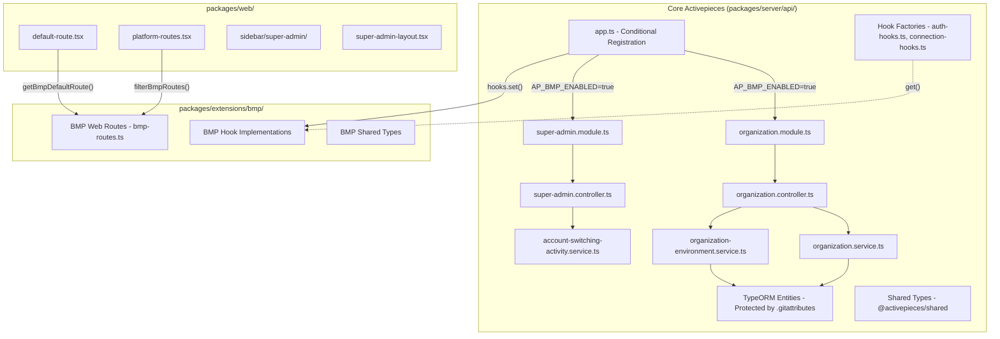

# BMP Extension - Complete Technical Documentation

> **Status:** COMPLETED  
> **Last Updated:** March 2026  
> **Project:** Activepieces BMP Multi-Tenant Extension

---

## Table of Contents

1. [Executive Summary](#executive-summary)
2. [Architecture Overview](#architecture-overview)
3. [Features Implemented](#features-implemented)
4. [File Organization](#file-organization)
5. [Code Change Analysis](#code-change-analysis)
6. [Implementation Details](#implementation-details)
7. [Validation Status](#validation-status)
8. [Configuration](#configuration)
9. [React UI SDK](#react-ui-sdk)
10. [Lessons Learned](#lessons-learned)
11. [Maintenance Guide](#maintenance-guide)

---

## Executive Summary

The BMP (Business Process Management) extension adds multi-tenant organization support to Activepieces Community Edition. The implementation follows a **hook-based architecture** that enables conditional loading of BMP features without modifying core Activepieces functionality.

### Key Statistics

| Category | Count |
|----------|-------|
| New BMP files | 86 (including 40 in react-ui-sdk) |
| Core files modified | 18 |
| New core hook files created | 3 |
| Extension package files | 12 |
| Features validated | 25+ |
| Total files changed | 37 (excluding new BMP files) |

### What Was Built

1. **Multi-tenant Organization System** - Organizations with environments (Dev/Staging/Production)
2. **Extended User Roles** - Added `SUPER_ADMIN` and `OWNER` to existing hierarchy
3. **BMP Piece Integration** - Custom ada-bmp piece with environment-aware API URL
4. **Account Switching** - Stack-based session management for cross-role navigation
5. **UI Customizations** - New routes, sidebars, dialogs for organization management
6. **React UI SDK** - Package for embedding Activepieces UI in external Angular applications

---

## Architecture Overview



### Key Architecture Decisions

| Decision | Rationale |
|----------|-----------|
| **Controllers/Services in Core** | TypeScript `rootDir` constraint prevents importing from outside package |
| **Hook-based Extension** | Core defines hook factories with defaults; BMP provides custom implementations |
| **Entity Protection via .gitattributes** | Entities cannot move outside server `rootDir`; protected with `merge=ours` |
| **Frontend Conditional Loading** | `isBmpEnabled()` and `getBmpDefaultRoute()` utilities for route/navigation control |

### Organization Hierarchy

```
Platform
  └── Organization (e.g., "ABC")
        ├── Environment: Dev
        │     ├── Admin User (project owner)
        │     ├── metadata: { ADA_BMP_API_URL: "..." }
        │     └── Project
        ├── Environment: Staging
        │     └── ...
        └── Environment: Production
              └── ...
```

### Role Hierarchy

```
SUPER_ADMIN (cross-platform)
  └── OWNER (tenant owner, per platform)
        └── ADMIN (environment admin, has personal project)
              ├── OPERATOR
              └── MEMBER
```

---

## Features Implemented

### Backend Features

| Feature | API Endpoints | Status |
|---------|---------------|--------|
| Organization CRUD | `GET/POST /v1/organizations` | ✅ Working |
| Organization Environments | `GET/POST /v1/organization-environments` | ✅ Working |
| Super Admin Management | `GET/POST /v1/super-admin/*` | ✅ Working |
| Account Switching (SUPER_ADMIN→OWNER) | `POST /v1/super-admin/tenants/:id/switch` | ✅ Working |
| Account Switching (OWNER→ADMIN) | `POST /v1/platforms/switch-to-admin/:id` | ✅ Working |
| BMP Piece Environment Metadata | Connection hooks | ✅ Working |

### Frontend Features

| Feature | Route/Component | Status |
|---------|-----------------|--------|
| Super Admin Dashboard | `/platform/super-admin` | ✅ Working |
| Owner Dashboard | `/platform/owner-dashboard` | ✅ Working |
| Organizations Management | `/platform/organizations` | ✅ Working |
| Conditional Sidebar Items | Platform sidebar | ✅ Working |
| Role-based Default Routes | `default-route.tsx` | ✅ Working |
| Account Switch Back Button | `switch-back-button.tsx` | ✅ Working |

---

## File Organization

### Extension Package Structure

```
packages/extensions/bmp/
├── src/
│   ├── index.ts                    # Main entry
│   ├── server/
│   │   ├── index.ts               # Server entry
│   │   ├── bmp.module.ts          # Fastify plugin
│   │   ├── controllers/
│   │   │   ├── organization.controller.ts
│   │   │   ├── organization-environment.controller.ts
│   │   │   ├── super-admin.controller.ts
│   │   │   └── account-switching.controller.ts
│   │   ├── services/
│   │   │   ├── organization.service.ts
│   │   │   ├── organization-environment.service.ts
│   │   │   ├── super-admin.service.ts
│   │   │   ├── account-switching.service.ts
│   │   │   └── multi-tenant-auth.service.ts
│   │   └── hooks/
│   │       ├── auth.hooks.ts
│   │       ├── connection.hooks.ts
│   │       ├── engine.hooks.ts
│   │       └── index.ts
│   ├── web/
│   │   ├── index.ts               # Web entry
│   │   ├── routes/
│   │   │   ├── organizations/
│   │   │   ├── super-admin/
│   │   │   └── owner-dashboard/
│   │   ├── components/
│   │   │   ├── super-admin-layout.tsx
│   │   │   ├── switch-back-button.tsx
│   │   │   ├── ada-bmp-environment-select.tsx
│   │   │   └── sidebar/
│   │   ├── api/
│   │   │   ├── organization-api.ts
│   │   │   └── super-admin-api.ts
│   │   └── hooks/
│   │       ├── organization-hooks.ts
│   │       └── super-admin-hooks.ts
│   ├── shared/
│   │   └── organization/
│   │       ├── organization.ts
│   │       └── organization.request.ts
│   └── hooks/
│       ├── types.ts
│       ├── registry.ts
│       └── index.ts
└── package.json

packages/extensions/react-ui-sdk/
├── src/
│   ├── angular/                  # Angular wrappers
│   ├── react/                    # React component wrappers
│   ├── providers/
│   ├── stubs/
│   ├── types/
│   ├── utils/
│   └── index.ts
├── scripts/
├── package.json
├── BUILD_GUIDE.md
├── BMP_OVERRIDES.md
└── README.md
```

### Entities (Protected in Core)

| Entity | Location | Protection |
|--------|----------|------------|
| `OrganizationEntity` | `packages/server/api/src/app/organization/organization.entity.ts` | `.gitattributes merge=ours` |
| `OrganizationEnvironmentEntity` | `packages/server/api/src/app/organization/organization-environment.entity.ts` | `.gitattributes merge=ours` |
| `AccountSwitchingActivityEntity` | `packages/server/api/src/app/account-switching/account-switching-activity.entity.ts` | `.gitattributes merge=ours` |

---

## Code Change Analysis

### New Files (Low Merge Conflict Risk)

#### Server - Organization Module (6 files)
- `packages/server/api/src/app/organization/organization.entity.ts`
- `packages/server/api/src/app/organization/organization.service.ts`
- `packages/server/api/src/app/organization/organization.controller.ts`
- `packages/server/api/src/app/organization/organization.module.ts`
- `packages/server/api/src/app/organization/organization-environment.entity.ts`
- `packages/server/api/src/app/organization/organization-environment.service.ts`

#### Server - Super Admin Module (2 files)
- `packages/server/api/src/app/super-admin/super-admin.controller.ts`
- `packages/server/api/src/app/super-admin/super-admin.module.ts`

#### Server - Account Switching (2 files)
- `packages/server/api/src/app/account-switching/account-switching-activity.entity.ts`
- `packages/server/api/src/app/account-switching/account-switching-activity.service.ts`

#### Server - Database Migrations (7 files)
- `1768457416000-AddAccountSwitchingActivity.ts`
- `1769126400000-AddOrganizationTables.ts`
- `1769127000000-AddOrganizationToUserInvitation.ts`
- `1769127500000-AddMetadataToOrganizationEnvironment.ts`
- `1769127600000-AddProjectIdToOrganization.ts`
- `1769127700000-AddMissingOrganizationEnvironments.ts`
- `1771241733000-AddClientIdToUser.ts`

#### Shared Types (3 files)
- `packages/shared/src/lib/organization/index.ts`
- `packages/shared/src/lib/organization/organization.ts`
- `packages/shared/src/lib/organization/organization.request.ts`

#### Web - New Pages/Components (15 files)
- `packages/web/src/app/routes/platform/organizations/index.tsx`
- `packages/web/src/app/routes/platform/organizations/environment-metadata-dialog.tsx`
- `packages/web/src/app/routes/platform/organizations/organization-environments-section.tsx`
- `packages/web/src/app/routes/platform/super-admin/index.tsx`
- `packages/web/src/app/routes/platform/super-admin/create-tenant-dialog.tsx`
- `packages/web/src/app/routes/platform/owner-dashboard/index.tsx`
- `packages/web/src/app/components/super-admin-layout.tsx`
- `packages/web/src/app/components/switch-back-button.tsx`
- `packages/web/src/app/components/sidebar/super-admin/index.tsx`
- `packages/web/src/app/connections/ada-bmp-environment-select.tsx`
- `packages/web/src/app/guards/platform-default-route.tsx`
- `packages/web/src/features/platform-admin/api/organization-api.ts`
- `packages/web/src/features/platform-admin/api/organization-hooks.ts`
- `packages/web/src/hooks/super-admin-hooks.ts`
- `packages/web/src/lib/super-admin-api.ts`

#### Custom Piece
- `packages/pieces/custom/ada-bmp/*` - All files are new

### Core Modifications (High Conflict Risk)

#### Critical Server Files

| File | Change Type | BMP-Specific Logic |
|------|-------------|-------------------|
| `app-connection-service.ts` | **Heavy** | `isBmpPiece()` helper, environment metadata fetch |
| `piece-metadata-controller.ts` | **Heavy** | `organizationEnvironmentMetadata` injection |
| `user-service.ts` | **Heavy** | Role-based filtering, organization meta info |
| `database-connection.ts` | **Medium** | Added BMP entities |
| `app.ts` | **Light** | Added `organizationModule`, `superAdminModule` |
| `user-entity.ts` | **Light** | Added `organizationId`, `clientId` columns |

#### Critical Shared Files

| File | Change Type | BMP-Specific Logic |
|------|-------------|-------------------|
| `user.ts` | **Medium** | Added `SUPER_ADMIN`, `OWNER` enum values |
| `engine-operation.ts` | **Light** | Added `environmentMetadata` properties |

#### Critical Web Files

| File | Change Type | BMP-Specific Logic |
|------|-------------|-------------------|
| `authentication-session.ts` | **Heavy** | Account switching stack |
| `platform-routes.tsx` | **Medium** | Added BMP routes |
| `invite-user-dialog.tsx` | **Heavy** | Organization selection |
| `sidebar-user.tsx` | **Medium** | Switch back button |

### Core Files Modified Summary (18 files)

**Server Package (9 files):**
1. `packages/server/api/src/app/app.ts` - Conditional BMP module loading
2. `packages/server/api/src/app/app-connection/app-connection-service/app-connection-service.ts` - Hook integration
3. `packages/server/api/src/app/app-connection/app-connection.controller.ts` - isBmpPiece check
4. `packages/server/api/src/app/authentication/authentication-utils.ts` - authHooks usage
5. `packages/server/api/src/app/core/security/v2/authz/authorize.ts` - authHooks usage
6. `packages/server/api/src/app/helper/system-validator.ts` - BMP prop validators
7. `packages/server/api/src/app/helper/system/system-props.ts` - BMP_ENABLED props
8. `packages/server/api/src/app/trigger/app-event-routing/app-event-routing.module.ts` - Type fix
9. `packages/server/worker/src/lib/execute/jobs/execute-property.ts` - organizationEnvironmentMetadata passing

**Web Package (9 files):**
1. `packages/web/src/app/components/sidebar/platform/index.tsx` - Conditional BMP items
2. `packages/web/src/app/components/sidebar/super-admin/index.tsx` - BMP check
3. `packages/web/src/app/components/super-admin-layout.tsx` - Suspense wrapper
4. `packages/web/src/app/guards/default-route.tsx` - BMP routing logic
5. `packages/web/src/app/guards/platform-default-route.tsx` - BMP route integration
6. `packages/web/src/app/routes/platform-routes.tsx` - Route filtering
7. `packages/web/src/components/icons/settings2.tsx` - SVG fix
8. `packages/web/src/components/providers/socket-provider.tsx` - Strict Mode fix
9. `packages/web/vite.config.mts` - VITE_BMP_ENABLED env loading

### New Core Files Created (3 files)

1. `packages/server/api/src/app/app-connection/connection-hooks.ts` - Hook factory
2. `packages/server/api/src/app/authentication/auth-hooks.ts` - Hook factory
3. `packages/web/src/app/routes/bmp-routes.ts` - BMP route utilities

---

## Implementation Details

### Hook Pattern Implementation

**Core Hook Factory (auth-hooks.ts):**
```typescript
import { hooksFactory } from '../helper/hooks-factory'

export interface AuthHooks {
    isPrivilegedRole: (role: string) => boolean
    getDefaultRoute: (role: string) => string
    enrichToken: (user: User, token: AccessToken) => Promise<AccessToken>
}

export const authHooks = hooksFactory.create<AuthHooks>(_log => ({
    isPrivilegedRole: () => false,  // No privileged roles in community
    getDefaultRoute: () => '/flows',
    enrichToken: async (_, token) => token,
}))
```

**BMP Hook Implementation (bmp/hooks/auth.hooks.ts):**
```typescript
export const bmpAuthHooks = (log: FastifyBaseLogger): AuthHooks => ({
    isPrivilegedRole: (role: string) => ['SUPER_ADMIN', 'OWNER'].includes(role),
    getDefaultRoute: (role: string) => {
        if (role === 'SUPER_ADMIN') return '/platform/super-admin'
        if (role === 'OWNER') return '/platform/owner-dashboard'
        return '/flows'
    },
    enrichToken: async (user, token) => {
        if (user.organizationId) {
            token.organizationId = user.organizationId
        }
        return token
    },
})
```

### Conditional Module Loading (app.ts)

```typescript
import { system, AppSystemProp } from '@activepieces/server-shared'

const bmpEnabled = system.getBoolean(AppSystemProp.BMP_ENABLED) ?? false
if (bmpEnabled) {
    const { bmpModule, bmpHooks } = await import('@activepieces/ext-bmp/server')
    await app.register(bmpModule)
    
    authHooks.set(bmpHooks.auth)
    connectionHooks.set(bmpHooks.connection)
    projectHooks.set(bmpHooks.project)
}
```

### Environment Metadata Flow

```
Organization → OrganizationEnvironment → metadata.ADA_BMP_API_URL
  ↓
Connection validation (app-connection-service.ts)
  ↓
Engine execution (piece-helper.ts injects to process.env)
  ↓
BMP Piece reads process.env.ADA_BMP_API_URL
```

---

## Validation Status

### Backend Server

| Feature | Status | Notes |
|---------|--------|-------|
| Server startup with AP_BMP_ENABLED=true | ✅ Validated | BMP modules registered correctly |
| Server startup with AP_BMP_ENABLED=false | ✅ Validated | BMP modules skipped |
| Organization APIs (/v1/organizations) | ✅ Validated | CRUD operations working |
| Organization Environments APIs | ✅ Validated | Initialize, list, update metadata |
| Super Admin APIs (/v1/super-admin) | ✅ Validated | Platform/tenant management |
| Account Switching (SUPER_ADMIN to OWNER) | ✅ Validated | Token exchange working |
| Account Switching (OWNER to ADMIN) | ✅ Validated | Platform switch working |
| BMP Piece Options (dropdown loading) | ✅ Validated | Fixed organizationEnvironmentMetadata passing |
| App Connections with environment metadata | ✅ Validated | ADA_BMP_API_URL correctly injected |
| Auth Hooks (isPrivilegedRole) | ✅ Validated | SUPER_ADMIN, OWNER, ADMIN checks |
| Connection Hooks (isBmpPiece) | ✅ Validated | BMP piece detection working |

### Frontend Web

| Feature | Status | Notes |
|---------|--------|-------|
| SUPER_ADMIN default route (/super-admin) | ✅ Validated | BMP route working |
| OWNER default route (/owner-dashboard) | ✅ Validated | BMP route working |
| ADMIN/MEMBER default route (/projects/.../flows) | ✅ Validated | Fixed to use project flows |
| Platform sidebar (BMP items conditional) | ✅ Validated | Items hidden when BMP disabled |
| Super Admin sidebar | ✅ Validated | Shows for privileged roles |
| Navigation loop prevention | ✅ Validated | Fixed Suspense boundaries |
| WebSocket reconnection | ✅ Validated | Fixed Strict Mode handling |
| SVG icon rendering (cx attribute) | ✅ Validated | Fixed motion.circle initial state |
| Loading states (Suspense) | ✅ Validated | LoadingScreen shown during data fetch |

### React UI SDK

| Feature | Status | Notes |
|---------|--------|-------|
| SDK bundle build | ✅ Validated | 12.9 MB bundle created |
| SDK package linking | ✅ Validated | Linked to bmp-fe-web |
| Angular app compilation | ✅ Validated | No errors |
| SDK script serving (/sdk/index.js) | ✅ Validated | Available via proxy |
| API proxy configuration | ✅ Validated | /api to localhost:3000 |
| Auto-provision endpoint | ✅ Validated | Token exchange working |

### Custom Piece (ada-bmp)

| Feature | Status | Notes |
|---------|--------|-------|
| Piece loading (AP_DEV_PIECES) | ✅ Validated | Piece appears in UI |
| Environment metadata injection | ✅ Validated | ADA_BMP_API_URL available |
| Channel dropdown options | ✅ Validated | Fixed worker metadata passing |

### Known Non-Critical Warnings

| Warning | Status | Notes |
|---------|--------|-------|
| getNodesBounds deprecation | ⚠️ Not Fixed | React Flow warning, not blocking |
| path.extname browser warning | ⚠️ Not Fixed | Third-party dependency, harmless |

---

## Configuration

### Environment Variables

| Variable | Type | Default | Description |
|----------|------|---------|-------------|
| `AP_BMP_ENABLED` | boolean | `false` | Enable/disable BMP extension |
| `AP_BMP_ORGANIZATIONS` | boolean | `true` | Enable organization features |
| `AP_BMP_SUPER_ADMIN` | boolean | `true` | Enable super admin features |
| `AP_BMP_ACCOUNT_SWITCHING` | boolean | `true` | Enable account switching |
| `AP_DEV_PIECES` | string | - | Set to `ada-bmp` for local development |

### System Props (server-shared)

```typescript
export enum AppSystemProp {
    BMP_ENABLED = 'AP_BMP_ENABLED',
    BMP_ORGANIZATIONS_ENABLED = 'AP_BMP_ORGANIZATIONS',
    BMP_SUPER_ADMIN_ENABLED = 'AP_BMP_SUPER_ADMIN',
    BMP_ACCOUNT_SWITCHING_ENABLED = 'AP_BMP_ACCOUNT_SWITCHING',
}
```

### Vite Configuration (packages/web/vite.config.mts)

```typescript
define: {
    'import.meta.env.VITE_BMP_ENABLED': JSON.stringify(process.env.AP_BMP_ENABLED ?? 'false'),
}
```

### tsconfig.base.json Path Aliases

```json
{
  "paths": {
    "@activepieces/ext-bmp": ["packages/extensions/bmp/src/index.ts"],
    "@activepieces/ext-bmp/*": ["packages/extensions/bmp/src/*"],
    "@activepieces/react-ui-sdk": ["packages/extensions/react-ui-sdk/src/index.ts"],
    "@activepieces/piece-ada-bmp": ["packages/pieces/custom/ada-bmp/src/index.ts"]
  }
}
```

### .gitattributes Merge Protection

```gitattributes
# BMP Extension Files - Protect from upstream merges
packages/extensions/** merge=ours
packages/pieces/custom/** merge=ours
packages/server/api/src/app/organization/** merge=ours
packages/server/api/src/app/super-admin/** merge=ours
packages/server/api/src/app/account-switching/** merge=ours
```

---

## React UI SDK

### Purpose

The React UI SDK enables embedding Activepieces UI components in external applications (specifically the Angular-based bmp-fe-web application).

### Key Features

- **CE (Community Edition) only** - Explicitly excludes EE features
- **MIT licensed** for external distribution
- Wraps `packages/web` React components for Angular consumption
- Provides `data-ap-view` attributes for CSS scoping in host apps
- Supports Flow Builder, Dashboard, Connections, Runs, Templates views

### Building the SDK

```bash
npx nx run react-ui-sdk:bundle
```

### Integration with bmp-fe-web

In `bmp-fe-web/package.json`:
```json
{
  "dependencies": {
    "@activepieces/react-ui-sdk": "file:../../POC/activepieces/dist/packages/react-ui-sdk-bundled",
    "@activepieces/shared": "file:../../POC/activepieces/packages/shared"
  }
}
```

---

## Lessons Learned

### TypeScript rootDir Constraint

**Issue:** Entity migration to `packages/extensions/bmp/src/server/entities/` failed.

**Root Cause:** The server package's TypeScript configuration (`packages/server/api/tsconfig.app.json`) sets `rootDir: "."` which prevents importing TypeScript files from outside the package directory during compilation.

**Error:**
```
TS2307: Cannot find module '@activepieces/ext-bmp/entities'
```

**Resolution:** Keep entities in core with `.gitattributes` protection. Entities are just schema definitions with no business logic.

### React Suspense with useSuspenseQuery

**Issue:** "Maximum update depth exceeded" navigation loops.

**Root Cause:** `useSuspenseQuery` suspends the component (doesn't return `isLoading`), causing routing decisions before data was available.

**Resolution:** Wrap components using `useSuspenseQuery` with `React.Suspense` and `LoadingScreen` fallback.

### Zod/TypeBox Validator Mismatch

**Issue:** API validation errors ("Cannot read properties of undefined (reading 'run')").

**Root Cause:** Global Zod `validatorCompiler` was applied to controllers still using TypeBox schemas.

**Resolution:** Convert affected controllers from `FastifyPluginAsyncTypebox` to `FastifyPluginAsyncZod` with Zod schemas.

### WebSocket Strict Mode

**Issue:** WebSocket connections failing immediately.

**Root Cause:** React Strict Mode double-invokes effects, causing duplicate socket connections and premature cleanup.

**Resolution:** Track connection count, use refs for cleanup state, add reconnection logic.

---

## Maintenance Guide

### Upgrading Upstream Activepieces

1. **Fetch upstream changes:**
   ```bash
   git fetch upstream
   git merge upstream/main
   ```

2. **Review conflicts:** `.gitattributes` with `merge=ours` will preserve BMP files automatically.

3. **Manual review needed for:**
   - Changes to hook factory interfaces in core
   - New system props that might conflict
   - Database migration ordering

4. **Re-validate after merge:**
   ```bash
   ./scripts/dev-local.sh start
   # Test with AP_BMP_ENABLED=true and AP_BMP_ENABLED=false
   ```

### Adding New BMP Features

1. **Server-side:** Add services/controllers to `packages/server/api/src/app/` (protected by `.gitattributes`)
2. **Web-side:** Add routes/components to `packages/web/src/app/routes/platform/`
3. **Update hooks** if new extension points needed
4. **Add migrations** to `packages/server/api/src/app/database/migration/postgres/`

### Testing Checklist

- [ ] Server starts with `AP_BMP_ENABLED=true`
- [ ] Server starts with `AP_BMP_ENABLED=false`
- [ ] BMP routes respond correctly when enabled
- [ ] Core routes work when BMP disabled
- [ ] TypeScript compilation passes
- [ ] No circular dependencies
- [ ] SDK bundle builds successfully
- [ ] bmp-fe-web integration works

---

## Appendix: API Reference

### Organization APIs

| Method | Endpoint | Description |
|--------|----------|-------------|
| GET | `/v1/organizations` | List organizations |
| POST | `/v1/organizations` | Create organization |
| GET | `/v1/organizations/:id` | Get organization |
| POST | `/v1/organizations/check-admin` | Check admin availability |

### Super Admin APIs

| Method | Endpoint | Description |
|--------|----------|-------------|
| GET | `/v1/super-admin/platforms` | List platforms |
| GET | `/v1/super-admin/tenants` | List tenants |
| POST | `/v1/super-admin/tenants` | Create tenant |
| GET | `/v1/super-admin/stats` | Get statistics |
| POST | `/v1/super-admin/tenants/:platformId/switch` | Switch to tenant |

### Account Switching APIs

| Method | Endpoint | Description |
|--------|----------|-------------|
| POST | `/v1/platforms/switch-to-admin/:adminId` | OWNER switches to ADMIN |

---

*Document generated from BMP Extension implementation project, March 2026*
