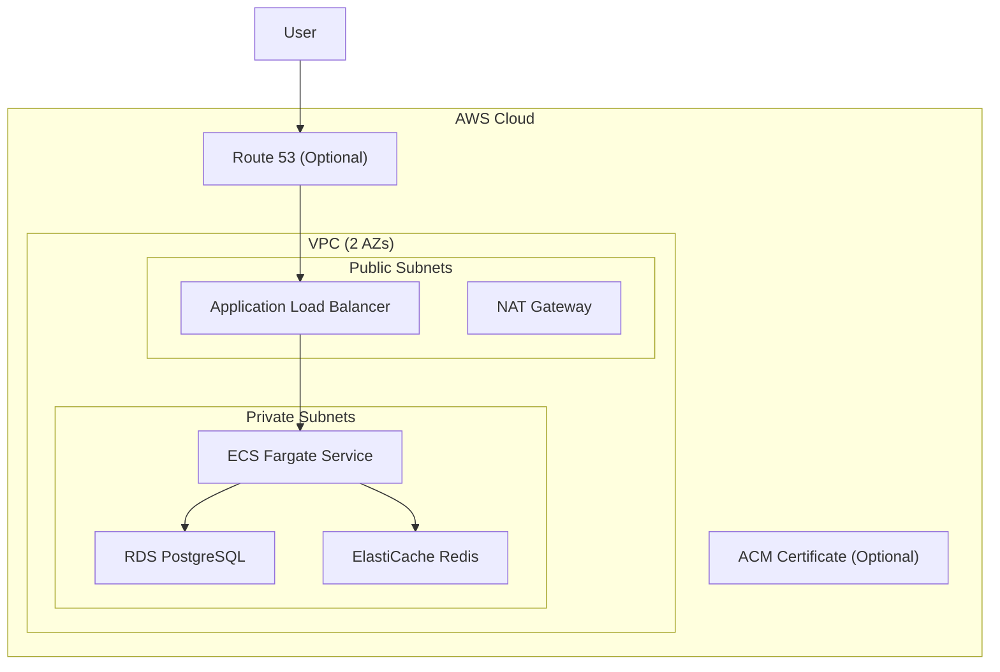

# AWS Deployment Plan for Activepieces

## Deployment Options

The repository provides two AWS deployment approaches:


| Option                   | Best For                            | Complexity | Infrastructure                  |
| ------------------------ | ----------------------------------- | ---------- | ------------------------------- |
| **Pulumi (ECS Fargate)** | Serverless containers, simpler ops  | Medium     | VPC, ALB, ECS, RDS, ElastiCache |
| **Helm (EKS)**           | Existing K8s clusters, more control | Higher     | EKS cluster + Helm chart        |


---

## Option 1: Pulumi (ECS Fargate) - Recommended

### Architecture




### What Gets Deployed

- **VPC** with 2 availability zones, public/private subnets, NAT Gateway
- **ECS Cluster** with Fargate service (serverless containers)
- **Application Load Balancer** with health checks
- **RDS PostgreSQL** (optional, or use SQLite)
- **ElastiCache Redis** (optional, or use in-memory)
- **Route 53 + ACM** (optional, for custom domain with SSL)

### Deployment Steps

**Step 1: Prerequisites**

```bash
# Install tools
brew install node pulumi awscli

# Configure AWS CLI
aws configure
```

**Step 2: One-Click Deploy (Pulumi Cloud)**

If using Pulumi Cloud with AWS OIDC integration:

[Deploy with Pulumi](https://app.pulumi.com/new?template=https://github.com/activepieces/activepieces/tree/main/deploy/pulumi)

**Step 3: Local Deploy with S3 State**

```bash
# Create S3 bucket for Pulumi state
aws s3api create-bucket --bucket my-pulumi-state --region us-east-1

# Login to Pulumi backend
pulumi login s3://my-pulumi-state?region=us-east-1

# Create project from template
mkdir deploy-activepieces && cd deploy-activepieces
pulumi new https://github.com/activepieces/activepieces/tree/main/deploy/pulumi

# Deploy (follow prompts for configuration)
pulumi up
```

**Step 4: Deploy from Local Build (Custom Image)**

```bash
cd deploy/pulumi
npm install

# Use existing stack config or create new
pulumi stack init activepieces-prod
pulumi up
```

### Configuration Options

Key settings in [deploy/pulumi/Pulumi.yaml](deploy/pulumi/Pulumi.yaml):


| Config               | Default        | Description                 |
| -------------------- | -------------- | --------------------------- |
| `containerCpu`       | 256            | CPU units (256 = 0.25 vCPU) |
| `containerMemory`    | 512            | Memory in MB                |
| `containerInstances` | 1              | Number of Fargate tasks     |
| `usePostgres`        | true           | Use RDS PostgreSQL          |
| `dbInstanceClass`    | db.t3.micro    | RDS instance size           |
| `useRedis`           | true           | Use ElastiCache Redis       |
| `redisNodeType`      | cache.t3.micro | Redis node size             |
| `domain`             | -              | Route 53 hosted zone        |
| `subDomain`          | -              | Subdomain for app           |


### Cost Estimate (Monthly)


| Resource          | Size             | Estimated Cost |
| ----------------- | ---------------- | -------------- |
| ECS Fargate       | 0.25 vCPU, 512MB | ~$10           |
| ALB               | Standard         | ~$20           |
| RDS PostgreSQL    | db.t3.micro      | ~$15           |
| ElastiCache Redis | cache.t3.micro   | ~$12           |
| NAT Gateway       | Single           | ~$35           |
| **Total**         |                  | **~$92/mo**    |


---

## Option 2: Helm Chart (EKS)

### Use Case

Deploy to an existing EKS cluster or when you need Kubernetes-native features (HPA, custom networking, service mesh).

### Prerequisites

- EKS cluster with kubectl access
- Helm 3 installed
- External PostgreSQL and Redis (or enable bundled subcharts)

### Deployment Steps

**Step 1: Create EKS Cluster (if needed)**

```bash
eksctl create cluster --name activepieces-cluster --region us-east-1 \
  --nodegroup-name standard-workers --node-type t3.medium --nodes 2
```

**Step 2: Create Secrets**

```bash
# Create namespace
kubectl create namespace activepieces

# Create secrets
kubectl create secret generic activepieces-auth-secrets \
  --namespace activepieces \
  --from-literal=AP_ENCRYPTION_KEY=$(openssl rand -hex 16) \
  --from-literal=AP_JWT_SECRET=$(openssl rand -hex 32)

kubectl create secret generic activepieces-db-secrets \
  --namespace activepieces \
  --from-literal=AP_POSTGRES_HOST=your-rds-endpoint \
  --from-literal=AP_POSTGRES_PORT=5432 \
  --from-literal=AP_POSTGRES_DATABASE=activepieces \
  --from-literal=AP_POSTGRES_USERNAME=postgres \
  --from-literal=AP_POSTGRES_PASSWORD=your-password
```

**Step 3: Install Helm Chart**

```bash
cd deploy/activepieces-helm

# Install with custom values
helm install activepieces . \
  --namespace activepieces \
  --set activepieces.frontendUrl=https://activepieces.yourdomain.com \
  --set activepieces.edition=ce \
  --set ingress.enabled=true \
  --set ingress.className=alb \
  --set ingress.annotations."alb\.ingress\.kubernetes\.io/scheme"=internet-facing
```

### Key Helm Values

From [deploy/activepieces-helm/values.yaml](deploy/activepieces-helm/values.yaml):

```yaml
replicaCount: 1
image:
  repository: ghcr.io/activepieces/activepieces
  tag: ""  # Uses appVersion from Chart.yaml

activepieces:
  frontendUrl: "https://activepieces.yourdomain.com"
  edition: "ce"
  executionMode: "SANDBOX_CODE_ONLY"
  environment: "prod"

ingress:
  enabled: true
  className: "alb"  # AWS Load Balancer Controller
  annotations:
    alb.ingress.kubernetes.io/scheme: internet-facing
    alb.ingress.kubernetes.io/target-type: ip

autoscaling:
  enabled: true
  minReplicas: 1
  maxReplicas: 10
  targetCPUUtilizationPercentage: 80
```

---

## Files Reference


| File                                                                                       | Purpose                             |
| ------------------------------------------------------------------------------------------ | ----------------------------------- |
| [deploy/pulumi/index.ts](deploy/pulumi/index.ts)                                           | Pulumi infrastructure code          |
| [deploy/pulumi/Pulumi.yaml](deploy/pulumi/Pulumi.yaml)                                     | Pulumi template with config options |
| [deploy/pulumi/Pulumi.activepieces-dev.yaml](deploy/pulumi/Pulumi.activepieces-dev.yaml)   | Dev stack config                    |
| [deploy/pulumi/Pulumi.activepieces-prod.yaml](deploy/pulumi/Pulumi.activepieces-prod.yaml) | Prod stack config                   |
| [deploy/activepieces-helm/](deploy/activepieces-helm/)                                     | Helm chart for Kubernetes           |
| [docs/install/options/aws.mdx](docs/install/options/aws.mdx)                               | Official AWS documentation          |


---

## Recommendation

**Use Pulumi (Option 1)** for:

- Simpler operations (no Kubernetes to manage)
- Lower learning curve
- All-in-one deployment script

**Use Helm (Option 2)** for:

- Existing EKS infrastructure
- Need for advanced K8s features (HPA, PodDisruptionBudget)
- Multi-tenant or complex networking requirements

## No Changes Required

All AWS deployment configurations already exist in the repository.