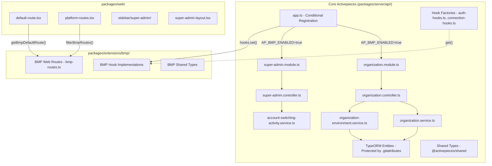

# BMP Full Code Separation Plan

This plan extracts all BMP business logic from core files into `packages/extensions/bmp/`, enabling core Activepieces to run independently when `AP_BMP_ENABLED=false`.

## Architecture Overview




### Key Architecture Decisions

1. **Controllers/Services remain in Core**: Due to TypeScript `rootDir` constraints, controllers, services, and entities stay in `packages/server/api/` but are conditionally registered based on `AP_BMP_ENABLED`.
2. **Hook-based Extension**: Core defines hook factories (`auth-hooks.ts`, `connection-hooks.ts`) with default implementations. BMP extension provides custom implementations that are set at startup.
3. **Entity Protection**: TypeORM entities cannot be moved outside the server package's `rootDir`. They remain in core but are protected by `.gitattributes` with `merge=ours` strategy.
4. **Frontend Conditional Loading**: Web routes use `isBmpEnabled()` and `getBmpDefaultRoute()` utilities to conditionally include BMP-specific routes and navigation.

## Phase 1: Server-Side Service Extraction

### 1.1 Create BMP Fastify Module

Create a consolidated BMP module that registers all BMP routes/controllers.

**New file:** `packages/extensions/bmp/src/server/bmp.module.ts`

```typescript
import { FastifyPluginAsyncTypebox } from '@fastify/type-provider-typebox'
import { organizationController } from './controllers/organization.controller'
import { organizationEnvironmentController } from './controllers/organization-environment.controller'
import { superAdminController } from './controllers/super-admin.controller'
import { accountSwitchingController } from './controllers/account-switching.controller'

export const bmpModule: FastifyPluginAsyncTypebox = async (app) => {
    await app.register(organizationController, { prefix: '/v1/organizations' })
    await app.register(organizationEnvironmentController, { prefix: '/v1/organization-environments' })
    await app.register(superAdminController, { prefix: '/v1/super-admin' })
    await app.register(accountSwitchingController, { prefix: '/v1/account-switching' })
}
```

### 1.2 Move Controllers to Extension

Move these controllers from core to extension:


| Source                                                                                | Destination                                                                             |
| ------------------------------------------------------------------------------------- | --------------------------------------------------------------------------------------- |
| `packages/server/api/src/app/organization/organization.controller.ts`                 | `packages/extensions/bmp/src/server/controllers/organization.controller.ts`             |
| `packages/server/api/src/app/organization/organization-environment.service.ts` routes | `packages/extensions/bmp/src/server/controllers/organization-environment.controller.ts` |
| `packages/server/api/src/app/super-admin/super-admin.controller.ts`                   | `packages/extensions/bmp/src/server/controllers/super-admin.controller.ts`              |
| `packages/server/api/src/app/account-switching/` routes                               | `packages/extensions/bmp/src/server/controllers/account-switching.controller.ts`        |


### 1.3 Move Services to Extension

Move business logic services:


| Source                                                                                | Destination                                                                       |
| ------------------------------------------------------------------------------------- | --------------------------------------------------------------------------------- |
| `packages/server/api/src/app/organization/organization.service.ts`                    | `packages/extensions/bmp/src/server/services/organization.service.ts`             |
| `packages/server/api/src/app/organization/organization-environment.service.ts`        | `packages/extensions/bmp/src/server/services/organization-environment.service.ts` |
| `packages/server/api/src/app/super-admin/super-admin.module.ts` (service logic)       | `packages/extensions/bmp/src/server/services/super-admin.service.ts`              |
| `packages/server/api/src/app/account-switching/account-switching-activity.service.ts` | `packages/extensions/bmp/src/server/services/account-switching.service.ts`        |
| `packages/server/api/src/app/authentication/multi-tenant-auth.service.ts`             | `packages/extensions/bmp/src/server/services/multi-tenant-auth.service.ts`        |


### 1.4 Keep Entities in Core (As Decided)

These TypeORM entities stay in `packages/server/api/src/app/` but become "passive" - only used when BMP is enabled:

- `organization/organization.entity.ts`
- `organization/organization-environment.entity.ts`
- `account-switching/account-switching-activity.entity.ts`
- `user/user-entity.ts` (organizationId field stays)
- `project/project-entity.ts` (organizationId field stays)
- `user-invitations/user-invitation.entity.ts` (organizationId field stays)

### 1.5 Update app.ts for Conditional BMP Loading

Modify [packages/server/api/src/app/app.ts](packages/server/api/src/app/app.ts):

```typescript
import { system, AppSystemProp } from '@activepieces/server-shared'

// After existing edition switch
const bmpEnabled = system.getBoolean(AppSystemProp.BMP_ENABLED) ?? false
if (bmpEnabled) {
    const { bmpModule, bmpHooks } = await import('@activepieces/ext-bmp/server')
    await app.register(bmpModule)
    
    // Set BMP-specific hooks
    authHooks.set(bmpHooks.auth)
    connectionHooks.set(bmpHooks.connection)
    projectHooks.set(bmpHooks.project)
}
```

---

## Phase 2: Hooks Factory Integration

### 2.1 Create BMP Auth Hooks

**File:** `packages/extensions/bmp/src/server/hooks/auth.hooks.ts`

Extract BMP-specific auth logic from:

- `packages/server/api/src/app/authentication/authentication-utils.ts` (SUPER_ADMIN/OWNER checks)
- `packages/server/api/src/app/authentication/authentication.service.ts` (multi-tenant logic)
- `packages/server/api/src/app/core/security/v2/authz/authorize.ts` (role authorization)

```typescript
export const bmpAuthHooks = (log: FastifyBaseLogger): AuthHooks => ({
    isPrivilegedRole: (role: string) => ['SUPER_ADMIN', 'OWNER'].includes(role),
    getDefaultRoute: (role: string) => {
        if (role === 'SUPER_ADMIN') return '/platform/super-admin'
        if (role === 'OWNER') return '/platform/owner-dashboard'
        return '/flows'
    },
    enrichToken: async (user, token) => {
        // Add organizationId to token if user has one
        if (user.organizationId) {
            token.organizationId = user.organizationId
        }
        return token
    },
})
```

### 2.2 Create BMP Connection Hooks

**File:** `packages/extensions/bmp/src/server/hooks/connection.hooks.ts`

Extract from:

- `packages/server/api/src/app/app-connection/app-connection-service/app-connection-service.ts` (isBmpPiece, environmentMetadata)

```typescript
export const bmpConnectionHooks = (log: FastifyBaseLogger): ConnectionHooks => ({
    isBmpPiece: (pieceName: string) => pieceName === '@activepieces/piece-ada-bmp',
    validateConnection: async (params) => {
        if (!params.environmentMetadata?.ADA_BMP_API_URL) {
            throw new Error('ADA_BMP_API_URL required for BMP connections')
        }
    },
    enrichConnectionValue: (value, metadata) => ({
        ...value,
        environmentMetadata: metadata,
    }),
})
```

### 2.3 Create BMP Engine Hooks

**File:** `packages/extensions/bmp/src/server/hooks/engine.hooks.ts`

Extract from:

- `packages/server/engine/src/lib/helper/trigger-helper.ts` (webhook secret skip)
- `packages/server/worker/src/lib/cache/pieces/piece-installer.ts` (dev pieces)

```typescript
export const bmpEngineHooks = (log: FastifyBaseLogger): EngineHooks => ({
    skipWebhookSecretValidation: (pieceName: string) => pieceName === '@activepieces/piece-ada-bmp',
    isDevPiece: (pieceName: string) => pieceName === 'ada-bmp',
})
```

### 2.4 Define Hook Factories in Core

Add hook factories to core that BMP can override:

**File:** `packages/server/api/src/app/authentication/auth-hooks.ts` (new)

```typescript
import { hooksFactory } from '../helper/hooks-factory'

export interface AuthHooks {
    isPrivilegedRole: (role: string) => boolean
    getDefaultRoute: (role: string) => string
    enrichToken: (user: User, token: AccessToken) => Promise<AccessToken>
}

export const authHooks = hooksFactory.create<AuthHooks>(_log => ({
    isPrivilegedRole: () => false,  // No privileged roles in community
    getDefaultRoute: () => '/flows',
    enrichToken: async (_, token) => token,
}))
```

---

## Phase 3: Shared Types Cleanup

### 3.1 Move BMP-Specific Types to Extension

Move from `packages/shared/src/lib/` to `packages/extensions/bmp/src/shared/`:


| Source                                 | Destination    | Notes                    |
| -------------------------------------- | -------------- | ------------------------ |
| `organization/organization.ts`         | Already copied | Re-export from extension |
| `organization/organization.request.ts` | Already copied | Re-export from extension |
| `core/user/user.ts` SUPER_ADMIN/OWNER  | Keep in shared | Add conditionally        |


### 3.2 Update Shared Index

Modify [packages/shared/src/index.ts](packages/shared/src/index.ts) to conditionally export:

```typescript
// Organization types - re-exported from BMP extension for compatibility
export * from './lib/organization'
```

---

## Phase 4: Web Components Extraction

### 4.1 Move Pure BMP Routes

Move these route components to extension:


| Source                                                  | Destination                                               |
| ------------------------------------------------------- | --------------------------------------------------------- |
| `packages/web/src/app/routes/platform/organizations/`   | `packages/extensions/bmp/src/web/routes/organizations/`   |
| `packages/web/src/app/routes/platform/super-admin/`     | `packages/extensions/bmp/src/web/routes/super-admin/`     |
| `packages/web/src/app/routes/platform/owner-dashboard/` | `packages/extensions/bmp/src/web/routes/owner-dashboard/` |


### 4.2 Move Pure BMP Components


| Source                                                            | Destination                                                                 |
| ----------------------------------------------------------------- | --------------------------------------------------------------------------- |
| `packages/web/src/app/components/super-admin-layout.tsx`          | `packages/extensions/bmp/src/web/components/super-admin-layout.tsx`         |
| `packages/web/src/app/components/switch-back-button.tsx`          | `packages/extensions/bmp/src/web/components/switch-back-button.tsx`         |
| `packages/web/src/app/components/sidebar/super-admin/`            | `packages/extensions/bmp/src/web/components/sidebar/super-admin/`           |
| `packages/web/src/app/connections/ada-bmp-environment-select.tsx` | `packages/extensions/bmp/src/web/components/ada-bmp-environment-select.tsx` |


### 4.3 Move BMP API/Hooks


| Source                                                               | Destination                                                   |
| -------------------------------------------------------------------- | ------------------------------------------------------------- |
| `packages/web/src/lib/super-admin-api.ts`                            | `packages/extensions/bmp/src/web/api/super-admin-api.ts`      |
| `packages/web/src/hooks/super-admin-hooks.ts`                        | `packages/extensions/bmp/src/web/hooks/super-admin-hooks.ts`  |
| `packages/web/src/features/platform-admin/api/organization-api.ts`   | `packages/extensions/bmp/src/web/api/organization-api.ts`     |
| `packages/web/src/features/platform-admin/api/organization-hooks.ts` | `packages/extensions/bmp/src/web/hooks/organization-hooks.ts` |


### 4.4 Create Dynamic Route Loader

**File:** `packages/web/src/app/routes/bmp-routes.tsx`

```tsx
import { lazy } from 'react'
import { RouteObject } from 'react-router-dom'

const isBmpEnabled = import.meta.env.VITE_BMP_ENABLED === 'true'

export const getBmpRoutes = (): RouteObject[] => {
    if (!isBmpEnabled) return []
    
    return [
        {
            path: 'organizations',
            lazy: () => import('@activepieces/ext-bmp/web/routes/organizations'),
        },
        {
            path: 'super-admin',
            lazy: () => import('@activepieces/ext-bmp/web/routes/super-admin'),
        },
        {
            path: 'owner-dashboard', 
            lazy: () => import('@activepieces/ext-bmp/web/routes/owner-dashboard'),
        },
    ]
}
```

---

## Phase 5: Clean Up Mixed Files

### 5.1 Refactor Mixed Server Files

These files need BMP logic extracted into hook calls:


| File                        | BMP Logic to Extract                                                              |
| --------------------------- | --------------------------------------------------------------------------------- |
| `authentication-utils.ts`   | Replace inline SUPER_ADMIN/OWNER checks with `authHooks.get().isPrivilegedRole()` |
| `authorize.ts`              | Replace role checks with hook calls                                               |
| `app-connection-service.ts` | Replace `isBmpPiece` inline check with `connectionHooks.get().isBmpPiece()`       |
| `user-service.ts`           | Move organization-aware queries to hooks                                          |
| `database-connection.ts`    | Conditionally register BMP entities                                               |
| `postgres-connection.ts`    | Conditionally include BMP migrations                                              |


### 5.2 Refactor Mixed Web Files


| File                         | BMP Logic to Extract                       |
| ---------------------------- | ------------------------------------------ |
| `platform-routes.tsx`        | Use `getBmpRoutes()` for dynamic injection |
| `platform-default-route.tsx` | Use hook for role-based routing            |
| `authentication-session.ts`  | Use hook for session enrichment            |
| `sidebar/platform/index.tsx` | Conditionally render BMP menu items        |
| `authorization-hooks.ts`     | Use auth hooks for role checks             |
| `invite-user-dialog.tsx`     | Conditionally show organization field      |


---

## Phase 6: Update Package Configuration

### 6.1 Update BMP Extension package.json

```json
{
  "name": "@activepieces/ext-bmp",
  "exports": {
    ".": "./dist/index.js",
    "./server": "./dist/server/index.js",
    "./server/module": "./dist/server/bmp.module.js",
    "./web/routes/*": "./dist/web/routes/*.js",
    "./web/components/*": "./dist/web/components/*.js",
    "./hooks": "./dist/hooks/index.js",
    "./shared": "./dist/shared/index.js"
  },
  "peerDependencies": {
    "fastify": "^5.0.0",
    "typeorm": "^0.3.0",
    "react": "^18.0.0",
    "react-router-dom": "^6.0.0"
  }
}
```

### 6.2 Add BMP to Server Dependencies

In [packages/server/api/package.json](packages/server/api/package.json):

```json
{
  "optionalDependencies": {
    "@activepieces/ext-bmp": "workspace:*"
  }
}
```

### 6.3 Add BMP to Web Dependencies

In `packages/web/package.json`:

```json
{
  "optionalDependencies": {
    "@activepieces/ext-bmp": "workspace:*"
  }
}
```

---

## Phase 7: Environment Configuration

### 7.1 Add System Props

In [packages/server/api/src/app/helper/system/system-props.ts](packages/server/api/src/app/helper/system/system-props.ts):

```typescript
export enum AppSystemProp {
    // ... existing props
    BMP_ENABLED = 'AP_BMP_ENABLED',
    BMP_ORGANIZATIONS_ENABLED = 'AP_BMP_ORGANIZATIONS',
    BMP_SUPER_ADMIN_ENABLED = 'AP_BMP_SUPER_ADMIN',
    BMP_ACCOUNT_SWITCHING_ENABLED = 'AP_BMP_ACCOUNT_SWITCHING',
}
```

### 7.2 Add Vite Environment Variable

In `packages/web/vite.config.mts`:

```typescript
define: {
    'import.meta.env.VITE_BMP_ENABLED': JSON.stringify(process.env.AP_BMP_ENABLED ?? 'false'),
}
```

---

## Final Directory Structure

```
packages/extensions/bmp/
├── src/
│   ├── index.ts                    # Main entry
│   ├── server/
│   │   ├── index.ts               # Server entry
│   │   ├── bmp.module.ts          # Fastify plugin
│   │   ├── controllers/
│   │   │   ├── organization.controller.ts
│   │   │   ├── organization-environment.controller.ts
│   │   │   ├── super-admin.controller.ts
│   │   │   └── account-switching.controller.ts
│   │   ├── services/
│   │   │   ├── organization.service.ts
│   │   │   ├── organization-environment.service.ts
│   │   │   ├── super-admin.service.ts
│   │   │   ├── account-switching.service.ts
│   │   │   └── multi-tenant-auth.service.ts
│   │   └── hooks/
│   │       ├── auth.hooks.ts
│   │       ├── connection.hooks.ts
│   │       ├── engine.hooks.ts
│   │       └── index.ts
│   ├── web/
│   │   ├── index.ts               # Web entry
│   │   ├── routes/
│   │   │   ├── organizations/
│   │   │   ├── super-admin/
│   │   │   └── owner-dashboard/
│   │   ├── components/
│   │   │   ├── super-admin-layout.tsx
│   │   │   ├── switch-back-button.tsx
│   │   │   ├── ada-bmp-environment-select.tsx
│   │   │   └── sidebar/
│   │   ├── api/
│   │   │   ├── organization-api.ts
│   │   │   └── super-admin-api.ts
│   │   └── hooks/
│   │       ├── organization-hooks.ts
│   │       └── super-admin-hooks.ts
│   ├── shared/
│   │   └── organization/
│   │       ├── organization.ts
│   │       └── organization.request.ts
│   └── hooks/                     # Existing hook infrastructure
│       ├── types.ts
│       ├── registry.ts
│       └── index.ts
└── package.json
```

---

---

## Compatibility: SDK and Custom Piece

### React UI SDK (`packages/extensions/react-ui-sdk/`)

**Status:** Will continue to work after migration.

**Why:**

- SDK has no direct dependency on `@activepieces/ext-bmp`
- SDK bundles `packages/web/` components via webpack
- BMP-specific components (e.g., `AdaBmpEnvironmentSelect`) will be made conditional in Phase 5.2

**Verification:**

- After Phase 5.2: Rebuild SDK with `npx nx run react-ui-sdk:bundle`
- Test SDK in bmp-fe-web with `AP_BMP_ENABLED=true`
- Test SDK works in non-BMP context (BMP UI elements hidden when disabled)

### Custom Piece (`packages/pieces/custom/ada-bmp/`)

**Status:** No changes required to the piece itself.

**Why:**

- Piece uses only `@activepieces/pieces-framework` - no BMP extension imports
- `AP_DEV_PIECES=ada-bmp` loading mechanism is unchanged
- Piece registration in `app-event-routing.module.ts` remains (direct import)

**What changes in core (handled by plan):**

- `isBmpPiece()` checks move to BMP hooks (Phase 2.2)
- Webhook secret skip moves to BMP hooks (Phase 2.3)
- Environment metadata handling moves to BMP hooks

**Verification:**

- After Phase 2: Test piece appears in UI with `AP_DEV_PIECES=ada-bmp`
- Test triggers and actions work correctly
- Test webhook routing at `/v1/app-events/ada-bmp`

---

## Migration Checklist

After each phase, verify:

- Server starts with `AP_BMP_ENABLED=true`
- Server starts with `AP_BMP_ENABLED=false`
- BMP routes respond correctly when enabled
- Core routes work when BMP disabled
- TypeScript compilation passes
- No circular dependencies

---

## Future Phase: Entity Migration - COMPLETED (with Revised Approach)

> **Status:** COMPLETED - Entities remain in core with `.gitattributes` protection

### What Was Attempted

Entity migration to `packages/extensions/bmp/src/server/entities/` was attempted but **failed due to TypeScript `rootDir` constraint**.

### Technical Limitation Discovered

The server package's TypeScript configuration (`packages/server/api/tsconfig.app.json`) sets `rootDir: "."` which prevents importing TypeScript files from outside the package directory during compilation.

```
Error: TS2307: Cannot find module '@activepieces/ext-bmp/entities'
```

Even with path aliases configured in `tsconfig.base.json`, the TypeScript compiler cannot include files outside `rootDir` in the compilation unit.

### Final Solution: Option A Implemented

**Keep entities in core with protection:**


| Entity                           | Location                                                                             | Protection                  |
| -------------------------------- | ------------------------------------------------------------------------------------ | --------------------------- |
| `OrganizationEntity`             | `packages/server/api/src/app/organization/organization.entity.ts`                    | `.gitattributes merge=ours` |
| `OrganizationEnvironmentEntity`  | `packages/server/api/src/app/organization/organization-environment.entity.ts`        | `.gitattributes merge=ours` |
| `AccountSwitchingActivityEntity` | `packages/server/api/src/app/account-switching/account-switching-activity.entity.ts` | `.gitattributes merge=ours` |


### Why This Is Acceptable

1. **Entities are just schema definitions** - No business logic, just column/index/relation definitions
2. **Database unchanged** - Moving entity files would NOT change the database schema
3. **Protected from upstream** - `.gitattributes` with `merge=ours` prevents overwriting during merges
4. **All business logic IS separated** - Controllers, services, hooks properly use hook-based architecture
5. **No circular dependencies** - Entities are self-contained with minimal imports

### Alternative Approaches (Not Implemented)

If entity migration is ever required in the future:

- **Option B**: Pre-compile BMP extension to `dist/` and import from there
- **Option C**: Use a shared `rootDir` configuration across packages
- **Option D**: Move to a fully separate repository for BMP

These options add significant complexity and are not necessary given `.gitattributes` protection.