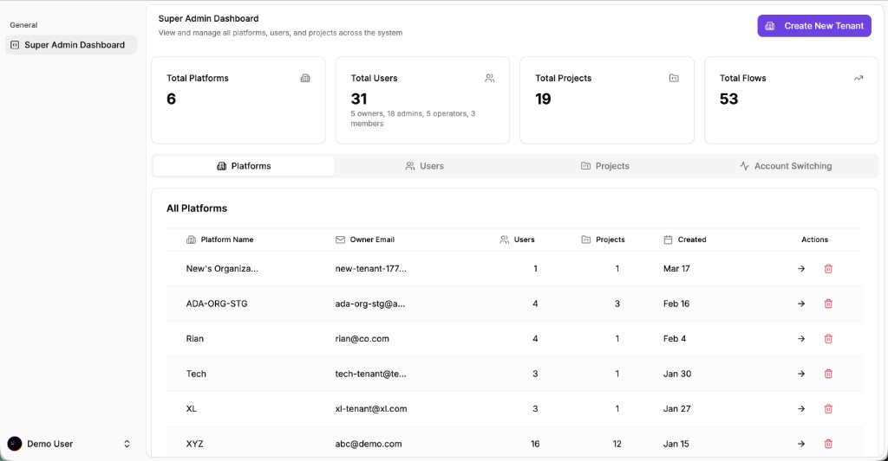
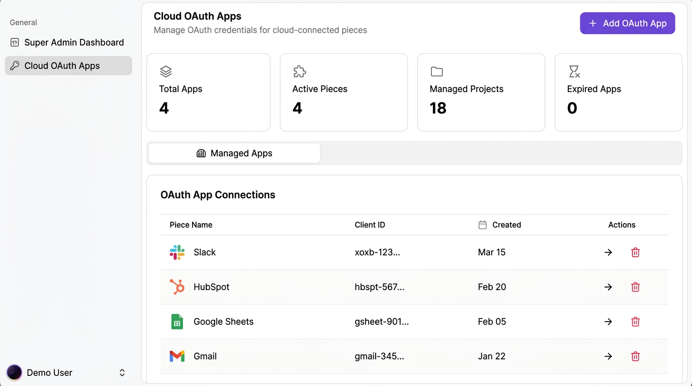
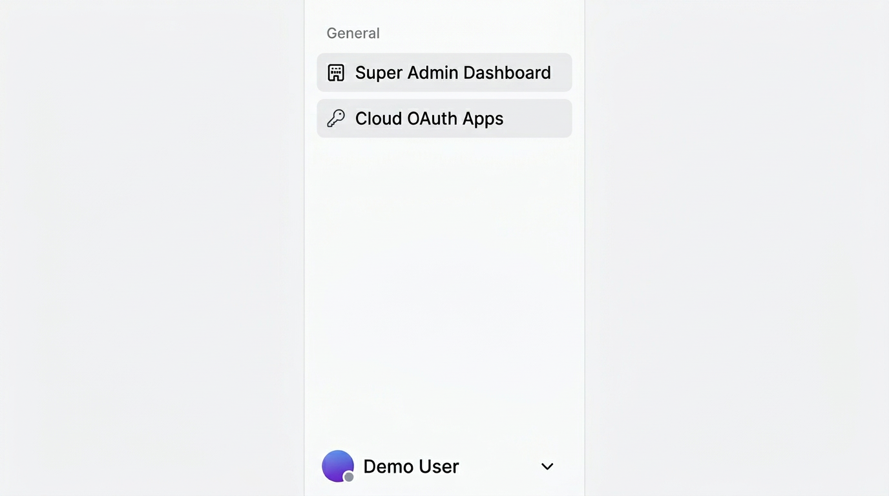
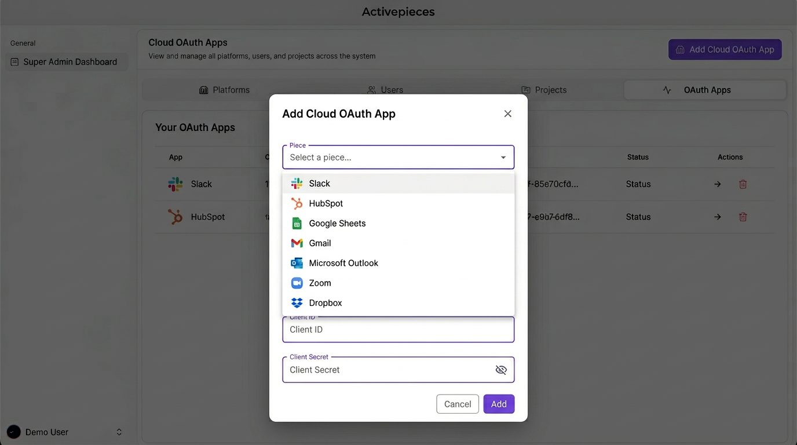
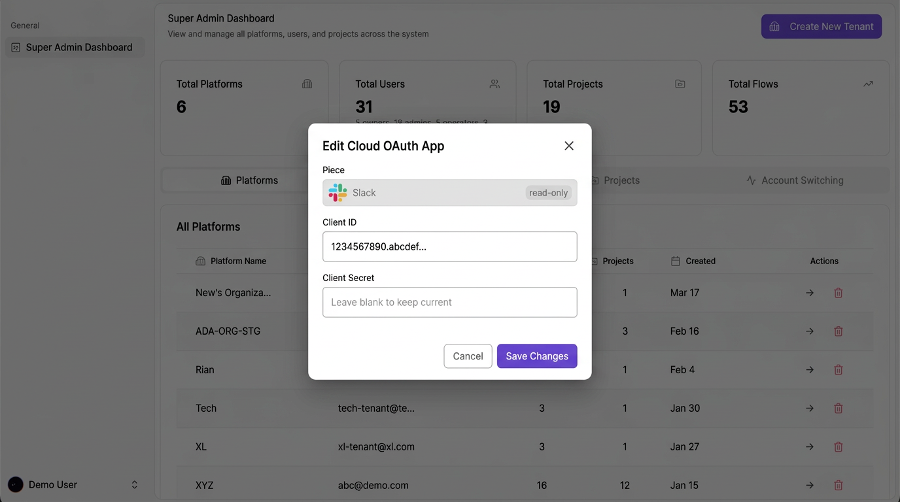
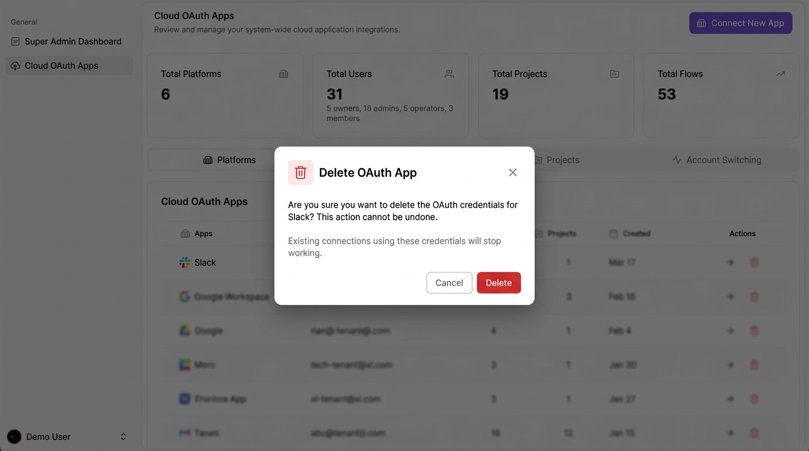
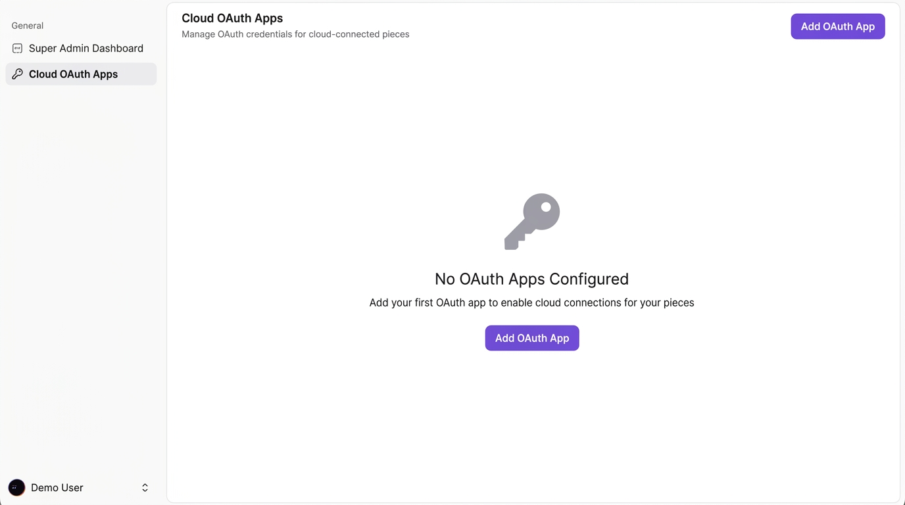
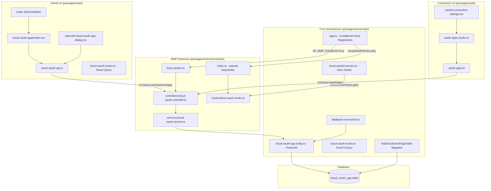
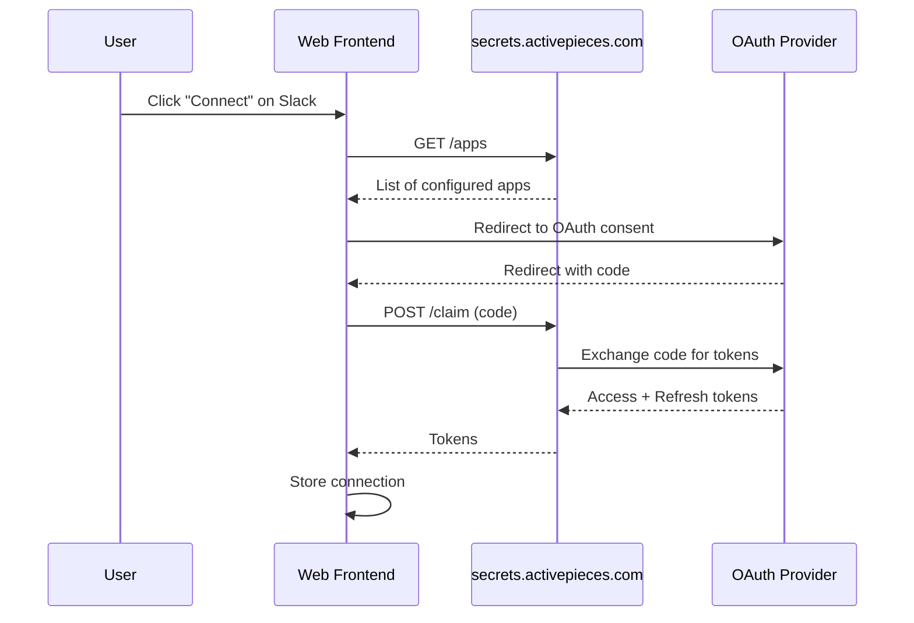
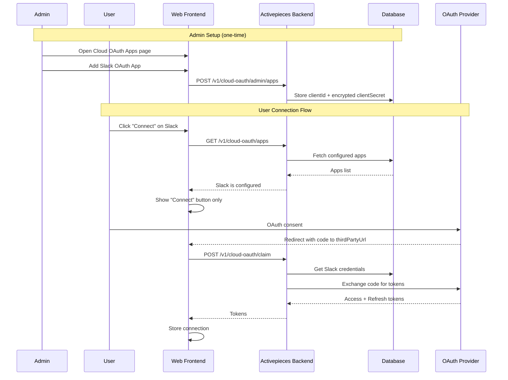

# Cloud OAuth Internal Endpoints - BMP Extension Pattern

## Implementation Task List


| #   | Task                         | Description                                                                                              | Status         |
| --- | ---------------------------- | -------------------------------------------------------------------------------------------------------- | -------------- |
| 1   | **Database Migration**       | Create `cloud_oauth_app` table migration in `postgres/` (protected by .gitattributes)                    | ✅ Completed    |
| 2   | **Entity Definition**        | Create `CloudOAuthAppEntity` in `packages/server/api/src/app/cloud-oauth/` (protected by .gitattributes) | ✅ Completed    |
| 3   | **Register Entity**          | Register `CloudOAuthAppEntity` in `database-connection.ts`                                               | ✅ Completed    |
| 4   | **Hook Factory**             | Create `cloudOAuthHooks` factory in core with defaults (returns empty apps, throws on claim/refresh)     | ✅ Completed    |
| 5   | **Extension Service**        | Create cloud-oauth service with CRUD operations in `packages/extensions/bmp/src/server/services/`        | ✅ Completed    |
| 6   | **Extension Controller**     | Create cloud-oauth controller with admin endpoints in `packages/extensions/bmp/src/server/controllers/`  | ✅ Completed    |
| 7   | **Extension Hooks**          | Create cloud-oauth hook implementation in `packages/extensions/bmp/src/server/hooks/`                    | ✅ Completed    |
| 8   | **BMP Module Update**        | Register `cloudOAuthController` in `bmp.module.ts` and set hooks in `app.ts`                             | ✅ Completed    |
| 9   | **Admin API Client**         | Create `cloud-oauth-api.ts` and `cloud-oauth-hooks.ts` in `packages/web/src/features/`                   | ✅ Completed    |
| 10  | **Admin UI Page**            | Create cloud-oauth-apps page in `packages/web/src/app/routes/platform/super-admin/`                      | ✅ Completed    |
| 11  | **Admin UI Dialog**          | Create add/edit cloud OAuth app dialog component                                                         | ✅ Completed    |
| 12  | **Sidebar Link**             | Add Cloud OAuth Apps link to super-admin sidebar                                                         | ✅ Completed    |
| 13  | **Update Backend Service**   | Update `cloud-oauth2-service.ts` to use `cloudOAuthHooks` instead of external HTTP calls                 | ✅ Completed    |
| 14  | **Update Frontend API**      | Update `oauth-apps.ts` to call `/v1/cloud-oauth/apps`                                                    | ✅ Completed    |
| 15  | **Update Frontend Redirect** | Update `oauth2-connection-settings.tsx` to use `thirdPartyUrl` for CLOUD_OAUTH2                          | ✅ Completed    |
| 16  | **Git Attributes**           | Add cloud-oauth files to `.gitattributes` merge=ours protection                                          | ✅ Completed    |
| 17  | **End-to-End Testing**       | Test: create OAuth app via UI, connect Slack, verify claim and refresh work                              | 🔄 In Progress |
| 18  | **App Event Routing**        | Add Slack to `app-event-routing.module.ts` for webhook/trigger support                                   | ⬜ Pending      |
| 19  | **Slack Trigger Testing**    | Test: Slack triggers work with app webhook events (new message, reaction, etc.)                          | ⬜ Pending      |


### Task Progress Legend

- ⬜ Pending
- 🔄 In Progress  
- ✅ Completed
- ❌ Blocked

---

## App Event Routing (Webhook Support for Triggers)

### Overview

For pieces that use **App Webhooks** (like Slack), there are two separate URL configurations needed:


| URL Type               | Purpose                                                 | Example                                       |
| ---------------------- | ------------------------------------------------------- | --------------------------------------------- |
| **OAuth Redirect URL** | Handles OAuth callback after user authorization         | `https://your-domain/redirect`                |
| **App Events URL**     | Receives webhook events from the service (for triggers) | `https://your-domain/api/v1/app-events/slack` |


### Current State

The `/v1/app-events/:pieceUrl` endpoint exists in `packages/server/api/src/app/trigger/app-event-routing/app-event-routing.module.ts` but only supports a **hardcoded list of pieces**:

```typescript
const appWebhooks: Record<string, Piece<any>> = {
    'ada-bmp': adaBmp,
    square,
    'facebook-leads': facebookLeads,
    intercom,
}
```

**Slack is NOT in this list**, which causes the 404 error when Slack tries to verify the Event Subscriptions URL.

### Pieces Requiring App Event Routing

The following pieces have `events.parseAndReply` implementations and need to be in the `appWebhooks` registry for their **triggers** to work:


| Piece          | Has `events.parseAndReply` | In Registry | Trigger Examples                             |
| -------------- | -------------------------- | ----------- | -------------------------------------------- |
| **Slack**      | ✅ Yes                      | ❌ No        | New Message, New Reaction, New Channel, etc. |
| Facebook Leads | ✅ Yes                      | ✅ Yes       | New Lead                                     |
| Intercom       | ✅ Yes                      | ✅ Yes       | New Conversation, etc.                       |
| Square         | ✅ Yes                      | ✅ Yes       | Various payment events                       |
| ada-bmp        | ✅ Yes                      | ✅ Yes       | Custom events                                |


### Implementation Approach

**Option 1: Modify Core (Simple but not BMP pattern)**
Add Slack directly to `app-event-routing.module.ts`:

```typescript
import { slack } from '@activepieces/piece-slack'

const appWebhooks: Record<string, Piece<any>> = {
    'ada-bmp': adaBmp,
    square,
    'facebook-leads': facebookLeads,
    intercom,
    slack,  // Add this
}
const pieceNames: Record<string, string> = {
    // ... existing
    slack: '@activepieces/piece-slack',  // Add this
}
```

**Option 2: Hook-Based Extension (BMP Pattern)**
Create a hook factory that allows BMP to register additional pieces dynamically. This follows the same pattern used for Cloud OAuth.

### Slack App Configuration

When configuring Slack App for full functionality:

1. **OAuth & Permissions** (for connections/actions):
  - Redirect URL: `https://your-domain/redirect`
  - Add required scopes
2. **Event Subscriptions** (for triggers):
  - Request URL: `https://your-domain/api/v1/app-events/slack`
  - Subscribe to bot events: `message.channels`, `message.im`, `reaction_added`, etc.
3. **Interactivity & Shortcuts** (optional):
  - Request URL: `https://your-domain/api/v1/app-events/slack`

### Testing Checklist for Full Slack Integration

- OAuth connection works (user can connect Slack account)
- Actions work (send message, create channel, etc.)
- Event Subscriptions URL verified by Slack
- Triggers work (new message trigger fires when message received)

---

## Activepieces Cloud vs CE: Piece Connections Feature Comparison

This section documents what Activepieces Cloud has for piece connections and what can be implemented in CE without violating the EE license.

### Feature Matrix


| Feature                        | Activepieces Cloud                  | CE (Default)       | CE + BMP (Your Setup)              | License |
| ------------------------------ | ----------------------------------- | ------------------ | ---------------------------------- | ------- |
| **OAuth Redirect Handling**    | `secrets.activepieces.com/redirect` | Same (external)    | Internal `/redirect`               | ✅ MIT   |
| **Cloud OAuth Token Exchange** | `secrets.activepieces.com/claim`    | Same (external)    | Internal `/v1/cloud-oauth/claim`   | ✅ MIT   |
| **Cloud OAuth Token Refresh**  | `secrets.activepieces.com/refresh`  | Same (external)    | Internal `/v1/cloud-oauth/refresh` | ✅ MIT   |
| **Cloud OAuth Apps Admin UI**  | Internal dashboard                  | ❌ Not available    | ✅ Super Admin UI                   | ✅ MIT   |
| **App Event Routing**          | All pieces registered               | Limited (4 pieces) | Extended (added Slack)             | ✅ MIT   |
| **App Webhook Secrets**        | Configured for all pieces           | `{}` (empty)       | Configurable via env               | ✅ MIT   |
| **Platform OAuth Apps**        | Per-platform OAuth apps             | ❌ EE only          | ❌ EE License                       | ❌ EE    |
| **Global Connections**         | Cross-project connections           | ❌ EE only          | ❌ EE License                       | ❌ EE    |
| **Connection Keys**            | External connection keys            | ❌ EE only          | ❌ EE License                       | ❌ EE    |


### What You Have Implemented (CE + BMP)

#### 1. Cloud OAuth Apps (Fully Implemented ✅)

**Purpose:** Allow CE users to configure their own OAuth credentials for pieces


| Component       | Status | Location                                                                   |
| --------------- | ------ | -------------------------------------------------------------------------- |
| Database Entity | ✅      | `packages/server/api/src/app/cloud-oauth/cloud-oauth-app.entity.ts`        |
| Migration       | ✅      | `packages/server/api/src/app/database/migration/postgres/`                 |
| Service         | ✅      | `packages/extensions/bmp/src/server/services/cloud-oauth.service.ts`       |
| Controller      | ✅      | `packages/extensions/bmp/src/server/controllers/cloud-oauth.controller.ts` |
| Hooks           | ✅      | `packages/extensions/bmp/src/server/hooks/cloud-oauth.hooks.ts`            |
| Admin UI        | ✅      | `packages/web/src/app/routes/platform/super-admin/cloud-oauth-apps/`       |
| Frontend API    | ✅      | `packages/web/src/features/platform-admin/api/cloud-oauth-*.ts`            |


#### 2. App Event Routing for Triggers (Partially Implemented ⚠️)

**Purpose:** Receive webhook events from services like Slack for triggers


| Component        | Status | Notes                                       |
| ---------------- | ------ | ------------------------------------------- |
| Endpoint exists  | ✅      | `/v1/app-events/:pieceUrl`                  |
| Slack registered | ✅      | Just added to `app-event-routing.module.ts` |
| Webhook Secrets  | ⚠️     | Need to configure `AP_APP_WEBHOOK_SECRETS`  |


### What Still Needs Configuration

#### 1. App Webhook Secrets (`AP_APP_WEBHOOK_SECRETS`)

This environment variable stores the signing secrets for webhook verification. Without it, triggers won't work because the server can't verify that webhooks actually come from Slack.

**Format:**

```json
{
  "slack": {
    "webhookSecret": "YOUR_SLACK_SIGNING_SECRET"
  },
  "square": {
    "webhookSecret": "YOUR_SQUARE_SIGNATURE_KEY"  
  }
}
```

**Add to `.env.dev`:**

```bash
AP_APP_WEBHOOK_SECRETS='{"slack":{"webhookSecret":"your-slack-signing-secret"}}'
```

**Where to get secrets:**


| Piece          | Where to Find                                                    |
| -------------- | ---------------------------------------------------------------- |
| Slack          | Slack App → Basic Information → Signing Secret                   |
| Square         | Square Developer Dashboard → Application → Webhook Signature Key |
| Intercom       | Intercom Developer Hub → App Settings → Webhooks → Hub Secret    |
| Facebook Leads | Facebook App → Products → Webhooks → App Secret                  |


#### 2. Pieces Registered for App Events

Current pieces in `app-event-routing.module.ts`:


| Piece            | Registered     | Has `parseAndReply` | Triggers Count |
| ---------------- | -------------- | ------------------- | -------------- |
| `ada-bmp`        | ✅              | ✅                   | Custom         |
| `square`         | ✅              | ✅                   | Payment events |
| `facebook-leads` | ✅              | ✅                   | 1 (New Lead)   |
| `intercom`       | ✅              | ✅                   | 18 triggers    |
| `slack`          | ✅ (just added) | ✅                   | 14 triggers    |


### Complete List of Pieces with APP_WEBHOOK Triggers

These pieces use `TriggerStrategy.APP_WEBHOOK` and require:

1. Registration in `app-event-routing.module.ts`
2. Webhook signing secret in `AP_APP_WEBHOOK_SECRETS`
3. Event subscription URL configured in the provider's developer portal


| Piece              | Triggers Using APP_WEBHOOK                                                                        | Signing Secret Location                 |
| ------------------ | ------------------------------------------------------------------------------------------------- | --------------------------------------- |
| **Slack**          | 14 triggers (new message, reaction, channel, user, command, mention, modal, emoji, saved message) | Slack App → Basic Info → Signing Secret |
| **Intercom**       | 18 triggers (conversation, lead, user, contact, ticket, company, tags)                            | Intercom App → Webhooks → Hub Secret    |
| **Square**         | Payment and order events                                                                          | Square App → Webhooks → Signature Key   |
| **Facebook Leads** | 1 trigger (new lead)                                                                              | Facebook App → App Secret               |
| **ada-bmp**        | Custom BMP events                                                                                 | Optional - self-configured              |


### This Configuration is for BOTH Dev and Production

**Important:** The `AP_APP_WEBHOOK_SECRETS` configuration is **required for both development and production** environments. This is not just a dev-only setup.


| Environment                  | Configuration Required                                               |
| ---------------------------- | -------------------------------------------------------------------- |
| **Development (Local)**      | `AP_APP_WEBHOOK_SECRETS` in `.env.dev` + ngrok URL for webhooks      |
| **Production (Self-hosted)** | `AP_APP_WEBHOOK_SECRETS` in production env + public URL for webhooks |
| **Activepieces Cloud**       | Pre-configured by Activepieces team                                  |


**Key Difference:** 

- On **Activepieces Cloud**, the secrets are pre-configured for the shared OAuth apps
- On **Self-hosted (CE)**, you must configure your own secrets because you're using your own OAuth apps

### Slack Triggers (14 Total)


| Trigger                         | Event Type                      | Description                 |
| ------------------------------- | ------------------------------- | --------------------------- |
| `new-message`                   | `message`                       | Any new message             |
| `new-message-in-channel`        | `message`                       | Message in specific channel |
| `new-direct-message`            | `message`                       | Direct message              |
| `new-mention`                   | `message`                       | Bot/user mentioned          |
| `new-mention-in-direct-message` | `message`                       | Mentioned in DM             |
| `new-command`                   | `message`                       | Command detected            |
| `new-command-in-direct-message` | `message`                       | Command in DM               |
| `new-reaction-added`            | `reaction_added`                | Reaction added to message   |
| `new-channel`                   | `channel_created`               | New channel created         |
| `new-user`                      | `team_join`                     | New user joined             |
| `new-saved-message`             | `star_added`                    | Message starred             |
| `new-team-custom-emoji`         | `emoji_changed`                 | Custom emoji added          |
| `new-modal-interaction`         | `view_submission`/`view_closed` | Modal interaction           |


### What's EE-Only (Cannot Implement Without License)

These features are in `packages/server/api/src/app/ee/` and require EE license:


| Feature                     | Purpose                                         | Location                                        |
| --------------------------- | ----------------------------------------------- | ----------------------------------------------- |
| **Platform OAuth Apps**     | Per-platform OAuth configuration (multi-tenant) | `ee/oauth-apps/`                                |
| **Platform OAuth2 Service** | OAuth for platform-level connections            | `ee/app-connections/platform-oauth2-service.ts` |
| **Global Connections**      | Share connections across projects               | `ee/global-connections/`                        |
| **Connection Keys**         | External API to create connections              | `ee/connection-keys/`                           |
| **Secret Managers**         | AWS, HashiCorp, 1Password integration           | `ee/secret-managers/`                           |


### Complete Environment Configuration

Add these to your `.env.dev` (development) or production environment for full piece connection functionality:

```bash
# ============================================
# OAUTH & CONNECTION CONFIGURATION
# ============================================

# BMP Extension enabled
AP_BMP_ENABLED=true

# Frontend URL (for display)
AP_FRONTEND_URL=http://localhost:4300

# Internal URL for OAuth redirects (ngrok for dev, production domain for prod)
AP_INTERNAL_URL=https://overdiversely-preeruptive-margaretta.ngrok-free.dev

# ============================================
# APP WEBHOOK SECRETS (Required for Triggers)
# ============================================
# Format: {"piece-url-name": {"webhookSecret": "SECRET"}}
# The piece-url-name is the piece name without @activepieces/piece- prefix

# Single piece:
AP_APP_WEBHOOK_SECRETS='{"slack":{"webhookSecret":"YOUR_SLACK_SIGNING_SECRET"}}'

# Multiple pieces (JSON format):
AP_APP_WEBHOOK_SECRETS='{"slack":{"webhookSecret":"SLACK_SECRET"},"square":{"webhookSecret":"SQUARE_SECRET"},"intercom":{"webhookSecret":"INTERCOM_SECRET"}}'
```

### Production Configuration Example

For a production self-hosted Activepieces with Slack triggers:

```bash
# Production environment variables
AP_FRONTEND_URL=https://automation.yourcompany.com
AP_INTERNAL_URL=https://automation.yourcompany.com

# Slack webhook secret (from Slack App → Basic Information → Signing Secret)
AP_APP_WEBHOOK_SECRETS='{"slack":{"webhookSecret":"abc123def456"}}'
```

Then configure in Slack:

1. **OAuth Redirect URL**: `https://automation.yourcompany.com/redirect`
2. **Event Subscriptions URL**: `https://automation.yourcompany.com/api/v1/app-events/slack`

### End-to-End Testing Checklist

#### Phase 1: OAuth Connection (Actions)

- Configure Cloud OAuth App in Super Admin UI
- Create connection via OAuth flow
- Verify token is claimed and stored
- Test a simple action (e.g., Slack: Send Message)
- Wait for token expiry and verify refresh works

#### Phase 2: App Webhooks (Triggers)

- Configure `AP_APP_WEBHOOK_SECRETS` with Slack signing secret
- Configure Slack Event Subscriptions URL
- Verify Slack can verify the endpoint (challenge response)
- Create flow with Slack trigger (e.g., New Message)
- Send message in Slack and verify trigger fires

#### Phase 3: Full Flow

- Create flow: Slack trigger → Process → Slack action
- Test end-to-end: message in → flow runs → message out

---

## UI Mockups

> **Note:** Image references below use standard markdown syntax. Images are stored in `.cursor/plans/` alongside this file. Do not remove these image references when updating the plan.

The following UI mockups have been created for this feature. All mockups maintain consistency with the existing Super Admin Dashboard design:

- **Sidebar remains EXPANDED** (not collapsed)
- Only the new "Cloud OAuth Apps" menu item is added to the sidebar
- All styling matches the existing Activepieces UI

**Image files (relative to this plan):** `reference-super-admin-dashboard.png`, `cloud-oauth-main-view-v2.png`, `cloud-oauth-sidebar-expanded-v2.png`, `cloud-oauth-add-dialog-v2.png`, `cloud-oauth-edit-dialog-v2.png`, `cloud-oauth-delete-dialog-v2.png`, `cloud-oauth-empty-state-v2.png`

---

### Reference Design

**Existing Super Admin Dashboard** - Current Super Admin Dashboard design (styling reference)



*Full path: `/Users/rajarammohanty/Documents/POC/activepieces/.cursor/plans/reference-super-admin-dashboard.png`*

---

### New Cloud OAuth Apps UI (v2 - Consistent with Reference)

#### 1. Main Dashboard View

Cloud OAuth Apps page with expanded sidebar, stats cards, and data table (Slack, HubSpot, Google Sheets, Gmail)



*Full path: `/Users/rajarammohanty/Documents/POC/activepieces/.cursor/plans/cloud-oauth-main-view-v2.png`*

---

#### 2. Sidebar (Expanded)

Expanded sidebar showing "Cloud OAuth Apps" added under "Super Admin Dashboard"



*Full path: `/Users/rajarammohanty/Documents/POC/activepieces/.cursor/plans/cloud-oauth-sidebar-expanded-v2.png`*

---

#### 3. Add Dialog with Dropdown

Add dialog with piece dropdown showing available pieces (Slack, HubSpot, Google Sheets, Gmail, etc.)



*Full path: `/Users/rajarammohanty/Documents/POC/activepieces/.cursor/plans/cloud-oauth-add-dialog-v2.png`*

---

#### 4. Edit Dialog

Edit dialog with read-only piece name (Slack) and editable Client ID/Secret



*Full path: `/Users/rajarammohanty/Documents/POC/activepieces/.cursor/plans/cloud-oauth-edit-dialog-v2.png`*

---

#### 5. Delete Confirmation

Delete confirmation with warning about existing connections



*Full path: `/Users/rajarammohanty/Documents/POC/activepieces/.cursor/plans/cloud-oauth-delete-dialog-v2.png`*

---

#### 6. Empty State

Empty state with key icon and "Add OAuth App" CTA when no apps configured



*Full path: `/Users/rajarammohanty/Documents/POC/activepieces/.cursor/plans/cloud-oauth-empty-state-v2.png`*

---

### UI Design Specifications

**Color Scheme (matching existing Activepieces UI):**

- Primary accent: Purple (#7c3aed)
- Destructive/Delete: Red (#ef4444)
- Background: White (#ffffff)
- Muted text: Gray (#6b7280)
- Sidebar: Dark purple (#1e1b4b)

**Components Used:**

- `DashboardPageHeader` - Page title, description, and action button
- `DataTable` - List of configured OAuth apps with actions
- `Dialog` - Modal for Add/Edit forms
- `Select` - Dropdown for piece selection (Add mode only)
- `Input` - Text fields for Client ID and Client Secret
- `Button` - Primary (purple), Outline, and Destructive (red) variants
- `ConfirmationDeleteDialog` - Delete confirmation with warning

**Key UX Features:**

1. **Piece Dropdown (Add Mode):** Only shows pieces not yet configured
2. **Read-only Piece (Edit Mode):** Cannot change piece, only credentials
3. **Stats Cards:** Quick overview of configured apps by category
4. **Table Actions:** Edit (pencil icon) and Delete (trash icon) per row

---

## Goal

Replace external calls to `secrets.activepieces.com` with internal backend endpoints following the **BMP extension architecture pattern**:

- **Hook-based Architecture** - Core defines hook factories with defaults; BMP extension provides implementations
- **Separate Codebase** - Business logic in `packages/extensions/bmp/` folder
- **Minimal Core Modifications** - Only hook integration points and entity (due to TypeScript rootDir constraint)
- **Protected Files** - Entity and migrations protected with `.gitattributes merge=ours`

This allows CE users to configure their own OAuth apps (Slack, HubSpot, etc.) with the simplified CLOUD_OAUTH2 UI.

---

## Behavior Matrix

### When `AP_BMP_ENABLED=false` (Default)

**Use current Activepieces OAuth feature** - everything works exactly as it does today via `secrets.activepieces.com`:


| Feature                                 | Behavior                                                    |
| --------------------------------------- | ----------------------------------------------------------- |
| OAuth Apps list                         | Fetched from `https://secrets.activepieces.com/apps`        |
| OAuth redirect                          | Uses `https://secrets.activepieces.com/redirect`            |
| Token claim                             | Uses `https://secrets.activepieces.com/claim`               |
| Token refresh                           | Uses `https://secrets.activepieces.com/refresh`             |
| Cloud OAuth Apps admin page             | **Not accessible** (route hidden)                           |
| Connection UI for configured pieces     | Simplified "Connect" button (from secrets.activepieces.com) |
| Connection UI for non-configured pieces | Standard OAuth form (user provides credentials)             |


### When `AP_BMP_ENABLED=true` (BMP Extension Enabled)

**Use Cloud OAuth feature** - internal endpoints replace `secrets.activepieces.com`:


| Feature                                 | Behavior                                            |
| --------------------------------------- | --------------------------------------------------- |
| OAuth Apps list                         | Fetched from internal `/v1/cloud-oauth/apps`        |
| OAuth redirect                          | Uses `thirdPartyUrl` (your domain)                  |
| Token claim                             | Uses internal `/v1/cloud-oauth/claim`               |
| Token refresh                           | Uses internal `/v1/cloud-oauth/refresh`             |
| Cloud OAuth Apps admin page             | **Accessible** for SUPER_ADMIN                      |
| Connection UI for configured pieces     | Simplified "Connect" button (admin-configured apps) |
| Connection UI for non-configured pieces | Standard OAuth form (user provides credentials)     |


### Summary

```
┌─────────────────────────────────────────────────────────────────────┐
│                        AP_BMP_ENABLED                               │
├─────────────────────────────┬───────────────────────────────────────┤
│         = false             │              = true                   │
├─────────────────────────────┼───────────────────────────────────────┤
│ Current Activepieces OAuth  │  Cloud OAuth Feature                  │
│ (secrets.activepieces.com)  │  (Internal Endpoints)                 │
├─────────────────────────────┼───────────────────────────────────────┤
│ • Uses external service     │  • Uses internal /v1/cloud-oauth/*    │
│ • No admin configuration    │  • Admin configures OAuth apps        │
│ • Activepieces manages keys │  • You manage your own OAuth keys     │
│ • No Cloud OAuth Apps page  │  • Cloud OAuth Apps page available    │
└─────────────────────────────┴───────────────────────────────────────┘
```

### Connection UI Logic (When `AP_BMP_ENABLED=true`)

For pieces that **ARE configured** in Cloud OAuth Apps by admin:

```
┌─────────────────────────────────────────┐
│  Connect to Slack                       │
│                                         │
│  Click the button below to connect      │
│  your Slack workspace.                  │
│                                         │
│         [ Connect with Slack ]          │
│                                         │
└─────────────────────────────────────────┘
```

For pieces that are **NOT configured** in Cloud OAuth Apps:

```
┌─────────────────────────────────────────┐
│  Connect to Zoom                        │
│                                         │
│  Client ID:    [_________________]      │
│  Client Secret:[_________________]      │
│                                         │
│  Redirect URL: https://your-domain/...  │
│                                         │
│              [ Connect ]                │
└─────────────────────────────────────────┘
```

### Implementation Logic

```typescript
// In oauth2-connection-settings.tsx or connection-dialog component

// Fetch configured Cloud OAuth apps (only when BMP is enabled)
const { data: cloudOAuthApps } = useQuery({
    queryKey: ['cloud-oauth-apps'],
    queryFn: () => api.get('/v1/cloud-oauth/apps'),
    enabled: isBmpEnabled, // Only fetch when BMP is enabled
})

// Check if this specific piece has Cloud OAuth configured by admin
const hasCloudOAuthConfig = cloudOAuthApps?.[pieceName] !== undefined

// Determine which UI to show
if (hasCloudOAuthConfig) {
    // Piece IS configured in Cloud OAuth Apps
    // → Show simplified "Connect" button only (no Client ID/Secret fields)
    // → Uses admin-provided OAuth credentials
    return <CloudOAuthConnectButton pieceName={pieceName} />
} else {
    // Piece is NOT configured in Cloud OAuth Apps (DEFAULT FALLBACK)
    // → Show standard OAuth form with Client ID/Secret inputs
    // → User must provide their own OAuth app credentials
    return <StandardOAuthForm pieceName={pieceName} />
}
```

**Important:** The `else` branch is the **default fallback** - any piece from `CLOUD_OAUTH2_ELIGIBLE_PIECES` that is NOT set up in Cloud OAuth Apps will automatically show the standard OAuth form where users provide their own credentials.

### Key Points

1. **Clear Separation**: `AP_BMP_ENABLED=false` uses Activepieces OAuth, `AP_BMP_ENABLED=true` uses Cloud OAuth
2. **Gradual Adoption**: When BMP is enabled, admins can configure OAuth apps one by one - unconfigured pieces require user credentials
3. **User Experience**: Users connecting to configured pieces see simplified UI; unconfigured pieces show standard form
4. **Self-Hosted Control**: With BMP enabled, you manage your own OAuth credentials - no dependency on Activepieces cloud
5. **No Breaking Changes**: Existing connections continue to work regardless of the flag setting

### Default Fallback Behavior (When `AP_BMP_ENABLED=true`)

When BMP is enabled and a user tries to connect a piece that is **NOT configured** in Cloud OAuth Apps:

```
┌──────────────────────────────────────────────────────────────────────────┐
│  CLOUD_OAUTH2_ELIGIBLE_PIECES (e.g., Slack, HubSpot, Google Sheets...)   │
├──────────────────────────────────────────────────────────────────────────┤
│                                                                          │
│   Admin configured in Cloud OAuth Apps?                                  │
│                                                                          │
│          YES                              NO                             │
│           │                                │                             │
│           ▼                                ▼                             │
│   ┌───────────────────┐          ┌───────────────────────────┐          │
│   │ Simplified UI     │          │ Standard OAuth Form       │          │
│   │ "Connect" button  │          │ User provides:            │          │
│   │ only              │          │ • Client ID               │          │
│   │                   │          │ • Client Secret           │          │
│   │ Uses admin's      │          │                           │          │
│   │ credentials       │          │ User's own OAuth app      │          │
│   └───────────────────┘          └───────────────────────────┘          │
│                                                                          │
└──────────────────────────────────────────────────────────────────────────┘
```

**Example Scenario:**

- Admin configures: Slack, Google Sheets, HubSpot in Cloud OAuth Apps
- User connects Slack → Sees "Connect" button only (uses admin credentials)
- User connects Zoom → Sees standard form (Zoom not configured, user provides own credentials)
- User connects Dropbox → Sees standard form (Dropbox not configured, user provides own credentials)

## Architecture Overview

### System Architecture Diagram




### Data Flow: AP_BMP_ENABLED=false (Current Activepieces OAuth)




### Data Flow: AP_BMP_ENABLED=true (Cloud OAuth Feature)




## Current Hardcoded URLs (To Be Replaced)


| Location                                                                                                                             | URL                                         | Purpose                       |
| ------------------------------------------------------------------------------------------------------------------------------------ | ------------------------------------------- | ----------------------------- |
| [oauth-apps.ts](packages/web/src/features/connections/api/oauth-apps.ts):16                                                          | `https://secrets.activepieces.com/apps`     | GET OAuth apps list           |
| [oauth2-connection-settings.tsx](packages/web/src/app/connections/oauth2-connection-settings.tsx):64                                 | `https://secrets.activepieces.com/redirect` | OAuth redirect URL            |
| [cloud-oauth2-service.ts](packages/server/api/src/app/app-connection/app-connection-service/oauth2/services/cloud-oauth2-service.ts) | `https://secrets.activepieces.com/claim`    | POST exchange code for tokens |
| [cloud-oauth2-service.ts](packages/server/api/src/app/app-connection/app-connection-service/oauth2/services/cloud-oauth2-service.ts) | `https://secrets.activepieces.com/refresh`  | POST refresh tokens           |


## File Organization

### New Files in Core (Protected by .gitattributes)

```
packages/server/api/src/app/
├── cloud-oauth/
│   └── cloud-oauth-app.entity.ts          # Entity (must stay in core due to rootDir)
├── app-connection/
│   └── cloud-oauth-hooks.ts               # Hook factory with defaults
└── database/migration/postgres/
    └── XXXXXXXXX-AddCloudOAuthAppTable.ts # Migration
```

### New Files in BMP Extension (Server)

```
packages/extensions/bmp/src/server/
├── services/
│   └── cloud-oauth.service.ts             # Business logic - CRUD, listApps, claim, refresh
├── controllers/
│   └── cloud-oauth.controller.ts          # API endpoints /v1/cloud-oauth/*
└── hooks/
    └── cloud-oauth.hooks.ts               # Hook implementation
```

### New Files in Web (Admin UI)

```
packages/web/src/
├── app/routes/platform/super-admin/
│   ├── cloud-oauth-apps/
│   │   └── index.tsx                      # Cloud OAuth Apps management page
│   └── add-edit-cloud-oauth-app-dialog.tsx # Add/Edit dialog component
├── features/platform-admin/api/
│   ├── cloud-oauth-api.ts                 # API client for cloud OAuth CRUD
│   └── cloud-oauth-hooks.ts               # React Query hooks
└── app/components/sidebar/super-admin/
    └── index.tsx                          # Add Cloud OAuth Apps link (modify)
```

### Modified Files


| File                                                                     | Change Type | Description                          |
| ------------------------------------------------------------------------ | ----------- | ------------------------------------ |
| `packages/server/api/src/app/app.ts`                                     | Light       | Set cloudOAuthHooks when BMP enabled |
| `packages/server/api/src/app/database/database-connection.ts`            | Light       | Register CloudOAuthAppEntity         |
| `packages/server/api/src/app/app-connection/.../cloud-oauth2-service.ts` | Medium      | Use hooks instead of HTTP calls      |
| `packages/extensions/bmp/src/server/bmp.module.ts`                       | Light       | Register cloudOAuthController        |
| `packages/web/src/features/connections/api/oauth-apps.ts`                | Light       | Call /v1/cloud-oauth/apps            |
| `packages/web/src/app/connections/oauth2-connection-settings.tsx`        | Light       | Use thirdPartyUrl                    |
| `packages/web/src/app/components/sidebar/super-admin/index.tsx`          | Light       | Add Cloud OAuth Apps sidebar link    |
| `packages/web/src/app/routes/platform-routes.tsx`                        | Light       | Add cloud-oauth-apps route           |
| `.gitattributes`                                                         | Light       | Add cloud-oauth protection           |


## Implementation Steps

### 1. Database Migration (Core - Protected)

Create migration in [packages/server/api/src/app/database/migration/postgres/](packages/server/api/src/app/database/migration/postgres/)

```typescript
import { MigrationInterface, QueryRunner } from 'typeorm'

export class AddCloudOAuthAppTable1234567890123 implements MigrationInterface {
    name = 'AddCloudOAuthAppTable1234567890123'

    public async up(queryRunner: QueryRunner): Promise<void> {
        await queryRunner.query(`
            CREATE TABLE "cloud_oauth_app" (
                "id" character varying(21) NOT NULL,
                "created" TIMESTAMP WITH TIME ZONE NOT NULL DEFAULT now(),
                "updated" TIMESTAMP WITH TIME ZONE NOT NULL DEFAULT now(),
                "pieceName" character varying NOT NULL,
                "clientId" character varying NOT NULL,
                "clientSecret" jsonb NOT NULL,
                CONSTRAINT "pk_cloud_oauth_app" PRIMARY KEY ("id"),
                CONSTRAINT "uq_cloud_oauth_app_piece_name" UNIQUE ("pieceName")
            )
        `)
    }

    public async down(queryRunner: QueryRunner): Promise<void> {
        await queryRunner.query(`DROP TABLE "cloud_oauth_app"`)
    }
}
```

### 2. Entity Definition (Core - Protected)

Create [packages/server/api/src/app/cloud-oauth/cloud-oauth-app.entity.ts](packages/server/api/src/app/cloud-oauth/cloud-oauth-app.entity.ts)

Note: Must stay in core due to TypeScript `rootDir` constraint (same as OrganizationEntity).

```typescript
import { EntitySchema } from 'typeorm'
import { BaseColumnSchemaPart, JSONB_COLUMN_TYPE } from '../database/database-common'
import { EncryptedObject } from '../helper/encryption'

type CloudOAuthAppSchema = {
    id: string
    created: string
    updated: string
    pieceName: string
    clientId: string
    clientSecret: EncryptedObject
}

export const CloudOAuthAppEntity = new EntitySchema<CloudOAuthAppSchema>({
    name: 'cloud_oauth_app',
    columns: {
        ...BaseColumnSchemaPart,
        pieceName: { type: String, nullable: false },
        clientId: { type: String, nullable: false },
        clientSecret: { type: JSONB_COLUMN_TYPE, nullable: false },
    },
    indices: [
        { name: 'uq_cloud_oauth_app_piece_name', columns: ['pieceName'], unique: true },
    ],
})
```

### 3. Hook Factory (Core)

Create [packages/server/api/src/app/app-connection/cloud-oauth-hooks.ts](packages/server/api/src/app/app-connection/cloud-oauth-hooks.ts)

Following pattern from [auth-hooks.ts](packages/server/api/src/app/authentication/auth-hooks.ts):

```typescript
import { hooksFactory } from '../helper/hooks-factory'
import { CloudOAuth2ConnectionValue } from '@activepieces/shared'

export interface CloudOAuthHooks {
    listApps: () => Promise<Record<string, { clientId: string }>>
    claim: (request: ClaimRequest) => Promise<CloudOAuth2ConnectionValue>
    refresh: (request: RefreshRequest) => Promise<CloudOAuth2ConnectionValue>
}

export interface ClaimRequest {
    pieceName: string
    code: string
    codeVerifier?: string
    clientId: string
    tokenUrl: string
    authorizationMethod?: string
    redirectUrl: string
}

export interface RefreshRequest {
    pieceName: string
    refreshToken: string
    clientId: string
    tokenUrl: string
    authorizationMethod?: string
}

export const cloudOAuthHooks = hooksFactory.create<CloudOAuthHooks>(_log => ({
    // Default: no cloud OAuth apps configured (CE without BMP)
    listApps: async () => ({}),
    // Default: throw error - cloud OAuth not available
    claim: async () => { throw new Error('Cloud OAuth not configured') },
    refresh: async () => { throw new Error('Cloud OAuth not configured') },
}))
```

### 4. BMP Extension Service (with CRUD)

Create [packages/extensions/bmp/src/server/services/cloud-oauth.service.ts](packages/extensions/bmp/src/server/services/cloud-oauth.service.ts)

```typescript
import { CloudOAuthAppEntity } from '@activepieces/server-api/cloud-oauth/cloud-oauth-app.entity'
import { encryptUtils } from '@activepieces/server-api/helper/encryption'
import { repoFactory } from '@activepieces/server-api/core/db/repo-factory'
import { credentialsOauth2Service } from '@activepieces/server-api/app-connection/...'
import { apId } from '@activepieces/shared'

const repo = repoFactory(CloudOAuthAppEntity)

export const cloudOAuthService = (log: FastifyBaseLogger) => ({
    // ==================== CRUD Operations ====================
    
    async list(): Promise<CloudOAuthApp[]> {
        const apps = await repo().find({ order: { created: 'DESC' } })
        // Return without clientSecret for security
        return apps.map(app => ({
            id: app.id,
            created: app.created,
            updated: app.updated,
            pieceName: app.pieceName,
            clientId: app.clientId,
        }))
    },

    async create(request: CreateCloudOAuthAppRequest): Promise<CloudOAuthApp> {
        const encryptedSecret = await encryptUtils.encryptString(request.clientSecret)
        const app = await repo().save({
            id: apId(),
            pieceName: request.pieceName,
            clientId: request.clientId,
            clientSecret: encryptedSecret,
        })
        return {
            id: app.id,
            created: app.created,
            updated: app.updated,
            pieceName: app.pieceName,
            clientId: app.clientId,
        }
    },

    async update(id: string, request: UpdateCloudOAuthAppRequest): Promise<CloudOAuthApp> {
        const existing = await repo().findOneByOrFail({ id })
        const updateData: Partial<typeof existing> = {}
        
        if (request.pieceName) updateData.pieceName = request.pieceName
        if (request.clientId) updateData.clientId = request.clientId
        if (request.clientSecret) {
            updateData.clientSecret = await encryptUtils.encryptString(request.clientSecret)
        }
        
        await repo().update({ id }, updateData)
        const updated = await repo().findOneByOrFail({ id })
        return {
            id: updated.id,
            created: updated.created,
            updated: updated.updated,
            pieceName: updated.pieceName,
            clientId: updated.clientId,
        }
    },

    async delete(id: string): Promise<void> {
        await repo().delete({ id })
    },

    // ==================== OAuth Operations ====================
    
    async listApps(): Promise<Record<string, { clientId: string }>> {
        const apps = await repo().find()
        const result: Record<string, { clientId: string }> = {}
        for (const app of apps) {
            result[app.pieceName] = { clientId: app.clientId }
            // Also add short name (e.g., "slack" from "@activepieces/piece-slack")
            const shortName = app.pieceName.replace('@activepieces/piece-', '')
            result[shortName] = { clientId: app.clientId }
        }
        return result
    },

    async getWithSecret(pieceName: string, clientId: string) {
        const app = await repo().findOne({ where: { pieceName, clientId } })
        if (!app) return null
        const clientSecret = await encryptUtils.decryptString(app.clientSecret)
        return { ...app, clientSecret }
    },

    async claim(request: ClaimRequest): Promise<CloudOAuth2ConnectionValue> {
        const app = await this.getWithSecret(request.pieceName, request.clientId)
        if (!app) throw new Error(`Cloud OAuth app not found: ${request.pieceName}`)
        return credentialsOauth2Service(log).claimWithSecret({
            ...request,
            clientSecret: app.clientSecret,
        })
    },

    async refresh(request: RefreshRequest): Promise<CloudOAuth2ConnectionValue> {
        const app = await this.getWithSecret(request.pieceName, request.clientId)
        if (!app) throw new Error(`Cloud OAuth app not found: ${request.pieceName}`)
        return credentialsOauth2Service(log).refreshWithSecret({
            ...request,
            clientSecret: app.clientSecret,
        })
    },
})

// Types for CRUD
export interface CloudOAuthApp {
    id: string
    created: string
    updated: string
    pieceName: string
    clientId: string
}

export interface CreateCloudOAuthAppRequest {
    pieceName: string
    clientId: string
    clientSecret: string
}

export interface UpdateCloudOAuthAppRequest {
    pieceName?: string
    clientId?: string
    clientSecret?: string
}
```

### 5. BMP Extension Controller (with Admin Endpoints)

Create [packages/extensions/bmp/src/server/controllers/cloud-oauth.controller.ts](packages/extensions/bmp/src/server/controllers/cloud-oauth.controller.ts)

```typescript
import { FastifyPluginAsyncZod } from 'fastify-type-provider-zod'
import { z } from 'zod'
import { cloudOAuthService } from '../services/cloud-oauth.service'
import { securityAccess } from '@activepieces/server-api/core/security/authorization/fastify-security'
import { PrincipalType, PlatformRole } from '@activepieces/shared'

export const cloudOAuthController: FastifyPluginAsyncZod = async (app) => {
    // ==================== Public Endpoints (for OAuth flow) ====================
    
    // GET /v1/cloud-oauth/apps - List apps for connection UI (public)
    app.get('/apps', async (request) => {
        return cloudOAuthService(request.log).listApps()
    })

    // POST /v1/cloud-oauth/claim - Exchange code for tokens
    app.post('/claim', {
        schema: {
            body: z.object({
                pieceName: z.string(),
                code: z.string(),
                codeVerifier: z.string().optional(),
                clientId: z.string(),
                tokenUrl: z.string(),
                authorizationMethod: z.string().optional(),
                redirectUrl: z.string(),
            }),
        },
    }, async (request) => {
        return cloudOAuthService(request.log).claim(request.body)
    })

    // POST /v1/cloud-oauth/refresh - Refresh tokens
    app.post('/refresh', {
        schema: {
            body: z.object({
                pieceName: z.string(),
                refreshToken: z.string(),
                clientId: z.string(),
                tokenUrl: z.string(),
                authorizationMethod: z.string().optional(),
            }),
        },
    }, async (request) => {
        return cloudOAuthService(request.log).refresh(request.body)
    })

    // ==================== Admin Endpoints (SUPER_ADMIN only) ====================
    
    // GET /v1/cloud-oauth/admin/apps - List all apps with details (admin)
    app.get('/admin/apps', {
        config: {
            security: securityAccess.platformAdminOnly([PrincipalType.USER]),
        },
    }, async (request) => {
        return cloudOAuthService(request.log).list()
    })

    // POST /v1/cloud-oauth/admin/apps - Create new app
    app.post('/admin/apps', {
        config: {
            security: securityAccess.platformAdminOnly([PrincipalType.USER]),
        },
        schema: {
            body: z.object({
                pieceName: z.string().min(1, 'Piece name is required'),
                clientId: z.string().min(1, 'Client ID is required'),
                clientSecret: z.string().min(1, 'Client Secret is required'),
            }),
        },
    }, async (request) => {
        return cloudOAuthService(request.log).create(request.body)
    })

    // PATCH /v1/cloud-oauth/admin/apps/:id - Update app
    app.patch('/admin/apps/:id', {
        config: {
            security: securityAccess.platformAdminOnly([PrincipalType.USER]),
        },
        schema: {
            params: z.object({ id: z.string() }),
            body: z.object({
                pieceName: z.string().optional(),
                clientId: z.string().optional(),
                clientSecret: z.string().optional(),
            }),
        },
    }, async (request) => {
        return cloudOAuthService(request.log).update(request.params.id, request.body)
    })

    // DELETE /v1/cloud-oauth/admin/apps/:id - Delete app
    app.delete('/admin/apps/:id', {
        config: {
            security: securityAccess.platformAdminOnly([PrincipalType.USER]),
        },
        schema: {
            params: z.object({ id: z.string() }),
        },
    }, async (request) => {
        await cloudOAuthService(request.log).delete(request.params.id)
        return { success: true }
    })
}
```

### 6. BMP Extension Hooks

Create [packages/extensions/bmp/src/server/hooks/cloud-oauth.hooks.ts](packages/extensions/bmp/src/server/hooks/cloud-oauth.hooks.ts)

```typescript
import { CloudOAuthHooks } from '@activepieces/server-api/app-connection/cloud-oauth-hooks'
import { cloudOAuthService } from '../services/cloud-oauth.service'
import { FastifyBaseLogger } from 'fastify'

export const bmpCloudOAuthHooks = (log: FastifyBaseLogger): CloudOAuthHooks => ({
    listApps: () => cloudOAuthService(log).listApps(),
    claim: (request) => cloudOAuthService(log).claim(request),
    refresh: (request) => cloudOAuthService(log).refresh(request),
})
```

### 7. Register in BMP Module

Update [packages/extensions/bmp/src/server/bmp.module.ts](packages/extensions/bmp/src/server/bmp.module.ts):

```typescript
import { cloudOAuthController } from './controllers/cloud-oauth.controller'

export const bmpModule: FastifyPluginAsyncZod = async (app) => {
    // ... existing registrations
    await app.register(cloudOAuthController, { prefix: '/v1/cloud-oauth' })
}
```

### 8. Export Hooks from BMP Server Index

Update [packages/extensions/bmp/src/server/index.ts](packages/extensions/bmp/src/server/index.ts):

```typescript
import { bmpCloudOAuthHooks } from './hooks/cloud-oauth.hooks'

export const bmpHooks = {
    auth: bmpAuthHooks,
    connection: bmpConnectionHooks,
    cloudOAuth: bmpCloudOAuthHooks,  // Add this
}
```

### 9. Set Hooks in app.ts

Update [packages/server/api/src/app/app.ts](packages/server/api/src/app/app.ts) in the BMP initialization block:

```typescript
import { cloudOAuthHooks } from './app-connection/cloud-oauth-hooks'

// ... in setupApp function, where BMP is loaded:
if (bmpEnabled) {
    const { bmpModule, bmpHooks } = await import('@activepieces/ext-bmp/server')
    await app.register(bmpModule)
    
    authHooks.set(bmpHooks.auth)
    connectionHooks.set(bmpHooks.connection)
    cloudOAuthHooks.set(bmpHooks.cloudOAuth)  // Add this
}
```

### 10. Update cloud-oauth2-service.ts

In [packages/server/api/src/app/app-connection/app-connection-service/oauth2/services/cloud-oauth2-service.ts](packages/server/api/src/app/app-connection/app-connection-service/oauth2/services/cloud-oauth2-service.ts):

Replace HTTP calls with hook calls:

```typescript
import { cloudOAuthHooks } from '../../../cloud-oauth-hooks'

export const cloudOAuth2Service = (log: FastifyBaseLogger): OAuth2Service<CloudOAuth2ConnectionValue> => ({
    async claim({ request, pieceName }) {
        return cloudOAuthHooks.get(log).claim({
            pieceName,
            code: request.code,
            codeVerifier: request.code_challenge,
            clientId: request.client_id,
            tokenUrl: request.token_url,
            authorizationMethod: request.authorization_method,
            redirectUrl: request.redirect_url,
        })
    },

    async refresh({ pieceName, connectionValue }) {
        return cloudOAuthHooks.get(log).refresh({
            pieceName,
            refreshToken: connectionValue.refresh_token,
            clientId: connectionValue.client_id,
            tokenUrl: connectionValue.token_url,
            authorizationMethod: connectionValue.authorization_method,
        })
    },
})
```

### 11. Update Frontend API

In [packages/web/src/features/connections/api/oauth-apps.ts](packages/web/src/features/connections/api/oauth-apps.ts):

```typescript
listCloudOAuth2Apps(edition: ApEdition): Promise<Record<string, { clientId: string }>> {
    return api.get<Record<string, { clientId: string }>>('/v1/cloud-oauth/apps', { edition });
},
```

### 12. Update Frontend Redirect URL

In [packages/web/src/app/connections/oauth2-connection-settings.tsx](packages/web/src/app/connections/oauth2-connection-settings.tsx):

```typescript
// Remove the special case for CLOUD_OAUTH2
const redirectUrl = thirdPartyUrl ?? 'no_redirect_url_found';
```

### 13. Update .gitattributes

Add protection for cloud-oauth files:

```gitattributes
# Cloud OAuth Extension Files - Protect from upstream merges
packages/server/api/src/app/cloud-oauth/** merge=ours
packages/server/api/src/app/database/migration/postgres/*CloudOAuth* merge=ours
packages/web/src/app/routes/platform/super-admin/cloud-oauth-apps/** merge=ours
packages/web/src/features/platform-admin/api/cloud-oauth-*.ts merge=ours
```

---

## Admin UI Implementation

### 14. Create Frontend API Client

Create [packages/web/src/features/platform-admin/api/cloud-oauth-api.ts](packages/web/src/features/platform-admin/api/cloud-oauth-api.ts)

```typescript
import { api } from '@/lib/api'

export interface CloudOAuthApp {
    id: string
    created: string
    updated: string
    pieceName: string
    clientId: string
}

export interface CreateCloudOAuthAppRequest {
    pieceName: string
    clientId: string
    clientSecret: string
}

export interface UpdateCloudOAuthAppRequest {
    pieceName?: string
    clientId?: string
    clientSecret?: string
}

export const cloudOAuthApi = {
    list(): Promise<CloudOAuthApp[]> {
        return api.get<CloudOAuthApp[]>('/v1/cloud-oauth/admin/apps')
    },

    create(request: CreateCloudOAuthAppRequest): Promise<CloudOAuthApp> {
        return api.post<CloudOAuthApp>('/v1/cloud-oauth/admin/apps', request)
    },

    update(id: string, request: UpdateCloudOAuthAppRequest): Promise<CloudOAuthApp> {
        return api.patch<CloudOAuthApp>(`/v1/cloud-oauth/admin/apps/${id}`, request)
    },

    delete(id: string): Promise<void> {
        return api.delete<void>(`/v1/cloud-oauth/admin/apps/${id}`)
    },
}
```

### 15. Create React Query Hooks

Create [packages/web/src/features/platform-admin/api/cloud-oauth-hooks.ts](packages/web/src/features/platform-admin/api/cloud-oauth-hooks.ts)

```typescript
import { useQuery, useMutation, useQueryClient } from '@tanstack/react-query'
import { cloudOAuthApi, CreateCloudOAuthAppRequest, UpdateCloudOAuthAppRequest } from './cloud-oauth-api'

const QUERY_KEY = 'cloud-oauth-apps'

export const cloudOAuthHooks = {
    useCloudOAuthApps: () => useQuery({
        queryKey: [QUERY_KEY],
        queryFn: () => cloudOAuthApi.list(),
        staleTime: 30000,
    }),

    useCreateCloudOAuthApp: () => {
        const queryClient = useQueryClient()
        return useMutation({
            mutationFn: (request: CreateCloudOAuthAppRequest) => cloudOAuthApi.create(request),
            onSuccess: () => {
                queryClient.invalidateQueries({ queryKey: [QUERY_KEY] })
            },
        })
    },

    useUpdateCloudOAuthApp: () => {
        const queryClient = useQueryClient()
        return useMutation({
            mutationFn: ({ id, request }: { id: string; request: UpdateCloudOAuthAppRequest }) =>
                cloudOAuthApi.update(id, request),
            onSuccess: () => {
                queryClient.invalidateQueries({ queryKey: [QUERY_KEY] })
            },
        })
    },

    useDeleteCloudOAuthApp: () => {
        const queryClient = useQueryClient()
        return useMutation({
            mutationFn: (id: string) => cloudOAuthApi.delete(id),
            onSuccess: () => {
                queryClient.invalidateQueries({ queryKey: [QUERY_KEY] })
            },
        })
    },
}
```

### 16. Create Add/Edit Dialog Component (with Piece Dropdown)

Create [packages/web/src/app/routes/platform/super-admin/add-edit-cloud-oauth-app-dialog.tsx](packages/web/src/app/routes/platform/super-admin/add-edit-cloud-oauth-app-dialog.tsx)

**Key UX Features:**

- **Add Mode:** Shows a dropdown of OAuth2-eligible pieces that are NOT already configured
- **Edit Mode:** Shows piece name as read-only (cannot change piece, only credentials)
- **Dropdown filters out:** Pieces that already have a cloud OAuth app configured
- **After delete:** Piece becomes available in dropdown again

```typescript
import { useState, useMemo } from 'react'
import { useForm } from 'react-hook-form'
import { zodResolver } from '@hookform/resolvers/zod'
import { z } from 'zod'
import { t } from 'i18next'
import { toast } from 'sonner'
import {
    Dialog, DialogContent, DialogHeader, DialogTitle,
    DialogDescription, DialogFooter, DialogTrigger,
} from '@/components/ui/dialog'
import { Button } from '@/components/ui/button'
import { Input } from '@/components/ui/input'
import {
    Form, FormField, FormItem, FormLabel, FormControl, FormMessage, FormDescription,
} from '@/components/ui/form'
import {
    Select, SelectContent, SelectItem, SelectTrigger, SelectValue,
} from '@/components/ui/select'
import { cloudOAuthHooks } from '@/features/platform-admin/api/cloud-oauth-hooks'
import { CloudOAuthApp } from '@/features/platform-admin/api/cloud-oauth-api'
import { piecesHooks } from '@/features/pieces/lib/pieces-hooks'

// Pieces that support CLOUD_OAUTH2 (have OAuth2 auth that can use cloud credentials)
// This list should match what secrets.activepieces.com/apps returns
const CLOUD_OAUTH2_ELIGIBLE_PIECES = [
    { name: '@activepieces/piece-slack', displayName: 'Slack' },
    { name: '@activepieces/piece-hubspot', displayName: 'HubSpot' },
    { name: '@activepieces/piece-google-sheets', displayName: 'Google Sheets' },
    { name: '@activepieces/piece-gmail', displayName: 'Gmail' },
    { name: '@activepieces/piece-google-drive', displayName: 'Google Drive' },
    { name: '@activepieces/piece-google-calendar', displayName: 'Google Calendar' },
    { name: '@activepieces/piece-notion', displayName: 'Notion' },
    { name: '@activepieces/piece-github', displayName: 'GitHub' },
    { name: '@activepieces/piece-gitlab', displayName: 'GitLab' },
    { name: '@activepieces/piece-dropbox', displayName: 'Dropbox' },
    { name: '@activepieces/piece-salesforce', displayName: 'Salesforce' },
    { name: '@activepieces/piece-typeform', displayName: 'Typeform' },
    { name: '@activepieces/piece-asana', displayName: 'Asana' },
    { name: '@activepieces/piece-monday', displayName: 'Monday.com' },
    { name: '@activepieces/piece-clickup', displayName: 'ClickUp' },
    { name: '@activepieces/piece-todoist', displayName: 'Todoist' },
    { name: '@activepieces/piece-figma', displayName: 'Figma' },
    { name: '@activepieces/piece-quickbooks', displayName: 'QuickBooks' },
    { name: '@activepieces/piece-zoom', displayName: 'Zoom' },
    { name: '@activepieces/piece-microsoft-outlook', displayName: 'Microsoft Outlook' },
    { name: '@activepieces/piece-microsoft-teams', displayName: 'Microsoft Teams' },
    { name: '@activepieces/piece-microsoft-onedrive', displayName: 'Microsoft OneDrive' },
    { name: '@activepieces/piece-trello', displayName: 'Trello' },
    { name: '@activepieces/piece-jira', displayName: 'Jira' },
    { name: '@activepieces/piece-linear', displayName: 'Linear' },
    { name: '@activepieces/piece-intercom', displayName: 'Intercom' },
    { name: '@activepieces/piece-zendesk', displayName: 'Zendesk' },
    { name: '@activepieces/piece-mailchimp', displayName: 'Mailchimp' },
    { name: '@activepieces/piece-shopify', displayName: 'Shopify' },
    { name: '@activepieces/piece-stripe', displayName: 'Stripe' },
    // Add more as needed - this can also be fetched from an API endpoint
].sort((a, b) => a.displayName.localeCompare(b.displayName))

const createFormSchema = z.object({
    pieceName: z.string().min(1, 'Please select a piece'),
    clientId: z.string().min(1, 'Client ID is required'),
    clientSecret: z.string().min(1, 'Client Secret is required'),
})

const editFormSchema = z.object({
    clientId: z.string().min(1, 'Client ID is required'),
    clientSecret: z.string().optional(),  // Optional in edit mode
})

interface Props {
    app?: CloudOAuthApp  // If provided, edit mode; otherwise create mode
    configuredPieceNames?: string[]  // List of piece names already configured
    children: React.ReactNode
    onSuccess?: () => void
}

export function AddEditCloudOAuthAppDialog({ app, configuredPieceNames = [], children, onSuccess }: Props) {
    const [open, setOpen] = useState(false)
    const isEditMode = !!app

    const createMutation = cloudOAuthHooks.useCreateCloudOAuthApp()
    const updateMutation = cloudOAuthHooks.useUpdateCloudOAuthApp()

    // Filter out already-configured pieces from dropdown (only for create mode)
    const availablePieces = useMemo(() => {
        if (isEditMode) return []
        return CLOUD_OAUTH2_ELIGIBLE_PIECES.filter(
            piece => !configuredPieceNames.includes(piece.name)
        )
    }, [isEditMode, configuredPieceNames])

    const form = useForm({
        resolver: zodResolver(isEditMode ? editFormSchema : createFormSchema),
        defaultValues: isEditMode
            ? { clientId: app?.clientId ?? '', clientSecret: '' }
            : { pieceName: '', clientId: '', clientSecret: '' },
    })

    const onSubmit = async (values: any) => {
        try {
            if (isEditMode) {
                await updateMutation.mutateAsync({
                    id: app!.id,
                    request: {
                        clientId: values.clientId,
                        ...(values.clientSecret ? { clientSecret: values.clientSecret } : {}),
                    },
                })
                toast.success(t('OAuth app updated successfully'))
            } else {
                await createMutation.mutateAsync({
                    pieceName: values.pieceName,
                    clientId: values.clientId,
                    clientSecret: values.clientSecret,
                })
                toast.success(t('OAuth app created successfully'))
            }
            setOpen(false)
            form.reset()
            onSuccess?.()
        } catch (error: any) {
            toast.error(t('Error'), {
                description: error?.response?.data?.message ?? error?.message,
            })
        }
    }

    const isPending = createMutation.isPending || updateMutation.isPending
    const selectedPiece = CLOUD_OAUTH2_ELIGIBLE_PIECES.find(p => p.name === app?.pieceName)

    return (
        <Dialog open={open} onOpenChange={setOpen}>
            <DialogTrigger asChild>{children}</DialogTrigger>
            <DialogContent>
                <DialogHeader>
                    <DialogTitle>
                        {isEditMode ? t('Edit Cloud OAuth App') : t('Add Cloud OAuth App')}
                    </DialogTitle>
                    <DialogDescription>
                        {isEditMode
                            ? t('Update the OAuth credentials for this piece.')
                            : t('Select a piece and add OAuth credentials to enable the simplified "Connect" button.')}
                    </DialogDescription>
                </DialogHeader>

                <Form {...form}>
                    <form onSubmit={form.handleSubmit(onSubmit)} className="space-y-4">
                        {/* Piece Name - Dropdown in create mode, read-only in edit mode */}
                        {isEditMode ? (
                            <FormItem>
                                <FormLabel>{t('Piece')}</FormLabel>
                                <div className="flex items-center gap-2 p-2 bg-muted rounded-md">
                                    <span className="font-medium">{selectedPiece?.displayName ?? app?.pieceName}</span>
                                    <code className="text-xs text-muted-foreground">{app?.pieceName}</code>
                                </div>
                                <FormDescription>
                                    {t('Piece cannot be changed. Delete and create new to use a different piece.')}
                                </FormDescription>
                            </FormItem>
                        ) : (
                            <FormField
                                control={form.control}
                                name="pieceName"
                                render={({ field }) => (
                                    <FormItem>
                                        <FormLabel>{t('Piece')}</FormLabel>
                                        <Select onValueChange={field.onChange} defaultValue={field.value}>
                                            <FormControl>
                                                <SelectTrigger>
                                                    <SelectValue placeholder={t('Select a piece...')} />
                                                </SelectTrigger>
                                            </FormControl>
                                            <SelectContent>
                                                {availablePieces.length === 0 ? (
                                                    <SelectItem value="_none" disabled>
                                                        {t('All eligible pieces are already configured')}
                                                    </SelectItem>
                                                ) : (
                                                    availablePieces.map(piece => (
                                                        <SelectItem key={piece.name} value={piece.name}>
                                                            {piece.displayName}
                                                        </SelectItem>
                                                    ))
                                                )}
                                            </SelectContent>
                                        </Select>
                                        <FormDescription>
                                            {t('Only pieces not yet configured are shown.')}
                                        </FormDescription>
                                        <FormMessage />
                                    </FormItem>
                                )}
                            />
                        )}

                        <FormField
                            control={form.control}
                            name="clientId"
                            render={({ field }) => (
                                <FormItem>
                                    <FormLabel>{t('Client ID')}</FormLabel>
                                    <FormControl>
                                        <Input placeholder="Your OAuth Client ID" {...field} />
                                    </FormControl>
                                    <FormMessage />
                                </FormItem>
                            )}
                        />

                        <FormField
                            control={form.control}
                            name="clientSecret"
                            render={({ field }) => (
                                <FormItem>
                                    <FormLabel>
                                        {t('Client Secret')}
                                        {isEditMode && (
                                            <span className="text-muted-foreground text-xs ml-2">
                                                ({t('leave empty to keep existing')})
                                            </span>
                                        )}
                                    </FormLabel>
                                    <FormControl>
                                        <Input
                                            type="password"
                                            placeholder="Your OAuth Client Secret"
                                            {...field}
                                        />
                                    </FormControl>
                                    <FormMessage />
                                </FormItem>
                            )}
                        />

                        <DialogFooter>
                            <Button
                                type="button"
                                variant="outline"
                                onClick={() => setOpen(false)}
                            >
                                {t('Cancel')}
                            </Button>
                            <Button type="submit" disabled={isPending}>
                                {isPending
                                    ? t('Saving...')
                                    : isEditMode
                                        ? t('Update')
                                        : t('Create')}
                            </Button>
                        </DialogFooter>
                    </form>
                </Form>
            </DialogContent>
        </Dialog>
    )
}
```

### 17. Create Cloud OAuth Apps Management Page

Create [packages/web/src/app/routes/platform/super-admin/cloud-oauth-apps/index.tsx](packages/web/src/app/routes/platform/super-admin/cloud-oauth-apps/index.tsx)

```typescript
import { useMemo } from 'react'
import { t } from 'i18next'
import { Plus, Pencil, Trash2, Key } from 'lucide-react'
import { ColumnDef } from '@tanstack/react-table'
import { toast } from 'sonner'

import { DashboardPageHeader } from '@/app/components/dashboard-page-header'
import { DataTable } from '@/components/custom/data-table'
import { DataTableColumnHeader } from '@/components/custom/data-table/data-table-column-header'
import { Button } from '@/components/ui/button'
import { Tooltip, TooltipContent, TooltipTrigger } from '@/components/ui/tooltip'
import { ConfirmationDeleteDialog } from '@/components/delete-dialog'
import { FormattedDate } from '@/components/ui/formatted-date'

import { cloudOAuthHooks } from '@/features/platform-admin/api/cloud-oauth-hooks'
import { CloudOAuthApp } from '@/features/platform-admin/api/cloud-oauth-api'
import { AddEditCloudOAuthAppDialog, CLOUD_OAUTH2_ELIGIBLE_PIECES } from '../add-edit-cloud-oauth-app-dialog'

// Helper to get display name for a piece
const getPieceDisplayName = (pieceName: string): string => {
    const piece = CLOUD_OAUTH2_ELIGIBLE_PIECES.find(p => p.name === pieceName)
    return piece?.displayName ?? pieceName.replace('@activepieces/piece-', '')
}

const columns: ColumnDef<CloudOAuthApp>[] = [
    {
        accessorKey: 'pieceName',
        header: ({ column }) => (
            <DataTableColumnHeader column={column} title={t('Piece')} />
        ),
        cell: ({ row }) => (
            <div className="flex flex-col">
                <span className="font-medium">{getPieceDisplayName(row.original.pieceName)}</span>
                <code className="text-xs text-muted-foreground">{row.original.pieceName}</code>
            </div>
        ),
    },
    {
        accessorKey: 'clientId',
        header: ({ column }) => (
            <DataTableColumnHeader column={column} title={t('Client ID')} />
        ),
        cell: ({ row }) => (
            <code className="text-sm bg-muted px-2 py-1 rounded">
                {row.original.clientId}
            </code>
        ),
    },
    {
        accessorKey: 'created',
        header: ({ column }) => (
            <DataTableColumnHeader column={column} title={t('Created')} />
        ),
        cell: ({ row }) => <FormattedDate date={row.original.created} />,
    },
]

export default function CloudOAuthAppsPage() {
    const { data: apps, isLoading, refetch } = cloudOAuthHooks.useCloudOAuthApps()
    const deleteMutation = cloudOAuthHooks.useDeleteCloudOAuthApp()

    // Get list of already-configured piece names for the dropdown filter
    const configuredPieceNames = useMemo(
        () => apps?.map(app => app.pieceName) ?? [],
        [apps]
    )

    const actions = [
        (row: CloudOAuthApp) => (
            <div className="flex items-center gap-1">
                {/* Edit mode - pass the app, no need for configuredPieceNames since piece is read-only */}
                <AddEditCloudOAuthAppDialog app={row} onSuccess={refetch}>
                    <Tooltip>
                        <TooltipTrigger asChild>
                            <Button variant="ghost" size="sm">
                                <Pencil className="size-4" />
                            </Button>
                        </TooltipTrigger>
                        <TooltipContent>{t('Edit')}</TooltipContent>
                    </Tooltip>
                </AddEditCloudOAuthAppDialog>

                <ConfirmationDeleteDialog
                    title={t('Delete OAuth App')}
                    message={t('Are you sure you want to delete this OAuth app? Existing connections using this app will stop working. The piece will become available for configuration again.')}
                    entityName={row.pieceName}
                    mutationFn={async () => {
                        await deleteMutation.mutateAsync(row.id)
                        toast.success(t('OAuth app deleted'))
                    }}
                >
                    <Tooltip>
                        <TooltipTrigger asChild>
                            <Button variant="ghost" size="sm">
                                <Trash2 className="size-4 text-destructive" />
                            </Button>
                        </TooltipTrigger>
                        <TooltipContent>{t('Delete')}</TooltipContent>
                    </Tooltip>
                </ConfirmationDeleteDialog>
            </div>
        ),
    ]

    return (
        <div className="flex flex-col gap-4">
            <DashboardPageHeader
                title={t('Cloud OAuth Apps')}
                description={t('Manage OAuth credentials for pieces to enable simplified "Connect" button flow.')}
            >
                {/* Create mode - pass configuredPieceNames to filter dropdown */}
                <AddEditCloudOAuthAppDialog 
                    configuredPieceNames={configuredPieceNames}
                    onSuccess={refetch}
                >
                    <Button>
                        <Plus className="size-4 mr-2" />
                        {t('Add OAuth App')}
                    </Button>
                </AddEditCloudOAuthAppDialog>
            </DashboardPageHeader>

            <DataTable
                columns={columns}
                page={{ data: apps ?? [], next: null, previous: null }}
                isLoading={isLoading}
                actions={actions}
                hidePagination
                emptyStateIcon={Key}
                emptyStateTextTitle={t('No OAuth Apps')}
                emptyStateTextDescription={t(
                    'Add OAuth credentials for pieces like Slack, HubSpot, etc. to enable the simplified connection flow.'
                )}
            />
        </div>
    )
}
```

### 18. Add Route to platform-routes.tsx

Update [packages/web/src/app/routes/platform-routes.tsx](packages/web/src/app/routes/platform-routes.tsx):

```typescript
// Add import
const CloudOAuthAppsPage = React.lazy(
    () => import('./platform/super-admin/cloud-oauth-apps')
)

// Add route in the super-admin section (inside filterBmpRoutes)
{
    path: 'cloud-oauth-apps',
    element: (
        <SuspenseWrapper>
            <PageTitle title="Cloud OAuth Apps">
                <CloudOAuthAppsPage />
            </PageTitle>
        </SuspenseWrapper>
    ),
}
```

### 19. Add Sidebar Link

Update [packages/web/src/app/components/sidebar/super-admin/index.tsx](packages/web/src/app/components/sidebar/super-admin/index.tsx):

```typescript
import { Key } from 'lucide-react'

// Add to sidebar items for SUPER_ADMIN
{
    label: t('Cloud OAuth Apps'),
    to: '/platform/cloud-oauth-apps',
    icon: Key,
}
```

## Verified Pre-conditions

- `/redirect` route exists at [packages/web/src/app/routes/redirect.tsx](packages/web/src/app/routes/redirect.tsx) - handles OAuth callbacks with `postMessage`
- `encryptUtils` available at [packages/server/api/src/app/helper/encryption.ts](packages/server/api/src/app/helper/encryption.ts)
- `hooksFactory` pattern established in [packages/server/api/src/app/helper/hooks-factory.ts](packages/server/api/src/app/helper/hooks-factory.ts)
- BMP module registration pattern in [packages/server/api/src/app/app.ts](packages/server/api/src/app/app.ts)
- `THIRD_PARTY_AUTH_PROVIDER_REDIRECT_URL` flag resolves to `{AP_FRONTEND_URL}/redirect`

## Key Architecture Decisions


| Decision                                 | Rationale                                                                            |
| ---------------------------------------- | ------------------------------------------------------------------------------------ |
| **Entity in Core**                       | TypeScript `rootDir` constraint prevents importing from outside package              |
| **Hook-based Extension**                 | Core defines hook factories with defaults; BMP provides custom implementations       |
| **Entity Protection via .gitattributes** | Entities cannot move outside server `rootDir`; protected with `merge=ours`           |
| **Business Logic in BMP Extension**      | Service and controller code stays in `packages/extensions/bmp/` for clean separation |


## Testing Checklist

### Backend Tests

- Server starts with `AP_BMP_ENABLED=true` - cloud OAuth endpoints available
- Server starts with `AP_BMP_ENABLED=false` - cloud OAuth hooks return empty/throw gracefully
- `GET /v1/cloud-oauth/apps` returns configured apps
- `GET /v1/cloud-oauth/admin/apps` requires SUPER_ADMIN auth
- `POST /v1/cloud-oauth/admin/apps` creates app with encrypted secret
- `PATCH /v1/cloud-oauth/admin/apps/:id` updates app
- `DELETE /v1/cloud-oauth/admin/apps/:id` removes app

### Admin UI Tests

- Cloud OAuth Apps page loads for SUPER_ADMIN
- DataTable shows list of configured OAuth apps
- Add OAuth App dialog opens and validates form
- Create new OAuth app - success toast shown
- Edit existing OAuth app - can update without changing secret
- Delete OAuth app - confirmation dialog works
- Sidebar link navigates to Cloud OAuth Apps page

### OAuth Flow Tests

- Add Slack OAuth app via admin UI
- Open Slack connection dialog - shows "Connect" button
- Complete OAuth flow - tokens stored correctly
- Trigger token refresh - new tokens obtained
- Redirect URL uses `thirdPartyUrl` (not secrets.activepieces.com)

### General

- TypeScript compilation passes
- No circular dependencies
- No linter errors

---

## Detailed End-to-End Validation

### Phase 1: Admin Setup Validation

**Step 1.1: Access Super Admin Dashboard**

1. Login as SUPER_ADMIN user
2. Navigate to Super Admin Dashboard
3. Verify "Cloud OAuth Apps" menu item appears in sidebar
4. Click "Cloud OAuth Apps" - page should load with empty state

**Step 1.2: Configure First OAuth App (Slack)**

1. Click "Add OAuth App" button
2. Verify piece dropdown shows all eligible pieces (Slack, HubSpot, Google Sheets, Gmail, etc.)
3. Select "Slack" from dropdown
4. Enter Client ID from Slack Developer Portal
5. Enter Client Secret from Slack Developer Portal
6. Click "Add" - success toast should appear
7. Verify Slack appears in the OAuth Apps table with masked Client ID

**Step 1.3: Configure Second OAuth App (Google Sheets)**

1. Click "Add OAuth App" button
2. Verify "Slack" is NOT in the dropdown (already configured)
3. Select "Google Sheets"
4. Enter Google OAuth credentials
5. Click "Add" - success toast should appear
6. Verify both Slack and Google Sheets appear in table

### Phase 2: User Connection Flow Validation

**Step 2.1: Verify Connection UI Changes**

1. Switch to a regular user account (non-admin)
2. Create a new flow or edit existing
3. Add a Slack trigger/action to the flow
4. Click to configure the Slack step
5. Verify connection dialog shows:
  - "Connect" button (simplified UI, NOT "Add New Connection" with OAuth form)
  - No Client ID/Secret input fields visible to user

**Step 2.2: Complete OAuth Authorization**

1. Click "Connect" button
2. Browser should redirect to Slack OAuth consent page
3. Verify redirect URL in browser is your domain (NOT secrets.activepieces.com)
  - Expected: `https://your-domain.com/redirect` or configured `thirdPartyUrl`
4. Authorize the application on Slack
5. Browser redirects back to Activepieces
6. Verify connection is created successfully
7. Connection should appear in "My Connections" list

**Step 2.3: Verify Connection Works**

1. Use the newly created Slack connection in a flow
2. Test the trigger/action - should work correctly
3. Verify no errors related to OAuth or tokens

### Phase 3: Token Lifecycle Validation

**Step 3.1: Verify Token Claim**

1. Check database `app_connection` table for the new connection
2. Verify `value` column contains encrypted OAuth tokens:
  - `access_token` - present
  - `refresh_token` - present (if applicable for the OAuth app)
  - `token_url` - points to Slack's token endpoint
  - `client_id` - matches configured Client ID

**Step 3.2: Verify Token Refresh**

1. Wait for access token to expire (or manually invalidate)
2. Trigger a flow that uses the Slack connection
3. Check server logs for refresh token call:
  - Should call internal `/v1/cloud-oauth/refresh` endpoint
  - Should NOT call `secrets.activepieces.com/refresh`
4. Verify new access token is obtained and connection works

**Step 3.3: Long-running Connection Test**

1. Leave a connection idle for 24+ hours
2. Trigger the flow again
3. Verify token refresh works and connection remains functional

### Phase 4: Edge Cases and Error Handling

**Step 4.1: Delete OAuth App with Active Connections**

1. As SUPER_ADMIN, go to Cloud OAuth Apps
2. Click delete on Slack OAuth App
3. Verify warning message about existing connections
4. Confirm deletion
5. Verify:
  - Slack is removed from OAuth Apps table
  - Slack reappears in "Add OAuth App" dropdown
  - Existing Slack connections in flows show error state
  - Users are prompted to reconnect

**Step 4.2: Update OAuth App Credentials**

1. As SUPER_ADMIN, click edit on an OAuth App
2. Update Client ID
3. Leave Client Secret blank (keep existing)
4. Save changes
5. Verify existing connections still work (or show clear error if credentials invalid)

**Step 4.3: Invalid Credentials**

1. Add a new OAuth App with invalid Client ID/Secret
2. Attempt to create a connection as user
3. OAuth flow should fail with clear error message
4. No connection should be created

**Step 4.4: Piece Not Configured**

1. As user, try to add a connection for a piece NOT configured in Cloud OAuth Apps
2. Verify user sees standard OAuth form (Client ID/Secret inputs)
3. User must provide their own credentials

### Phase 5: Multi-Piece Validation

**Step 5.1: Test Different OAuth Providers**
Repeat Phase 2 connection flow for each configured piece:

- Slack (uses standard OAuth2)
- Google Sheets (uses Google OAuth with scopes)
- HubSpot (uses HubSpot OAuth)
- Gmail (uses Google OAuth with different scopes)

**Step 5.2: Verify Isolation**

1. Create connections for multiple pieces
2. Each connection should use correct Client ID/Secret
3. Token refresh for one piece should not affect others

### Phase 6: Feature Flag and Mixed Configuration Validation

**Step 6.1: BMP Disabled (`AP_BMP_ENABLED=false`)**

1. Set `AP_BMP_ENABLED=false`
2. Restart server
3. Verify **current behavior is preserved exactly**:
  - `/v1/cloud-oauth/`* endpoints return 404 or not registered
  - Super Admin sidebar does NOT show "Cloud OAuth Apps"
  - Connection dialog for ANY OAuth2 piece shows standard form (Client ID/Secret inputs)
  - OAuth flow uses `secrets.activepieces.com` if applicable (existing behavior)

**Step 6.2: BMP Enabled with Mixed Configuration**

1. Set `AP_BMP_ENABLED=true`
2. Restart server
3. Configure only Slack and Google Sheets in Cloud OAuth Apps (leave others unconfigured)
4. Test connection UI for **configured pieces (Slack, Google Sheets)**:
  - Connection dialog shows **"Connect" button only** (no Client ID/Secret fields)
  - OAuth redirect uses internal URL
  - Token claim/refresh uses internal endpoints
5. Test connection UI for **unconfigured pieces (e.g., Zoom, Dropbox)**:
  - Connection dialog shows **standard OAuth form** (Client ID/Secret inputs)
  - User must provide their own OAuth credentials
  - OAuth flow works as it does today

**Step 6.3: Dynamic Configuration Changes**

1. Start with Slack configured
2. User creates Slack connection using simplified UI
3. Admin deletes Slack from Cloud OAuth Apps
4. New users trying to connect Slack should now see standard OAuth form
5. Existing Slack connections should show warning/error (credentials no longer available)
6. Admin re-adds Slack to Cloud OAuth Apps
7. New users should see simplified "Connect" button again

**Step 6.4: Connection List/Dialog Display Verification**

Verify in all places where connections are displayed or created:


| Location                       | Configured Pieces (e.g., Slack)               | Unconfigured Pieces (e.g., Zoom)                 |
| ------------------------------ | --------------------------------------------- | ------------------------------------------------ |
| New Connection Dialog          | "Connect" button only                         | Standard OAuth form                              |
| Piece Step Connection Selector | Shows existing connections + "Connect" option | Shows existing connections + "Add New" with form |
| Connections Page               | Lists connections normally                    | Lists connections normally                       |
| Reconnect Dialog               | "Connect" button only                         | Standard OAuth form                              |


### Validation Checklist Summary


| Test                                                     | Expected Result                        | Status |
| -------------------------------------------------------- | -------------------------------------- | ------ |
| **Admin UI**                                             |                                        |        |
| Admin can access Cloud OAuth Apps page                   | Page loads, shows empty state or list  |        |
| Admin can add new OAuth App                              | App created, appears in table          |        |
| Dropdown excludes already configured pieces              | Configured pieces not shown            |        |
| Deleted piece reappears in dropdown                      | Piece available after deletion         |        |
| **BMP Disabled (`AP_BMP_ENABLED=false`)**                |                                        |        |
| Cloud OAuth Apps page not accessible                     | Route hidden, 404 if accessed directly |        |
| All OAuth pieces use current Activepieces OAuth          | Uses secrets.activepieces.com          |        |
| Existing behavior preserved                              | Works exactly as current Activepieces  |        |
| **BMP Enabled - Configured Pieces**                      |                                        |        |
| User sees "Connect" button only                          | No Client ID/Secret fields             |        |
| OAuth redirect uses internal URL                         | Not secrets.activepieces.com           |        |
| Token claim works via internal endpoint                  | Connection created with tokens         |        |
| Token refresh works via internal endpoint                | New tokens obtained automatically      |        |
| **BMP Enabled - Unconfigured Pieces (DEFAULT FALLBACK)** |                                        |        |
| User sees standard OAuth form                            | Client ID/Secret inputs visible        |        |
| User can provide own credentials                         | Connection works with user credentials |        |
| Fallback works for any eligible piece not configured     | Standard form shown by default         |        |
| **Mixed Configuration**                                  |                                        |        |
| Configured and unconfigured pieces coexist               | Different UI per piece correctly       |        |
| Slack configured, Zoom not → different UIs               | Slack: Connect button, Zoom: form      |        |
| Deleting OAuth App changes UI for new connections        | Standard form shown after deletion     |        |
| Adding OAuth App changes UI for new connections          | "Connect" button shown after adding    |        |
| **Error Handling**                                       |                                        |        |
| Invalid credentials show error                           | Clear error message                    |        |
| Deleted OAuth App with active connections                | Warning shown, connections error       |        |


---

## Affected Areas - Implementation & Validation Checklist

This section lists all affected areas organized by component. Use this as a checklist during implementation and validation.

### 1. Database Layer


| Area                | File/Location                                                                                | Impact     | What to Validate                                                                            |
| ------------------- | -------------------------------------------------------------------------------------------- | ---------- | ------------------------------------------------------------------------------------------- |
| New Table           | `cloud_oauth_app` table                                                                      | **HIGH**   | Table created with correct schema (id, pieceName, clientId, clientSecret, created, updated) |
| Migration           | `packages/server/api/src/app/database/migration/postgres/XXXXXXXXX-AddCloudOAuthAppTable.ts` | **HIGH**   | Migration runs successfully, rollback works                                                 |
| Entity              | `packages/server/api/src/app/cloud-oauth/cloud-oauth-app.entity.ts`                          | **HIGH**   | Entity maps correctly to table, unique index on pieceName                                   |
| Entity Registration | `packages/server/api/src/app/database/database-connection.ts`                                | **MEDIUM** | CloudOAuthAppEntity registered in entities array                                            |


### 2. Backend - Core (packages/server/api/)


| Area                 | File/Location                                                                                               | Impact     | What to Validate                                                               |
| -------------------- | ----------------------------------------------------------------------------------------------------------- | ---------- | ------------------------------------------------------------------------------ |
| Hook Factory         | `packages/server/api/src/app/app-connection/cloud-oauth-hooks.ts`                                           | **HIGH**   | Hook factory created with defaults (empty apps, throws on claim/refresh)       |
| App Bootstrap        | `packages/server/api/src/app/app.ts`                                                                        | **MEDIUM** | Conditional hook registration when `AP_BMP_ENABLED=true`                       |
| Cloud OAuth2 Service | `packages/server/api/src/app/app-connection/app-connection-service/oauth2/services/cloud-oauth2-service.ts` | **HIGH**   | Uses `cloudOAuthHooks.get()` instead of HTTP calls to secrets.activepieces.com |


**Validation Points:**

- Server starts with `AP_BMP_ENABLED=false` - existing behavior unchanged
- Server starts with `AP_BMP_ENABLED=true` - hooks registered correctly
- Token claim uses hooks (not external HTTP)
- Token refresh uses hooks (not external HTTP)

### 3. Backend - BMP Extension (packages/extensions/bmp/)


| Area                 | File/Location                                                              | Impact     | What to Validate                                 |
| -------------------- | -------------------------------------------------------------------------- | ---------- | ------------------------------------------------ |
| Service              | `packages/extensions/bmp/src/server/services/cloud-oauth.service.ts`       | **HIGH**   | CRUD operations work, encryption of clientSecret |
| Controller           | `packages/extensions/bmp/src/server/controllers/cloud-oauth.controller.ts` | **HIGH**   | All endpoints respond correctly with proper auth |
| Hooks Implementation | `packages/extensions/bmp/src/server/hooks/cloud-oauth.hooks.ts`            | **HIGH**   | Hook implementation calls service correctly      |
| Module Registration  | `packages/extensions/bmp/src/server/bmp.module.ts`                         | **MEDIUM** | Controller registered in Fastify                 |
| Index Export         | `packages/extensions/bmp/src/server/index.ts`                              | **MEDIUM** | `cloudOAuth` hooks exported in `bmpHooks`        |


**API Endpoints to Validate:**


| Endpoint                         | Method | Auth        | What to Validate                                         |
| -------------------------------- | ------ | ----------- | -------------------------------------------------------- |
| `/v1/cloud-oauth/apps`           | GET    | Public      | Returns configured apps list (clientId only, no secrets) |
| `/v1/cloud-oauth/claim`          | POST   | Public      | Exchanges code for tokens using stored credentials       |
| `/v1/cloud-oauth/refresh`        | POST   | Public      | Refreshes tokens using stored credentials                |
| `/v1/cloud-oauth/admin/apps`     | GET    | SUPER_ADMIN | Returns full list of OAuth apps                          |
| `/v1/cloud-oauth/admin/apps`     | POST   | SUPER_ADMIN | Creates new OAuth app                                    |
| `/v1/cloud-oauth/admin/apps/:id` | PATCH  | SUPER_ADMIN | Updates OAuth app                                        |
| `/v1/cloud-oauth/admin/apps/:id` | DELETE | SUPER_ADMIN | Deletes OAuth app                                        |


### 4. Frontend - Connection Flow (packages/web/)


| Area                | File/Location                                                     | Impact   | What to Validate                                                        |
| ------------------- | ----------------------------------------------------------------- | -------- | ----------------------------------------------------------------------- |
| OAuth Apps API      | `packages/web/src/features/connections/api/oauth-apps.ts`         | **HIGH** | Calls `/v1/cloud-oauth/apps` instead of `secrets.activepieces.com/apps` |
| Connection Settings | `packages/web/src/app/connections/oauth2-connection-settings.tsx` | **HIGH** | Uses `thirdPartyUrl` for redirect, shows correct UI based on config     |


**Connection UI Validation Points:**

- Configured piece (e.g., Slack) → Shows "Connect" button only
- Unconfigured piece (e.g., Zoom) → Shows standard OAuth form
- OAuth redirect URL uses your domain (not secrets.activepieces.com)
- Connection created successfully with tokens

### 5. Frontend - Admin UI (packages/web/)


| Area              | File/Location                                                                          | Impact     | What to Validate                                       |
| ----------------- | -------------------------------------------------------------------------------------- | ---------- | ------------------------------------------------------ |
| API Client        | `packages/web/src/features/platform-admin/api/cloud-oauth-api.ts`                      | **MEDIUM** | API calls work correctly                               |
| React Query Hooks | `packages/web/src/features/platform-admin/api/cloud-oauth-hooks.ts`                    | **MEDIUM** | Hooks fetch/mutate data correctly                      |
| Management Page   | `packages/web/src/app/routes/platform/super-admin/cloud-oauth-apps/index.tsx`          | **HIGH**   | Page loads, displays table, CRUD works                 |
| Add/Edit Dialog   | `packages/web/src/app/routes/platform/super-admin/add-edit-cloud-oauth-app-dialog.tsx` | **HIGH**   | Form validation, dropdown filtering, create/edit works |
| Sidebar           | `packages/web/src/app/components/sidebar/super-admin/index.tsx`                        | **LOW**    | "Cloud OAuth Apps" link visible for SUPER_ADMIN        |
| Routes            | `packages/web/src/app/routes/platform-routes.tsx`                                      | **LOW**    | Route registered, lazy loading works                   |


**Admin UI Validation Points:**

- Page accessible only for SUPER_ADMIN
- Empty state displays correctly
- Add OAuth App → dropdown shows eligible pieces
- Add OAuth App → already configured pieces excluded from dropdown
- Edit OAuth App → piece name read-only
- Delete OAuth App → confirmation dialog, piece returns to dropdown
- Sidebar link navigates correctly

### 6. Configuration & Protection


| Area                 | File/Location    | Impact     | What to Validate                              |
| -------------------- | ---------------- | ---------- | --------------------------------------------- |
| Git Attributes       | `.gitattributes` | **MEDIUM** | Cloud OAuth files protected with `merge=ours` |
| Environment Variable | `AP_BMP_ENABLED` | **HIGH**   | Feature toggle works correctly                |


### 7. User-Facing Screens Affected


| Screen                | Location                         | What Changes                                                           |
| --------------------- | -------------------------------- | ---------------------------------------------------------------------- |
| New Connection Dialog | Flow builder, step configuration | Shows "Connect" button for configured pieces, standard form for others |
| Connections Page      | Platform settings                | Lists connections (no change to display, just how they're created)     |
| Reconnect Dialog      | Connection error handling        | Same as new connection dialog                                          |
| Super Admin Dashboard | Platform admin                   | New "Cloud OAuth Apps" menu item in sidebar                            |
| Cloud OAuth Apps Page | `/platform/cloud-oauth-apps`     | **NEW PAGE** - manage OAuth apps                                       |


### 8. Data Flow Validation

**When user connects a CONFIGURED piece (e.g., Slack):**

```
1. User clicks "Connect" button
2. Frontend redirects to OAuth provider (Slack)
3. OAuth provider redirects back to your domain (thirdPartyUrl)
4. Frontend calls POST /v1/cloud-oauth/claim with code
5. Backend retrieves stored clientId/clientSecret for Slack
6. Backend exchanges code for tokens with OAuth provider
7. Backend returns tokens to frontend
8. Frontend stores connection
```

**When user connects an UNCONFIGURED piece (e.g., Zoom):**

```
1. User enters their own Client ID and Client Secret
2. User clicks "Connect" button
3. Frontend redirects to OAuth provider (Zoom)
4. OAuth provider redirects back
5. Frontend uses user-provided credentials for token exchange
6. Connection stored with user's credentials
```

### 9. Regression Risk Areas


| Area                  | Risk Level | What Could Break                                       | How to Validate                        |
| --------------------- | ---------- | ------------------------------------------------------ | -------------------------------------- |
| Existing connections  | **HIGH**   | Token refresh might fail if hooks not set up correctly | Test refresh on existing connections   |
| BMP disabled mode     | **HIGH**   | Feature should be completely hidden                    | Test with `AP_BMP_ENABLED=false`       |
| Non-OAuth connections | **LOW**    | Should not be affected at all                          | Test API key, basic auth connections   |
| Other BMP features    | **MEDIUM** | Hook registration order might matter                   | Test all BMP features together         |
| Database migrations   | **HIGH**   | Migration might fail on existing databases             | Test migration on production-like data |


### 10. Quick Validation Checklist

**Before Deployment:**

- Migration runs successfully
- Server starts with both `AP_BMP_ENABLED=true` and `false`
- All API endpoints respond correctly
- Admin UI loads and CRUD works
- TypeScript compilation passes
- No linter errors

**After Deployment:**

- Create OAuth app for Slack via Admin UI
- Connect Slack as user → simplified UI, connection works
- Test unconfigured piece → standard form works
- Test token refresh → works via internal endpoint
- Delete OAuth app → piece shows standard form again
- Verify `AP_BMP_ENABLED=false` → existing behavior unchanged

---

## Additional Impacted Areas (Found in Codebase Analysis)

These are additional files/areas that interact with Cloud OAuth functionality and should be monitored during implementation:

### 11. Shared Types & Enums


| File                                                                                     | What It Contains                                                         | Impact                                       |
| ---------------------------------------------------------------------------------------- | ------------------------------------------------------------------------ | -------------------------------------------- |
| `packages/shared/src/lib/automation/app-connection/app-connection.ts`                    | `AppConnectionType.CLOUD_OAUTH2` enum, `CloudOAuth2ConnectionValue` type | **NO CHANGE NEEDED** - types remain the same |
| `packages/shared/src/lib/automation/app-connection/dto/upsert-app-connection-request.ts` | Connection request DTOs                                                  | **NO CHANGE NEEDED**                         |
| `packages/shared/src/lib/management/platform/platform.model.ts`                          | `cloudAuthEnabled` flag in Platform model                                | **NO CHANGE NEEDED**                         |


### 12. OAuth Apps Hooks (Frontend)


| File                                                              | What It Contains                                                | Impact                                                                                  |
| ----------------------------------------------------------------- | --------------------------------------------------------------- | --------------------------------------------------------------------------------------- |
| `packages/web/src/features/connections/hooks/oauth-apps-hooks.ts` | `usePiecesOAuth2AppsMap()` hook that builds the OAuth apps map  | **MEDIUM** - This file calls `oauthAppsApi.listCloudOAuth2Apps()` which we're modifying |
| `packages/web/src/features/connections/utils/oauth2-utils.ts`     | `getPredefinedOAuth2App()` function, `PiecesOAuth2AppsMap` type | **NO CHANGE NEEDED** - logic remains the same                                           |


**Key Logic in `oauth-apps-hooks.ts`:**

```typescript
const cloudApps = !platform.cloudAuthEnabled
  ? {}
  : await oauthAppsApi.listCloudOAuth2Apps(edition!);

// Then builds appsMap with cloudOAuth2App and platformOAuth2App
```

This hook determines which pieces show "Connect" button vs standard form. When `AP_BMP_ENABLED=true`, our new endpoint `/v1/cloud-oauth/apps` will be called instead of `secrets.activepieces.com/apps`.

### 13. Connection Dialog Components


| File                                                                 | What It Contains                                        | Impact                                                    |
| -------------------------------------------------------------------- | ------------------------------------------------------- | --------------------------------------------------------- |
| `packages/web/src/app/connections/create-edit-connection-dialog.tsx` | Main connection dialog that uses `oauth2App.oauth2Type` | **LOW** - No change needed, just uses the data from hooks |
| `packages/web/src/features/pieces/utils/form-utils.tsx`              | Form utilities for pieces                               | **LOW** - May need monitoring                             |


### 14. Backend OAuth2 Handler Registry


| File                                                                                | What It Contains       | Impact               |
| ----------------------------------------------------------------------------------- | ---------------------- | -------------------- |
| `packages/server/api/src/app/app-connection/app-connection-service/oauth2/index.ts` | OAuth2 handler mapping | **NO CHANGE NEEDED** |


```typescript
export const oauth2Handler = {
    [AppConnectionType.CLOUD_OAUTH2]: cloudOAuth2Service,  // This service we're modifying
    [AppConnectionType.OAUTH2]: credentialsOauth2Service,
    [AppConnectionType.PLATFORM_OAUTH2]: unimplementedService,
}
```

### 15. Piece-Specific OAuth Implementations

Some pieces have type definitions that include `CLOUD_OAUTH2`:


| Piece        | File                                                               | Impact                                      |
| ------------ | ------------------------------------------------------------------ | ------------------------------------------- |
| Slack        | `packages/pieces/community/slack/src/lib/common/auth-helpers.ts`   | **NO CHANGE NEEDED** - just type definition |
| Tenzo        | `packages/pieces/community/tenzo/src/lib/common/client.ts`         | **NO CHANGE NEEDED** - just type definition |
| Baremetrics  | `packages/pieces/community/baremetrics/src/lib/common/client.ts`   | **NO CHANGE NEEDED**                        |
| DigitalOcean | `packages/pieces/community/digital-ocean/src/lib/common/client.ts` | **NO CHANGE NEEDED**                        |
| ClicData     | `packages/pieces/community/clicdata/src/lib/common/client.ts`      | **NO CHANGE NEEDED**                        |


### 16. Platform Service & Flags


| File                                                             | What It Contains                                       | Impact               |
| ---------------------------------------------------------------- | ------------------------------------------------------ | -------------------- |
| `packages/server/api/src/app/platform/platform.service.ts`       | Creates platform with `cloudAuthEnabled: true` default | **NO CHANGE NEEDED** |
| `packages/server/api/src/app/ee/flags/enterprise-flags.hooks.ts` | Sets `CLOUD_AUTH_ENABLED` flag from platform           | **NO CHANGE NEEDED** |


### 17. License Keys Service (EE Only)


| File                                                                  | What It Contains                             | Impact                                        |
| --------------------------------------------------------------------- | -------------------------------------------- | --------------------------------------------- |
| `packages/server/api/src/app/ee/license-keys/license-keys-service.ts` | Uses `secrets.activepieces.com/license-keys` | **NOT IN SCOPE** - Different feature, EE only |


### 18. Integration Tests


| File                                                                   | What It Contains              | Impact                                                     |
| ---------------------------------------------------------------------- | ----------------------------- | ---------------------------------------------------------- |
| `packages/server/api/test/integration/cloud/platform/platform.test.ts` | Tests `cloudAuthEnabled` flag | **MAY NEED UPDATES** - If we add new tests for Cloud OAuth |


---

## Summary: Files That Need Changes vs Files to Monitor

### Files Requiring Changes (Active Implementation)


| #   | File                                                                                         | Change Type |
| --- | -------------------------------------------------------------------------------------------- | ----------- |
| 1   | `packages/server/api/src/app/database/migration/postgres/XXXXXXXXX-AddCloudOAuthAppTable.ts` | **NEW**     |
| 2   | `packages/server/api/src/app/cloud-oauth/cloud-oauth-app.entity.ts`                          | **NEW**     |
| 3   | `packages/server/api/src/app/app-connection/cloud-oauth-hooks.ts`                            | **NEW**     |
| 4   | `packages/server/api/src/app/database/database-connection.ts`                                | **MODIFY**  |
| 5   | `packages/server/api/src/app/app.ts`                                                         | **MODIFY**  |
| 6   | `packages/server/api/src/app/app-connection/.../cloud-oauth2-service.ts`                     | **MODIFY**  |
| 7   | `packages/extensions/bmp/src/server/services/cloud-oauth.service.ts`                         | **NEW**     |
| 8   | `packages/extensions/bmp/src/server/controllers/cloud-oauth.controller.ts`                   | **NEW**     |
| 9   | `packages/extensions/bmp/src/server/hooks/cloud-oauth.hooks.ts`                              | **NEW**     |
| 10  | `packages/extensions/bmp/src/server/bmp.module.ts`                                           | **MODIFY**  |
| 11  | `packages/extensions/bmp/src/server/index.ts`                                                | **MODIFY**  |
| 12  | `packages/web/src/features/connections/api/oauth-apps.ts`                                    | **MODIFY**  |
| 13  | `packages/web/src/app/connections/oauth2-connection-settings.tsx`                            | **MODIFY**  |
| 14  | `packages/web/src/features/platform-admin/api/cloud-oauth-api.ts`                            | **NEW**     |
| 15  | `packages/web/src/features/platform-admin/api/cloud-oauth-hooks.ts`                          | **NEW**     |
| 16  | `packages/web/src/app/routes/platform/super-admin/cloud-oauth-apps/index.tsx`                | **NEW**     |
| 17  | `packages/web/src/app/routes/platform/super-admin/add-edit-cloud-oauth-app-dialog.tsx`       | **NEW**     |
| 18  | `packages/web/src/app/components/sidebar/super-admin/index.tsx`                              | **MODIFY**  |
| 19  | `packages/web/src/app/routes/platform-routes.tsx`                                            | **MODIFY**  |
| 20  | `.gitattributes`                                                                             | **MODIFY**  |


### Files to Monitor (No Changes, But Verify Still Work)


| #   | File                                                                                      | Why Monitor                  |
| --- | ----------------------------------------------------------------------------------------- | ---------------------------- |
| 1   | `packages/web/src/features/connections/hooks/oauth-apps-hooks.ts`                         | Uses the API we're modifying |
| 2   | `packages/web/src/features/connections/utils/oauth2-utils.ts`                             | OAuth2 utility functions     |
| 3   | `packages/web/src/app/connections/create-edit-connection-dialog.tsx`                      | Main connection dialog       |
| 4   | `packages/server/api/src/app/app-connection/app-connection-service/oauth2/index.ts`       | OAuth2 handler registry      |
| 5   | `packages/server/api/src/app/app-connection/app-connection-service/oauth2/oauth2-util.ts` | OAuth2 utilities             |
| 6   | `packages/shared/src/lib/automation/app-connection/app-connection.ts`                     | Type definitions             |
| 7   | Piece auth helpers (Slack, Tenzo, etc.)                                                   | Type usage                   |
| 8   | `packages/server/api/test/integration/cloud/platform/platform.test.ts`                    | Existing tests               |


