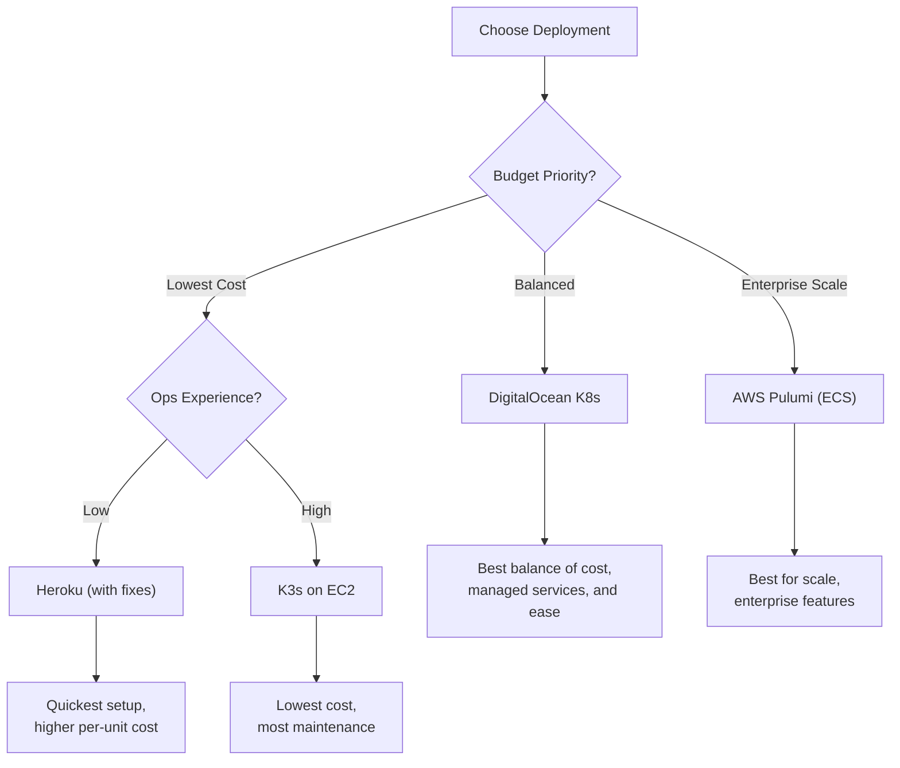

# Deployment Plan Validation and Best Approach

## Critical Requirements Discovered

Based on thorough codebase analysis, these are the **deployment-critical features** that ALL plans must support:

### 1. WebSocket (Socket.IO) - CRITICAL

```
Path: /api/socket.io
Transport: websocket only (no polling fallback)
Buffer Size: 100MB (maxHttpBufferSize: 1e8)
Timeout: 900s (15 minutes) for long-running operations
```

**Impact on Load Balancers:**

- Must support WebSocket upgrade (`Connection: Upgrade`)
- Must allow long-lived connections (15+ minutes)
- For horizontal scaling: **Redis adapter required** for Socket.IO fan-out

### 2. Redis - MANDATORY

Redis is **not optional** for production deployments:


| Feature           | Redis Usage                      |
| ----------------- | -------------------------------- |
| BullMQ Job Queues | Flow execution, scheduled jobs   |
| Socket.IO Adapter | Multi-instance WebSocket fan-out |
| Distributed Locks | Concurrency control              |
| Rate Limiting     | API throttling                   |
| Pub/Sub           | Engine response watching         |
| Caching           | Secret manager, run metadata     |


### 3. File Upload Limits

```
Default: 25MB (AP_MAX_FILE_SIZE_MB)
Body Limit: max(file_size, log_size, 25) + 4 MB
```

**Impact:** Nginx/Ingress must set `client_max_body_size` appropriately.

### 4. Health Check Endpoints


| Endpoint                    | Access     | Use                        |
| --------------------------- | ---------- | -------------------------- |
| `GET /api/v1/health/`       | Public     | Load balancer health check |
| `GET /api/v1/health/system` | Admin only | Detailed system health     |


### 5. Real Client IP Header

```
Default: X-Real-IP (AP_CLIENT_REAL_IP_HEADER)
```

**Impact:** Proxies must forward the correct header for rate limiting and audit logs.

### 6. Execution Mode Considerations


| Mode                | Description                             | Resource Impact                |
| ------------------- | --------------------------------------- | ------------------------------ |
| `UNSANDBOXED`       | Direct execution (recommended for most) | Lower memory                   |
| `SANDBOX_CODE_ONLY` | V8 isolates for code steps              | Requires `isolated-vm`         |
| `SANDBOX_PROCESS`   | Full process isolation                  | Requires privileged containers |


---

## Plan Validation Matrix


| Requirement        | Heroku      | AWS Pulumi       | K3s EC2          | DO/Linode K8s        |
| ------------------ | ----------- | ---------------- | ---------------- | -------------------- |
| WebSocket Support  | **FIXED**   | OK               | **NEEDS CONFIG** | **NEEDS CONFIG**     |
| Redis              | OK (add-on) | OK (ElastiCache) | **NEEDS CONFIG** | OK (managed/bundled) |
| PostgreSQL         | OK (add-on) | OK (RDS)         | **NEEDS CONFIG** | OK (managed/bundled) |
| File Upload Limit  | OK (100MB)  | **MISSING**      | **MISSING**      | **NEEDS CONFIG**     |
| Health Check       | OK          | **MISSING**      | OK               | OK                   |
| Client IP Header   | OK          | **MISSING**      | **NEEDS CONFIG** | **NEEDS CONFIG**     |
| Persistent Storage | Limited     | OK (EBS)         | OK (local-path)  | OK (block storage)   |
| Horizontal Scaling | Limited     | OK               | No               | OK                   |


---

## Issues Found in Each Plan

### Heroku Plan Issues

1. **WebSocket path incorrect** - Nginx template uses `/socket.io` but app expects `/api/socket.io`
2. **Single dyno limitation** - Can't horizontally scale without Redis adapter config
3. **Ephemeral filesystem** - Cache directory lost on restart (S3 recommended)

**Fixes needed in `nginx.heroku.conf.template`:**

```nginx
# Current (WRONG):
location /socket.io {
    proxy_pass http://localhost:3000/socket.io;

# Should be:
location /api/socket.io {
    proxy_pass http://localhost:3000/api/socket.io;
```

### AWS Pulumi Plan Issues

1. **No health check configured** for ECS task definition
2. **No file upload limit** configured for ALB
3. **Missing `AP_CLIENT_REAL_IP_HEADER`** for proper IP forwarding
4. **WebSocket timeout** not explicitly configured on ALB (default 60s may be too short)

**Recommended additions to `index.ts`:**

```typescript
// Add health check to task definition
healthCheck: {
    command: ["CMD-SHELL", "curl -f http://localhost:80/api/v1/health/ || exit 1"],
    interval: 30,
    timeout: 5,
    retries: 3,
    startPeriod: 60,
}

// Add to environment variables
{ name: "AP_CLIENT_REAL_IP_HEADER", value: "X-Forwarded-For" }
```

### K3s EC2 Plan Issues

1. **Helm chart uses Argo Rollouts by default** - K3s doesn't have Argo, needs `workloadType: statefulset`
2. **Missing Ingress WebSocket annotations** for Traefik
3. **Missing file upload annotation**
4. **Database secrets need proper values**

**Required Traefik annotations:**

```yaml
ingress:
  annotations:
    traefik.ingress.kubernetes.io/router.middlewares: ""
    # Traefik supports WebSocket by default, but ensure timeouts:
    traefik.ingress.kubernetes.io/router.entrypoints: web,websecure
```

### DigitalOcean/Linode Plan Issues

1. **Missing nginx ingress WebSocket timeout annotations**
2. **Missing file upload size annotation**
3. **Missing client IP header configuration**

**Required nginx-ingress annotations:**

```yaml
ingress:
  annotations:
    nginx.ingress.kubernetes.io/proxy-body-size: "100m"
    nginx.ingress.kubernetes.io/proxy-read-timeout: "900"
    nginx.ingress.kubernetes.io/proxy-send-timeout: "900"
    nginx.ingress.kubernetes.io/proxy-connect-timeout: "60"
    # WebSocket support (nginx-ingress enables by default, but explicit is safer)
    nginx.ingress.kubernetes.io/websocket-services: "activepieces"
```

---

## Best Deployment Approach Recommendation

### Decision Matrix


| Factor                | Heroku    | AWS Pulumi | K3s EC2  | DO K8s   | Linode K8s |
| --------------------- | --------- | ---------- | -------- | -------- | ---------- |
| **Setup Complexity**  | Low       | Medium     | Medium   | Medium   | Medium     |
| **Cost (Small)**      | ~$55/mo   | ~$92/mo    | ~$68/mo  | ~$92/mo  | ~$75/mo    |
| **Cost (Production)** | ~$100+/mo | ~$150+/mo  | ~$120/mo | ~$120/mo | ~$100/mo   |
| **Scalability**       | Limited   | Excellent  | Poor     | Good     | Good       |
| **Maintenance**       | Low       | Low        | High     | Low      | Low        |
| **WebSocket Support** | Good*     | Good*      | Good     | Good     | Good       |
| **Managed DB/Redis**  | Yes       | Yes        | No       | Yes      | Partial    |


*Requires fixes noted above

### Recommended Approach by Use Case




### My Recommendation: **DigitalOcean Kubernetes**

**Why:**

1. **Free control plane** - Only pay for nodes
2. **Managed PostgreSQL and Redis** - Reduces ops burden
3. **Simple pricing** - Predictable costs
4. **Native K8s** - Uses standard Helm chart
5. **Good WebSocket support** - nginx-ingress works well
6. **Reasonable scaling** - Can add nodes easily
7. **Cost-effective** - ~$75-92/mo for production setup

### Second Choice: **AWS Pulumi (ECS Fargate)**

**Why:**

1. **Serverless containers** - No node management
2. **Proven at scale** - AWS reliability
3. **Complete IaC** - Already in repo
4. **Managed everything** - RDS, ElastiCache, ALB

**Trade-off:** Higher cost (~$92/mo minimum)

---

## Consolidated Fixes Checklist

### All Plans Need:

1. **WebSocket timeout configuration** (900s minimum)
2. **File upload limit** (100MB recommended)
3. **Client IP header forwarding** (`X-Forwarded-For` or `X-Real-IP`)
4. **Health check endpoint** (`/api/v1/health/`)
5. **Redis connection** (mandatory for production)

### Environment Variables for All Deployments:

```bash
# Required
AP_ENCRYPTION_KEY=<32-char-hex>      # openssl rand -hex 16
AP_JWT_SECRET=<64-char-hex>          # openssl rand -hex 32
AP_FRONTEND_URL=https://your-domain.com
AP_POSTGRES_URL=<connection-string>
AP_REDIS_URL=<connection-string>

# Recommended
AP_ENVIRONMENT=prod
AP_EDITION=ce
AP_EXECUTION_MODE=UNSANDBOXED
AP_CLIENT_REAL_IP_HEADER=X-Forwarded-For
AP_TELEMETRY_ENABLED=false
AP_QUEUE_MODE=REDIS
AP_POSTGRES_USE_SSL=true
AP_REDIS_USE_SSL=true  # If using managed Redis with TLS
```

---

## Summary Table


| Plan                                                                  | Status            | Action Needed                            |
| --------------------------------------------------------------------- | ----------------- | ---------------------------------------- |
| [Heroku](/.cursor/plans/heroku_deployment_plan_4e6a4228.plan.md)      | Needs Fixes       | Fix WebSocket path in nginx template     |
| [AWS Pulumi](/.cursor/plans/aws_deployment_plan_499d5dba.plan.md)     | Needs Additions   | Add health check, timeouts, IP header    |
| [K3s EC2](/.cursor/plans/k3s_ec2_deployment_plan_ca23b3cd.plan.md)    | Needs Config      | Add Ingress annotations, use StatefulSet |
| [DO/Linode](/.cursor/plans/doks_lke_deployment_plan_c3730398.plan.md) | Needs Annotations | Add nginx timeout/upload annotations     |


**Recommended:** Start with **DigitalOcean Kubernetes** for the best balance of cost, ease, and production readiness.