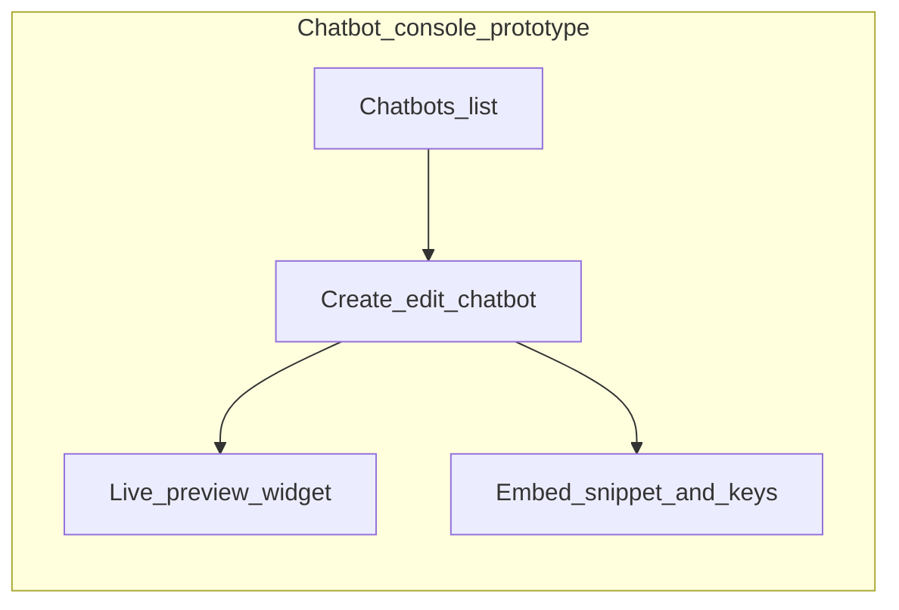
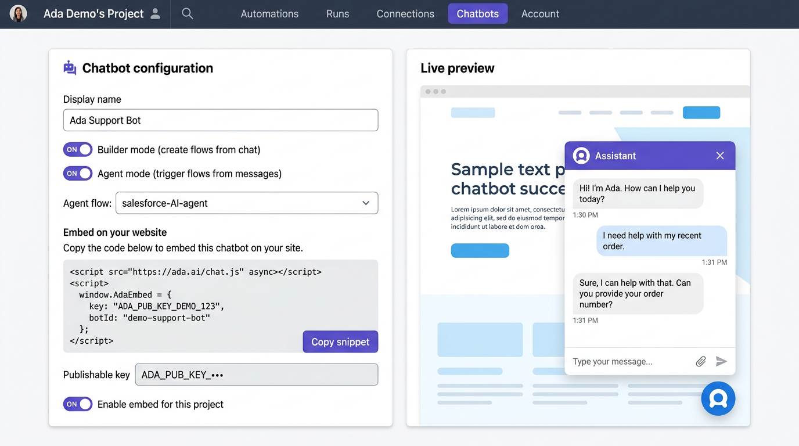
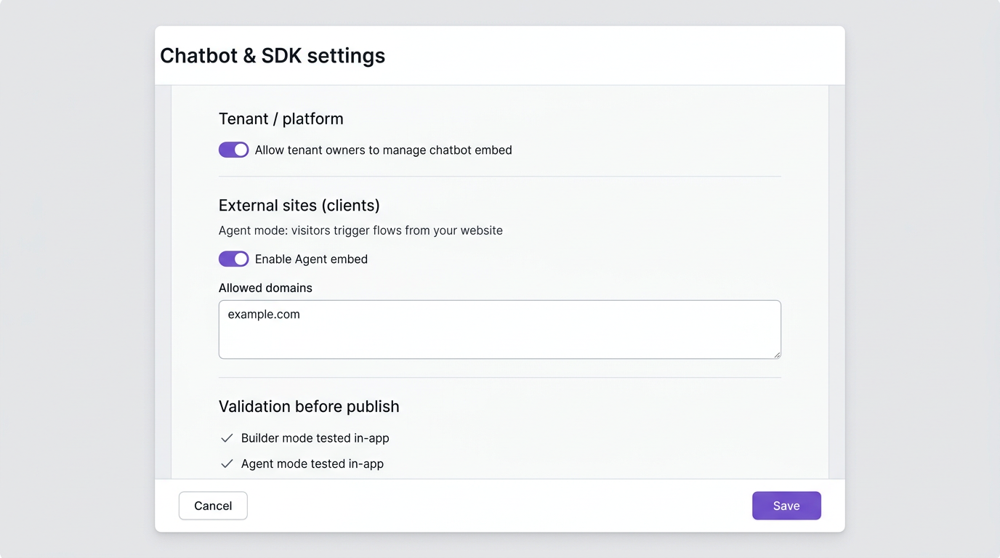
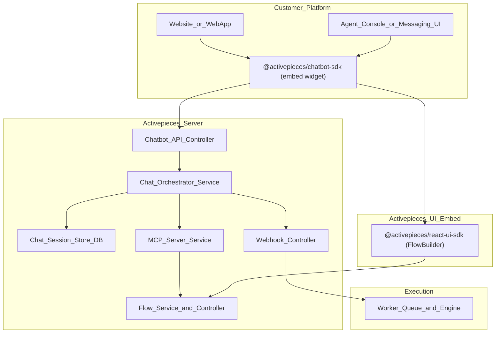
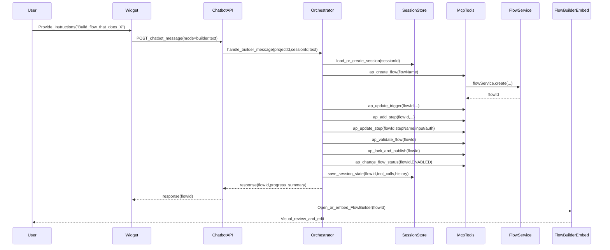
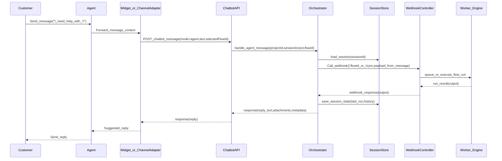

## Goals
- Provide a drop-in npm package that customers can embed on their website/app.
- The embedded UI supports two experiences:
  - Builder mode: a conversational assistant that turns instructions into an Activepieces flow.
  - Agent mode: a conversational assistant that triggers an existing client flow based on chat messages and returns the result.

**Reference UI for implementation:** see [Reference images (implementation mockups)](#reference-images-implementation-mockups) — use those PNGs for layout parity when building the **Chatbots** routes and the **SDK settings** screen.

## What the repo already provides (building blocks)
- Flow creation is already a service call in the API:

```60:104:/Users/rajarammohanty/Documents/POC/activepieces/packages/server/api/src/app/flows/flow/flow.service.ts
export const flowService = (log: FastifyBaseLogger) => ({
    async create({ projectId, request, externalId, ownerId, templateId, creatorPlatformRole }: CreateParams): Promise<PopulatedFlow> {
        ...
        const savedFlow = await flowRepo().save(newFlow)
        const savedFlowVersion = await flowVersionService(log).createEmptyVersion(
            savedFlow.id,
            {
                displayName: request.displayName,
                notes: [],
            },
        )
        ...
    },
```

- The codebase already exposes an “agent-friendly” tool surface (MCP) for programmatic flow building:
  - Set/update trigger: `ap_update_trigger`.

```28:90:/Users/rajarammohanty/Documents/POC/activepieces/packages/server/api/src/app/mcp/tools/ap-update-trigger.ts
export const apUpdateTriggerTool = (mcp: McpServer, log: FastifyBaseLogger): McpToolDefinition => {
  return {
    title: 'ap_update_trigger',
    ...
    execute: async (args) => {
      ...
      const operation: FlowOperationRequest = {
        type: FlowOperationType.UPDATE_TRIGGER,
```

  - Add steps: `ap_add_step`.

```33:111:/Users/rajarammohanty/Documents/POC/activepieces/packages/server/api/src/app/mcp/tools/ap-add-step.ts
export const apAddStepTool = (mcp: McpServer, log: FastifyBaseLogger): McpToolDefinition => {
  return {
    title: 'ap_add_step',
    description: 'Add a new step to a flow (skeleton only — configure with ap_update_step afterwards).',
    ...
    execute: async (args) => {
      ...
      const operation: FlowOperationRequest = {
        type: FlowOperationType.ADD_ACTION,
```

  - The MCP server includes a documented recommended workflow (create → trigger → steps → validate → publish).

```18:33:/Users/rajarammohanty/Documents/POC/activepieces/packages/server/api/src/app/mcp/mcp-service.ts
const MCP_SERVER_INSTRUCTIONS = `## Activepieces MCP Server — Agent Workflow Guide

### Recommended workflow
1. **Discover**: ap_list_pieces ...
2. **Schema**: ap_get_piece_props ...
3. **Build**: ap_create_flow → ap_update_trigger → ap_add_step → ap_update_step
4. **Validate**: ap_validate_step_config ... or ap_validate_flow ...
5. **Publish**: ap_lock_and_publish → ap_change_flow_status
```

- Flow triggering from outside already exists via a webhook endpoint (`/:flowId` and `/:flowId/sync`):

```16:55:/Users/rajarammohanty/Documents/POC/activepieces/packages/server/api/src/app/webhooks/webhook-controller.ts
app.all(
  '/:flowId/sync',
  ...,
  async (request, reply) => {
    const response = await webhookService.handleWebhook({
      ...,
      flowId: request.params.flowId,
      async: false,
      ...
    })
```

- There is already an embeddable UI SDK for Activepieces screens (including the flow builder).

```1:47:/Users/rajarammohanty/Documents/POC/activepieces/packages/extensions/react-ui-sdk/src/react/flow-builder.tsx
export const FlowBuilder: React.FC<FlowBuilderProps> = (props) => {
  const { apiUrl, token, projectId, flowId } = props;
  useEffect(() => {
    configureAPI({ apiUrl, token, projectId, flowId });
  }, [apiUrl, token, projectId, flowId]);
  ...
}
```

## Proposed architecture
- `@activepieces/chatbot-sdk` (new package under `packages/extensions/`):
  - `ChatbotWidget` (React) + optional vanilla JS `mountChatbot()` helper (mirrors `react-ui-sdk` pattern).
  - Optional wrappers for Angular (similar pattern to `react-ui-sdk`, if required).
- **Conversation window (like “real” product chatbots):** Yes — the SDK should ship a **familiar embed UX**, not just APIs: floating **launcher** (bottom-right by default), **expand/collapse** panel, **scrollable message list** (user vs assistant bubbles), **text input** (and later file chips if needed), optional **typing** / **thinking** state, and **white-label** hooks (colors, title, avatar) per platform branding rules. Implementation-wise: fixed positioning + high `z-index`, optional **Shadow DOM** or CSS scope to avoid clashing with the host site, and **streaming** or polling for assistant replies so it feels live. This is the same class of UX as common website chat widgets; the difference is your backend connects to Activepieces (builder/agent orchestration) instead of a generic FAQ bot only.
- A new server capability for “chat sessions” (minimal):
  - Persist chat session state (conversation history + selected flow + tool calls) scoped to a project.
  - Expose a single API endpoint the widget can call: `POST /v1/chatbot/message`.

### Conversational AI layer (how customer intent becomes a flow)

- **Yes — by default we assume an LLM-backed orchestrator** (or equivalent “agent” runtime) for **builder mode**: it reads the customer’s natural-language request, decides which MCP tools to call (`ap_list_pieces`, `ap_get_piece_props`, `ap_create_flow`, `ap_update_trigger`, `ap_add_step`, `ap_update_step`, `ap_validate_flow`, `ap_lock_and_publish`, etc.), and **uses the chatbot for multi-turn Q&A** when something is missing (which app to connect, which mailbox, OAuth connection id, field mappings, approval to publish).
- **Agent mode** uses the same LLM to interpret free-text (e.g. “what is the status of Lead X”) into a **structured webhook payload** for a **lookup/status** flow (object, field, search value, or Lead Id), or a fixed schema if you prefer no NL parsing on the server.
- **MVP alternative (no full LLM):** pick from **templates** + structured forms in the widget, then apply deterministic MCP calls — useful for a first release before general NL flow building is reliable.

### Chatbot creation UI (prototype — “same as real chatbot” admin)

Goal: a **visual console** where a customer configures an embeddable chatbot **before** pasting it on their site — similar in spirit to Intercom/Drift “install messenger” flows, but backed by Activepieces project + flows.

**Recommended prototype screens (MVP):**

1. **Chatbots list** — Project-scoped rows: name, status (draft/live), last updated, **Open** / **Embed code**.
2. **Create / Edit chatbot (wizard or single page):**
   - **Identity:** display name, optional subtitle (shown in the conversation header).
   - **Modes:** toggles — **Builder** (NL → MCP flow creation) and/or **Agent** (trigger existing flow); for Agent, **pick flow(s)** or paste **flow id** + describe payload contract.
   - **Connections / AI:** which Salesforce (etc.) connection the builder may use (reuse `ap_list_connections` semantics); optional LLM profile later.
   - **Appearance:** primary color, launcher position, logo URL — **live preview** panel on the right showing the **floating launcher + conversation panel** (same components as the npm widget, mounted in an iframe or sandboxed div so it matches production).
3. **Install** — Generated **embed snippet** (`<script src="…">` + `init({ siteKey, apiBase, … })` or React `<ChatbotWidget … />`), **rotate key**, **allowed origins** (if product supports CORS allowlist).
4. **Try it** — Full-width **embedded preview** talking to staging orchestrator (or mock) so PM/design can validate without a real customer site.

**Using build mode inside the current Activepieces web app (your project shell):**

- **Yes.** The **in-product** build-mode chatbot is not limited to the npm embed or a separate site. It should live **inside the same UI chrome** you already use: project sidebar, header, and **top tabs** alongside **Automations**, **Runs**, and **Connections** — e.g. a new **Chatbots** (or **Assistants**) tab for that project.
- **Same project, same data:** `projectId`, **Connections**, and flows created via the chatbot **show up in the Automations list** (like existing flows e.g. `salesforce-AI-agent`) and open in the **Flow Builder** for edits — one catalog of “web codes” / flows, whether created manually or via chatbot.
- **Two surfaces, one backend:** (1) **In-app Chatbots tab** = configure + run builder/agent chat with live preview, no external site required. (2) **npm `@activepieces/chatbot-sdk`** = drop the **same** conversation widget on a customer website; optional and separate from using build mode inside the product.

**Where to build the prototype (pick one for speed):**

- **A)** `packages/web` — New route as a **project tab** next to Automations / Runs / Connections (e.g. **Chatbots**), reusing the existing project layout, tables, and forms (best long-term; needs API stubs or feature flag).
- **B)** Static **HTML + minimal JS** under `docs/` (fastest stakeholder demo; pattern similar to existing mock UIs in the repo).
- **C)** **Storybook** stories for `@activepieces/chatbot-sdk` + MSW mocks for `POST /v1/chatbot/message` (good for component polish without full app wiring).

**Sketch (information architecture):**



### Reference images (implementation mockups)

These **PNG reference images** are for **implementers** (and design handoff): layout, sections, and control grouping — not final pixel-perfect UI. Match **Activepieces** components, spacing, and **white-label** rules when you build `packages/web`.

- **Image 1 — Project Chatbots tab:** configuration column (Builder / Agent toggles, default flow, **embed snippet**, publishable key) + **live preview** of the floating widget.
- **Image 2 — Chatbot & SDK settings:** org/tenant-level toggles, **external Agent embed**, allowed domains, **validation checklist** before release.





**Files in-repo (source of truth for the plan):**

- [`docs/chatbot-ui-previews/chatbot-tab-main-preview.png`](../../docs/chatbot-ui-previews/chatbot-tab-main-preview.png)
- [`docs/chatbot-ui-previews/chatbot-settings-embed-tenant-preview.png`](../../docs/chatbot-ui-previews/chatbot-settings-embed-tenant-preview.png)

### Permissions: who sees Chatbots and who can enable / disable (RBAC)

Use the same **platform and project** permission model as the rest of the product (`PlatformRole` in [`packages/shared/src/lib/core/user/user.ts`](../../packages/shared/src/lib/core/user/user.ts): `SUPER_ADMIN`, `OWNER`, `ADMIN`, `MEMBER`, `OPERATOR`). Exact UI rules should match your fork (some deployments restrict **OWNER** from creating flows; align Chatbots with **who may edit flows** on a project).

- **Deployment / cloud (organization-wide) “feature on”:** Typically **`SUPER_ADMIN`** (or internal ops) plus **billing / plan** flags decide whether **Chatbots** exists at all for an installation or tier. Optional: **`ADMIN`** on cloud can enable the feature for **their** platform if product allows.

- **Tenant / organization — `OWNER` (tenant owner):** Sees **platform-level** settings that apply to **their** org (e.g. allow sub-admins to manage embeds, plan limits). **Enable/disable the chatbot product for the tenant** and **high-risk actions** (global embed policy, rotate org-wide defaults) should follow the same rules as other **owner-only** platform settings in your edition.

- **Organization / platform — `ADMIN`:** Full **platform administration** — usually **can enable/disable Chatbots for projects**, manage **users**, and access **Chatbot & SDK settings** for any project they administer. Treat **embed key rotation** and **“Enable embed for this project”** as **sensitive**; require **`ADMIN`** or **`OWNER`** where other integrations do.

- **Project-level (operators / members):** **`OPERATOR`** and **`MEMBER`** see the **Project → Chatbots** tab only when they have **access to that project** and a **project role** that allows the same actions as **editing flows** (e.g. configure Builder/Agent, run **Try it**). If a user **cannot** create or edit flows in a project, they should **not** configure Builder mode there. **Embed snippet / publishable keys** may be further restricted to **project admin** or **`ADMIN`/`OWNER`** only — mirror how **Connections** or **secrets** are gated.

- **Enable vs disable (summary):**
  - **Disable Chatbots feature entirely:** `SUPER_ADMIN` / plan (and optionally platform `ADMIN`/`OWNER` per product).
  - **Disable embed for a project / rotate keys:** Prefer **`ADMIN`**, **`OWNER`**, or **project admin** — not every flow editor.
  - **Toggle Builder/Agent and day-to-day chat:** Users with **flow write** access on that project, unless you split read-only preview for viewers.

Backend: enforce with **`platformMustHaveFeatureEnabled()`**-style middleware for paid features and **project RBAC** on every `POST /v1/chatbot/message` and settings mutation.

### Where to enable options, external embed, and pre-publish validation

- **Primary place (your platform):** **Project → Chatbots** tab (alongside Automations / Runs / Connections). Left column: **Builder mode** and **Agent mode** toggles, **default Agent flow**, branding. **“Embed on your website”** section: **publishable key**, **copy snippet**, **Enable embed for this project**, optional **allowed domains / CORS** — see **Permissions** above for who may change these.
- **External clients’ websites:** Ship **`@activepieces/chatbot-sdk`** with **Agent mode** (and optionally Builder if policy allows) so **visitors** trigger configured flows; scope keys so production sites only get **Agent** if Builder is internal-only.
- **Validate both modes before publishing the npm package (e.g. to GitHub):** Use the **in-app Chatbots tab** + **Try it** preview for **Builder** and **Agent**; complete the **checklist** in **Chatbot & SDK settings**, then tag/release **`@activepieces/chatbot-sdk`**.

### Example: Salesforce CRM — two complementary flows

#### A) Builder chatbot: “Create a new Lead, then a follow-up Task”

**Goal (customer message):** “I want a flow that **creates a new Lead** in Salesforce and then **creates a follow-up Task** tied to that Lead.”

**Typical runtime shape (the chatbot builds this via MCP):**

- **Trigger:** **Webhook** (recommended) so your site, form, or another system can POST lead fields (Last Name, Company, Email, etc.); alternatives are **Manual** (testing) or other triggers depending on where the data originates.
- **Step 1 — `create_lead`:** map webhook body fields into **Create Lead** (`create_lead`) inputs (`LastName`, `Company`, `FirstName`, `Email`, … per `ap_get_piece_props`).
- **Step 2 — `create_task`:** map **WhoId** (or equivalent) to the **Lead Id** returned from step 1 (e.g. from `create_lead` output), plus **Subject**, **Status**, **Priority**.

**What the chatbot might ask:**

- Which **Salesforce connection** (`ap_list_connections`).
- Webhook **sample payload** shape (field names) so mappings are correct.
- **Task** defaults (subject template, priority, status).

**Illustrative MCP sequence:** `ap_create_flow` → `ap_update_trigger` (webhook piece + version for your edition) → `ap_add_step` (`create_lead`) → `ap_add_step` (`create_task`) → `ap_update_step` for both with `{{trigger...}}` / `{{step_1...}}` references → `ap_validate_flow` → `ap_lock_and_publish` → enable.

**Related pattern (event-driven):** “When a **new Lead appears** in Salesforce, create a Task” uses trigger **`new_lead`** + **`create_task`** only — use when the Lead is created **inside** Salesforce (polling), not when this flow is the system that creates the Lead.

#### B) Agent mode: “What is the current status of this Lead?”

**Goal:** An agent types e.g. “What is the current status of **Acme Co**?” or “Status for **john.doe@email.com**?” — identifiers should match how you search Leads in Salesforce (Name, Email, Id per your org).

**Why a separate flow:** Lookup is **on-demand** from **chat**, so use a flow that starts with a **Webhook** (or **Manual** test) accepting **structured** input — not the **`new_lead`** polling trigger (that runs when Salesforce creates a Lead, not when someone asks a question).

**Runtime path:**

1. **Agent mode** receives the message → **LLM extracts** `{ object: "Lead", field: "Email" | "Name" | "Id", search_value: "..." }` (or your fixed schema).
2. Orchestrator **POSTs** to that flow’s **webhook URL** with that JSON (aligned with what the first step reads from `trigger.body`).
3. Flow steps: Salesforce **`find_record`** (`find_record`) and/or **`find_records_by_query`** / **`run_query`** to load the Lead — read **Status** (and other fields as needed).
4. **Response to chat:** **`/:flowId/sync`** can return a body the UI shows to the agent; purely async webhooks may need another channel (e.g. Slack) unless the product adds a dedicated reply path.

**Chatbot builder for B:** “Build a flow so agents can ask for Lead status by name or email” → MCP builds webhook trigger + **`find_record`** (object Lead, field Name or Email, `search_value` from `{{trigger.body...}}`) → optional formatting step → validate/publish.

**Afterwards:** customers refine both flows in the **embedded Flow Builder**; **A** automates create+task, **B** powers **agent mode** status lookups.


## Diagrams

### Architecture (high level)



Note: The diagram uses a top-to-bottom (`TB`) outer layout and stacks `Customer_Platform` → `Activepieces_UI_Embed` → `Activepieces_Server` → `Execution` so Mermaid does not overlap the embed subgraph with the server subgraph (a common issue with `LR` + multiple wide subgraphs). Node labels that include `@` or `/` (npm scopes) must use **quoted** text, e.g. `Widget["@activepieces/..."]`, or Markdown Preview Enhanced / Mermaid will throw a parse error.

### Sequence diagram 1: Builder mode (instruction → auto-build flow)



### Sequence diagram 2: Agent mode (message → trigger existing flow → reply)



### Builder mode (create/update flow from instructions)
- Widget sends user instruction text.
- Server-side “chat orchestrator” uses MCP tool workflow:
  - `ap_create_flow`.
  - `ap_update_trigger`.
  - `ap_add_step` / `ap_update_step`.
  - `ap_validate_flow`.
  - `ap_lock_and_publish` and enable flow.
- Widget deep-links (or embeds) `FlowBuilder` from `@activepieces/react-ui-sdk` so the user can visually review the generated flow.

### Agent mode (trigger an existing flow)
- Widget (or channel adapter) maps an inbound customer message into a run request.
- Server triggers the flow by calling the existing webhook endpoint (`/:flowId` or `/:flowId/sync`) and returns the result back to the widget/channel.

## Security + tenancy model (decision points, but implementable incrementally)
- Start with “Activepieces-hosted AI orchestration” where the widget authenticates with a project-scoped token.
- Later support “customer BFF” mode where the widget never talks to Activepieces directly; customer backend calls Activepieces.

## Impacted areas / risks (what will change after implementation)

- **Server API (Fastify)**
  - **New endpoints**: chatbot message endpoint + chatbot config/embed settings endpoints.
  - **RBAC/tenancy**: must align with `PlatformRole` + project roles; sensitive actions (enable embed, rotate keys) should be restricted.
  - **Rate limiting & abuse**: external Agent-mode embeds can increase traffic; require throttling + request validation.
  - **Flow safety**: builder mode writes flows (create/update/publish/enable) via MCP tool chain → affects audits, validations, and “who can publish”.
  - **Secrets/Connections**: embed keys and connection selection are sensitive; avoid leaking connection identifiers to the browser.

- **Database**
  - **New tables/entities**: chatbot configs, publishable keys/allowed domains, chat sessions.
  - **Retention**: chat session history needs cleanup to avoid unbounded growth.

- **Worker/engine & queues**
  - **Run volume spikes**: Agent mode on client websites can spike flow runs → impacts concurrency pools, queue backpressure, and cost controls.
  - **Sync response constraints**: `/:flowId/sync` replies can time out for long flows; enforce short “chat reply” flows or add async reply patterns.

- **Web app (`packages/web`)**
  - **Navigation + routing**: new **Project → Chatbots** tab, plus **Chatbot & SDK settings** screen.
  - **White-labeling**: all customer-facing UI must follow platform branding rules (cloud vs ee vs ce).
  - **Permission UX**: hide/disable sensitive controls based on role; show clear “read-only” states when applicable.

- **SDK (`packages/extensions`)**
  - **New npm package surface area** (`@activepieces/chatbot-sdk`): versioning, backward compatibility, docs, security model (scoped keys).
  - **Embed isolation**: CSS collisions and z-index issues on host sites; consider Shadow DOM / CSS scoping.

- **Observability & audit**
  - **Audit log / telemetry**: record who created flows via chatbot, who rotated keys, who enabled embeds, and external embed usage metrics.

## Folder structure (keep implementation in dedicated folders)

Goal: all new code lives in **clearly named, isolated folders** so it’s easy to maintain and review.

```text
packages/
  server/
    api/
      src/app/
        chatbot/                       # NEW: chatbot feature module (server-side)
          chatbot.module.ts
          chatbot.controller.ts        # POST /v1/chatbot/message (builder + agent)
          chatbot.service.ts           # orchestration logic (LLM + MCP + webhook trigger)
          chatbot-session/
            chatbot-session.entity.ts
            chatbot-session.repo.ts
            chatbot-session.service.ts
          chatbot-embed/
            chatbot-embed.entity.ts    # keys, allowed domains, enabled flags
            chatbot-embed.controller.ts
            chatbot-embed.service.ts
          dto/                         # request/response schemas
            ...
        # (no mixing into flows/, webhooks/, etc. except imports)

  web/
    src/app/routes/
      chatbots/                        # NEW: in-app Chatbots tab + editor
        index.tsx                      # list
        id/                            # edit/view
          index.tsx
      settings/
        chatbot-sdk/                   # NEW: “Chatbot & SDK settings” screen
          index.tsx

  extensions/
    chatbot-sdk/                       # NEW: embeddable widget package
      src/
        react/
          chatbot-widget.tsx
        utils/
          mount-chatbot.ts
          api-config.ts
        types/
          index.ts
      package.json
      README.md

docs/
  chatbot-ui-previews/                 # already added: reference PNGs
    chatbot-tab-main-preview.png
    chatbot-settings-embed-tenant-preview.png
```

## Automation validation (quality gate before publish)

Goal: make sure this feature stays safe as it touches **flow creation**, **webhook execution**, and **external embeds**.

- **Static checks (always)**
  - Run `npm run lint-dev` (required by repo rules).
  - **Important: lint must not “dirty” the repo.** Use `lint-dev` (no `--fix`) and avoid `lint-dev:fix` unless you explicitly want auto-fixes.
  - If you see “multiple new files” after lint:
    - If they’re under ignored cache dirs (e.g. `.turbo/`, `.nx/cache/`, `node_modules/`), that’s expected and should not show up in git status.
    - If they show up in git status, they are either (a) **tracked files modified** by a formatter/auto-fix, or (b) **new unignored artifacts**. In that case, we should either adjust the lint configuration to be read-only or extend `.gitignore` for the generated artifact type (without ignoring real source files).

- **Server integration tests (builder + agent)**
  - Add tests under `packages/server/api/test/integration/**` that cover:
    - **Builder mode path** (happy path): chatbot endpoint produces a flow via MCP tools, validates, and publishes/enables.
    - **Agent mode path** (happy path): chatbot endpoint triggers a configured webhook flow (prefer `/sync`) and returns a response shape suitable for chat UI.
    - **RBAC**: ensure users without flow-write cannot run builder mode; ensure only allowed roles can rotate keys / enable embed.
    - **Abuse controls**: basic rate-limit behaviour (at least one test asserting 429 / rejection when exceeded, if implemented).

- **Web UI smoke (prototype UI)**
  - Minimal automated UI checks (Playwright or component tests) for:
    - Chatbots tab loads, toggles render, “Copy snippet” button exists.
    - Settings page loads and hides sensitive controls for non-admin roles.

- **Pre-publish checklist (in-product)**
  - Keep the manual checklist in the **Chatbot & SDK settings** screen, but back it by the automated checks above so “green” means CI already passed.

## Implementation steps
1. Server: add a new module for chatbot orchestration (controller + service) that:
   - Accepts `projectId` + message + `mode`.
   - In builder mode, drives the MCP tool chain for flow creation and returns `{flowId}` plus human-readable progress.
   - In agent mode, triggers a configured flow via the webhook controller path and returns the response.
2. Server: add minimal persistence for chat sessions (DB entity + repo) so multi-turn conversations work.
3. SDK: create a new extension package with:
   - React `ChatbotWidget` component.
   - A `mountChatbot()` helper for plain HTML sites.
   - Styling aligned with existing embed patterns.
4. SDK: integrate optional embedded `FlowBuilder` (from `@activepieces/react-ui-sdk`) for “review/edit generated flow”.
5. Verification: add a small integration test that:
   - Creates a flow via the chatbot orchestration.
   - Triggers it via webhook and asserts expected output.
6. **Prototype UI:** deliver the **Chatbot console** (option A/B/C above) with list + edit + **live preview** + install snippet — enough for demos and UX iteration before hardening production RBAC and billing.

## MVP scope recommendation
- Limit initial supported “instruction types” to a small set of patterns (e.g., “when I receive a message → call webhook/LLM → send reply”), then expand piece coverage after the end-to-end path is stable.
