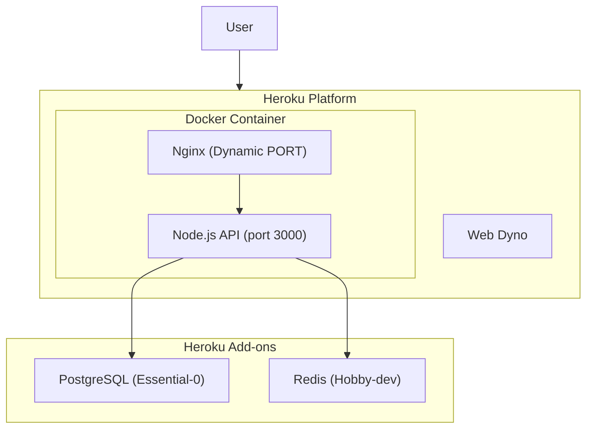

# Heroku Deployment Plan for Activepieces

## Current State

The repository already contains complete Heroku deployment configuration:

- [Dockerfile.heroku](Dockerfile.heroku) - Multi-stage Docker build optimized for Heroku
- [heroku.yml](heroku.yml) - Heroku manifest for container builds
- [nginx.heroku.conf.template](nginx.heroku.conf.template) - Nginx reverse proxy config (handles dynamic PORT)
- [docker-entrypoint.heroku.sh](docker-entrypoint.heroku.sh) - Container entrypoint script
- [HEROKU_DEPLOYMENT.md](HEROKU_DEPLOYMENT.md) - Comprehensive deployment guide
- [HEROKU_QUICK_START.sh](HEROKU_QUICK_START.sh) - Automated deployment script

## Architecture




## Deployment Steps

### 1. Prerequisites

- Heroku CLI installed (`brew tap heroku/brew && brew install heroku`)
- Docker running locally
- Git repository initialized
- Heroku account

### 2. Quick Deploy (Automated)

Run the existing quick start script:

```bash
chmod +x HEROKU_QUICK_START.sh
./HEROKU_QUICK_START.sh
```

This script will:

- Create Heroku app
- Set stack to container
- Add PostgreSQL and Redis add-ons
- Generate and set security keys
- Configure all required environment variables
- Deploy the application

### 3. Manual Deploy Steps

**Step 3a: Create App and Add-ons**

```bash
heroku login
heroku container:login
heroku create your-activepieces-app
heroku stack:set container -a your-activepieces-app
heroku addons:create heroku-postgresql:essential-0
heroku addons:create heroku-redis:hobby-dev
```

**Step 3b: Set Environment Variables**

Required variables:

- `AP_ENCRYPTION_KEY` - 32-byte hex key (`openssl rand -hex 32`)
- `AP_JWT_SECRET` - 32-byte hex secret (`openssl rand -hex 32`)
- `AP_POSTGRES_URL` - From `DATABASE_URL` (auto-set by add-on)
- `AP_REDIS_URL` - From `REDIS_URL` (auto-set by add-on)
- `AP_FRONTEND_URL` - `https://your-app.herokuapp.com`
- `AP_POSTGRES_USE_SSL` - `true`
- `AP_QUEUE_MODE` - `REDIS`

**Step 3c: Deploy**

```bash
git add heroku.yml Dockerfile.heroku nginx.heroku.conf.template docker-entrypoint.heroku.sh
git commit -m "Add Heroku deployment configuration"
git push heroku main
```

### 4. Post-Deployment

```bash
heroku ps:scale web=1 -a your-app
heroku open -a your-app
heroku logs --tail -a your-app
```

## Important Considerations

### Memory Requirements


| Dyno Type   | RAM   | Cost   | Recommendation |
| ----------- | ----- | ------ | -------------- |
| Eco         | 512MB | $5/mo  | Testing only   |
| Basic       | 512MB | $7/mo  | Light usage    |
| Standard-1X | 512MB | $25/mo | Production     |
| Standard-2X | 1GB   | $50/mo | Recommended    |


### Ephemeral Filesystem

Heroku dynos have ephemeral storage. For production, configure S3 for file storage:

```bash
heroku config:set AP_FILE_STORAGE_LOCATION=S3
heroku config:set AP_S3_BUCKET=your-bucket
heroku config:set AP_S3_ACCESS_KEY_ID=your-key
heroku config:set AP_S3_SECRET_ACCESS_KEY=your-secret
heroku config:set AP_S3_REGION=us-east-1
```

### Database Migrations

Migrations run automatically on startup via the API bootstrap process.

## Cost Estimate


| Resource   | Plan        | Monthly Cost |
| ---------- | ----------- | ------------ |
| Dyno       | Standard-2X | $50          |
| PostgreSQL | Essential-0 | $5           |
| Redis      | Hobby-dev   | Free         |
| **Total**  |             | **~$55/mo**  |


## No Changes Required

All Heroku deployment files already exist in the repository. The deployment can proceed using the existing configuration.