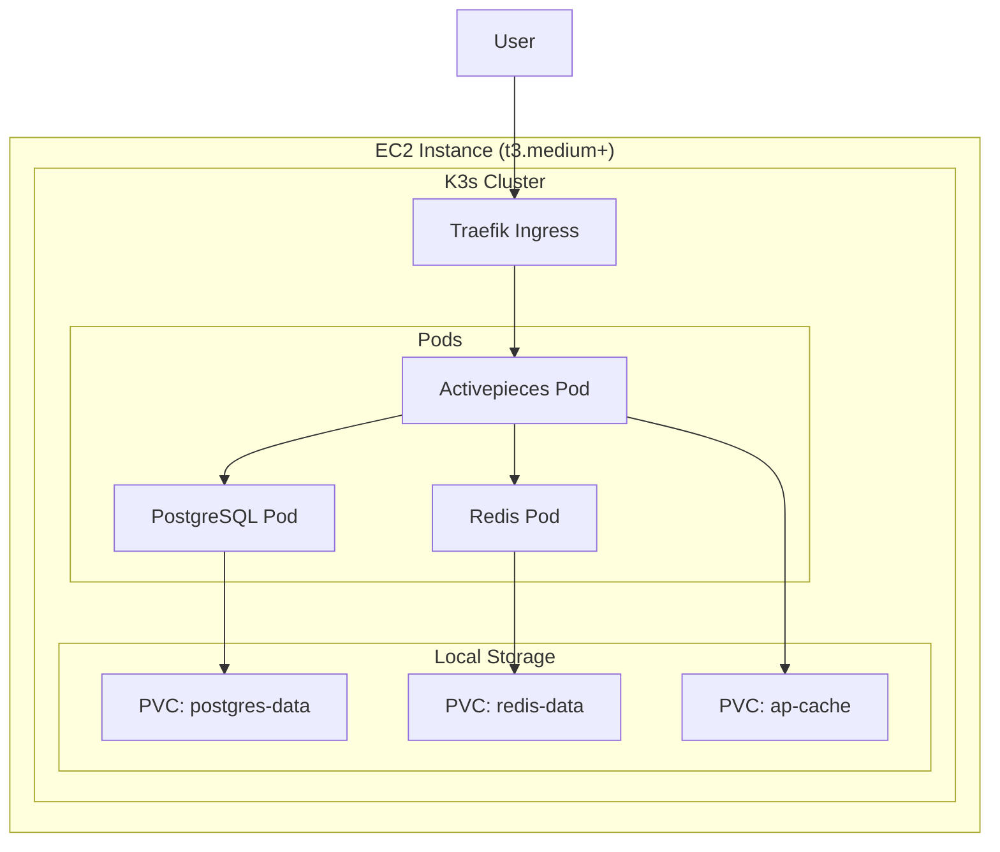

# K3s on Single EC2 Deployment Plan for Activepieces

## Why K3s on Single EC2?


| Aspect              | K3s               | Docker Compose  | ECS Fargate      |
| ------------------- | ----------------- | --------------- | ---------------- |
| Resource Overhead   | ~500MB RAM        | Minimal         | None (managed)   |
| Complexity          | Medium            | Low             | Medium           |
| Scalability         | Easy to add nodes | Manual          | Auto             |
| Cost                | Single EC2 only   | Single EC2 only | Per-task pricing |
| Kubernetes Features | Full              | None            | Limited          |


K3s is ideal when you want Kubernetes benefits (Helm, Ingress, secrets management, easy upgrades) on a budget-friendly single EC2 instance.

## Architecture




## EC2 Instance Requirements


| Size      | vCPU | RAM  | Storage   | Cost     | Recommendation              |
| --------- | ---- | ---- | --------- | -------- | --------------------------- |
| t3.medium | 2    | 4GB  | 30GB EBS  | ~$30/mo  | Minimum for testing         |
| t3.large  | 2    | 8GB  | 50GB EBS  | ~$60/mo  | Recommended                 |
| t3.xlarge | 4    | 16GB | 100GB EBS | ~$120/mo | Production with heavy usage |


## Deployment Steps

### Step 1: Launch EC2 Instance

**Using AWS Console or CLI:**

```bash
# Create security group
aws ec2 create-security-group \
  --group-name activepieces-k3s \
  --description "Activepieces K3s"

# Allow inbound traffic
aws ec2 authorize-security-group-ingress \
  --group-name activepieces-k3s \
  --protocol tcp --port 22 --cidr 0.0.0.0/0    # SSH
aws ec2 authorize-security-group-ingress \
  --group-name activepieces-k3s \
  --protocol tcp --port 80 --cidr 0.0.0.0/0    # HTTP
aws ec2 authorize-security-group-ingress \
  --group-name activepieces-k3s \
  --protocol tcp --port 443 --cidr 0.0.0.0/0   # HTTPS
aws ec2 authorize-security-group-ingress \
  --group-name activepieces-k3s \
  --protocol tcp --port 6443 --cidr 0.0.0.0/0  # K3s API (optional)

# Launch instance (Ubuntu 22.04)
aws ec2 run-instances \
  --image-id ami-0c7217cdde317cfec \
  --instance-type t3.large \
  --key-name your-key \
  --security-groups activepieces-k3s \
  --block-device-mappings '[{"DeviceName":"/dev/sda1","Ebs":{"VolumeSize":50}}]'
```

### Step 2: Install K3s

SSH into the EC2 instance and run:

```bash
# Install K3s (single node, includes Traefik ingress)
curl -sfL https://get.k3s.io | sh -

# Verify installation
sudo kubectl get nodes

# Set up kubeconfig for non-root user
mkdir -p ~/.kube
sudo cp /etc/rancher/k3s/k3s.yaml ~/.kube/config
sudo chown $(id -u):$(id -g) ~/.kube/config
export KUBECONFIG=~/.kube/config

# Install Helm
curl https://raw.githubusercontent.com/helm/helm/main/scripts/get-helm-3 | bash
```

### Step 3: Clone Repository and Prepare Helm Chart

```bash
# Clone the repo
git clone https://github.com/activepieces/activepieces.git
cd activepieces/deploy/activepieces-helm

# Update Helm dependencies
helm dependency update
```

### Step 4: Create Secrets

```bash
# Create namespace
kubectl create namespace activepieces

# Generate and create secrets
ENCRYPTION_KEY=$(openssl rand -hex 16)
JWT_SECRET=$(openssl rand -hex 32)

kubectl create secret generic activepieces-auth-secrets \
  --namespace activepieces \
  --from-literal=AP_ENCRYPTION_KEY=$ENCRYPTION_KEY \
  --from-literal=AP_JWT_SECRET=$JWT_SECRET \
  --from-literal=AP_API_KEY="" \
  --from-literal=AP_WORKER_TOKEN="" \
  --from-literal=AP_GOOGLE_CLIENT_ID="" \
  --from-literal=AP_GOOGLE_CLIENT_SECRET="" \
  --from-literal=AP_FIREBASE_HASH_PARAMETERS=""

kubectl create secret generic activepieces-config-secrets \
  --namespace activepieces \
  --from-literal=AP_EDITION=ce \
  --from-literal=AP_EXECUTION_MODE=UNSANDBOXED \
  --from-literal=AP_ENVIRONMENT=prod \
  --from-literal=AP_FRONTEND_URL=http://YOUR_EC2_PUBLIC_IP \
  --from-literal=AP_ENABLE_FLOW_ON_PUBLISH=true \
  --from-literal=AP_CLIENT_REAL_IP_HEADER="" \
  --from-literal=AP_DB_TYPE=POSTGRES \
  --from-literal=AP_ENGINE_EXECUTABLE_PATH="dist/packages/engine/main.js" \
  --from-literal=AP_PLATFORM_ID_FOR_DEDICATED_WORKER="" \
  --from-literal=AP_PIECES_SYNC_MODE="" \
  --from-literal=AP_PIECES_SOURCE=""

# Create remaining empty secrets for the Helm chart
for secret in activepieces-queue-secrets activepieces-log-secrets \
  activepieces-telemetry-secrets activepieces-limits-secrets \
  activepieces-cloudflare-secrets activepieces-integrations-secrets \
  activepieces-db-secrets activepieces-redis-secrets \
  activepieces-s3-secrets activepieces-smtp-secrets \
  activepieces-stripe-secrets activepieces-otel-secrets; do
  kubectl create secret generic $secret --namespace activepieces --from-literal=placeholder=""
done
```

### Step 5: Create Custom Values File

Create `values-k3s.yaml`:

```yaml
replicaCount: 1

image:
  repository: ghcr.io/activepieces/activepieces
  pullPolicy: IfNotPresent
  tag: "latest"

# Use StatefulSet instead of Argo Rollout (K3s doesn't have Argo by default)
workloadType: statefulset

# Resource limits for single node
resources:
  limits:
    cpu: "1500m"
    memory: "2Gi"
  requests:
    cpu: "500m"
    memory: "1Gi"

# Persistence using K3s local-path provisioner
persistence:
  enabled: true
  size: 5Gi
  storageClassName: local-path
  mountPath: "/usr/src/app/cache"

# Service configuration
service:
  type: ClusterIP
  port: 80

# Ingress with Traefik (built into K3s)
ingress:
  enabled: true
  className: traefik
  annotations:
    traefik.ingress.kubernetes.io/router.entrypoints: web,websecure
  hosts:
    - host: ""  # Empty for IP-based access, or set your domain
      paths:
        - path: /
          pathType: Prefix
  tls: []  # Add TLS config if using domain with cert-manager

# Activepieces configuration
activepieces:
  frontendUrl: "http://YOUR_EC2_PUBLIC_IP"
  edition: "ce"
  executionMode: "UNSANDBOXED"
  environment: "prod"
  telemetryEnabled: false

# Enable bundled PostgreSQL
postgresql:
  enabled: true
  auth:
    database: activepieces
    username: postgres
    password: "your-secure-password"  # Change this!
  primary:
    persistence:
      enabled: true
      size: 10Gi
      storageClass: local-path

# Enable bundled Redis
redis:
  enabled: true
  auth:
    enabled: true
    password: "your-redis-password"  # Change this!
  master:
    persistence:
      enabled: true
      size: 2Gi
      storageClass: local-path

# Disable autoscaling for single node
autoscaling:
  enabled: false
```

### Step 6: Update Database Secrets

After deciding on passwords, update the db secrets:

```bash
kubectl create secret generic activepieces-db-secrets \
  --namespace activepieces \
  --from-literal=AP_POSTGRES_DATABASE=activepieces \
  --from-literal=AP_POSTGRES_HOST=activepieces-postgresql \
  --from-literal=AP_POSTGRES_PORT=5432 \
  --from-literal=AP_POSTGRES_PASSWORD=your-secure-password \
  --from-literal=AP_POSTGRES_USERNAME=postgres \
  --from-literal=AP_POSTGRES_USE_SSL=false \
  --from-literal=AP_POSTGRES_POOL_SIZE="" \
  --from-literal=AP_POSTGRES_SSL_CA="" \
  --dry-run=client -o yaml | kubectl apply -f -

kubectl create secret generic activepieces-redis-secrets \
  --namespace activepieces \
  --from-literal=AP_REDIS_TYPE=DEFAULT \
  --from-literal=AP_REDIS_HOST=activepieces-redis-master \
  --from-literal=AP_REDIS_PORT=6379 \
  --from-literal=AP_REDIS_PASSWORD=your-redis-password \
  --from-literal=AP_REDIS_USE_SSL=false \
  --from-literal=AP_REDIS_USER="" \
  --dry-run=client -o yaml | kubectl apply -f -
```

### Step 7: Install with Helm

```bash
helm install activepieces . \
  --namespace activepieces \
  --values values-k3s.yaml
```

### Step 8: Verify Deployment

```bash
# Check pods
kubectl get pods -n activepieces -w

# Check services
kubectl get svc -n activepieces

# Check ingress
kubectl get ingress -n activepieces

# View logs
kubectl logs -n activepieces -l app.kubernetes.io/name=activepieces -f
```

### Step 9: Access the Application

Open `http://YOUR_EC2_PUBLIC_IP` in your browser.

---

## Alternative: Docker Compose (Simpler)

If Kubernetes complexity isn't needed, use docker-compose on the same EC2:

```bash
# SSH into EC2
# Install Docker
curl -fsSL https://get.docker.com | sh
sudo usermod -aG docker $USER

# Clone and run
git clone https://github.com/activepieces/activepieces.git
cd activepieces

# Create .env file
cat > .env << 'EOF'
AP_ENCRYPTION_KEY=$(openssl rand -hex 16)
AP_JWT_SECRET=$(openssl rand -hex 32)
AP_POSTGRES_DATABASE=activepieces
AP_POSTGRES_PASSWORD=secure-password
AP_POSTGRES_USERNAME=postgres
AP_FRONTEND_URL=http://YOUR_EC2_PUBLIC_IP:8080
AP_ENVIRONMENT=prod
AP_EDITION=ce
EOF

# Start
docker compose -f docker-compose.prod.yml up -d
```

Access at `http://YOUR_EC2_PUBLIC_IP:8080`

---

## Adding HTTPS with Let's Encrypt

For K3s with a domain:

```bash
# Install cert-manager
kubectl apply -f https://github.com/cert-manager/cert-manager/releases/download/v1.13.0/cert-manager.yaml

# Create ClusterIssuer
cat <<EOF | kubectl apply -f -
apiVersion: cert-manager.io/v1
kind: ClusterIssuer
metadata:
  name: letsencrypt-prod
spec:
  acme:
    server: https://acme-v02.api.letsencrypt.org/directory
    email: your-email@example.com
    privateKeySecretRef:
      name: letsencrypt-prod
    solvers:
    - http01:
        ingress:
          class: traefik
EOF
```

Then update ingress in values-k3s.yaml:

```yaml
ingress:
  enabled: true
  className: traefik
  annotations:
    cert-manager.io/cluster-issuer: letsencrypt-prod
  hosts:
    - host: activepieces.yourdomain.com
      paths:
        - path: /
          pathType: Prefix
  tls:
    - secretName: activepieces-tls
      hosts:
        - activepieces.yourdomain.com
```

---

## Cost Estimate


| Resource              | Configuration | Monthly Cost |
| --------------------- | ------------- | ------------ |
| EC2 t3.large          | On-Demand     | ~$60         |
| EBS Storage           | 50GB gp3      | ~$4          |
| Elastic IP (optional) | Static IP     | ~$4          |
| **Total**             |               | **~$68/mo**  |


With Reserved Instance (1-year): ~$40/mo

---

## Files Reference


| File                                                                         | Purpose                    |
| ---------------------------------------------------------------------------- | -------------------------- |
| [deploy/activepieces-helm/](deploy/activepieces-helm/)                       | Helm chart                 |
| [deploy/activepieces-helm/values.yaml](deploy/activepieces-helm/values.yaml) | Default Helm values        |
| [docker-compose.prod.yml](docker-compose.prod.yml)                           | Docker Compose alternative |
| [Dockerfile](Dockerfile)                                                     | Container image build      |


