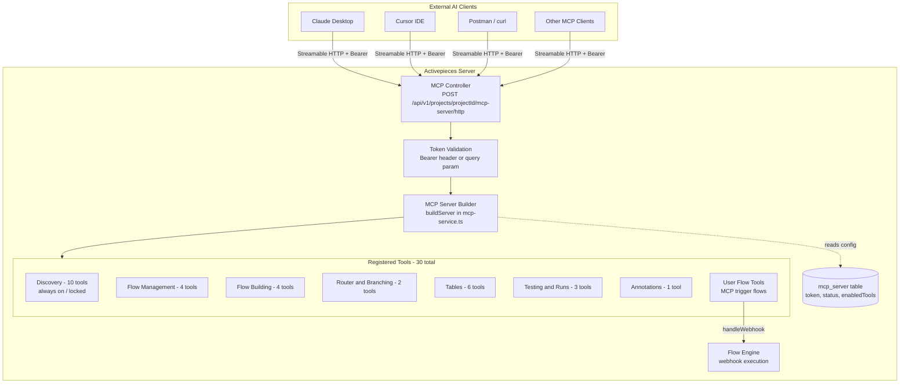

# Activepieces MCP Server -- Complete Guide

## What is MCP?

The **Model Context Protocol (MCP)** is an open standard created by Anthropic that lets AI assistants (Claude, GPT, Cursor, etc.) connect to external tools and data sources through a unified interface. Think of it as a "USB port" for AI -- any AI client that speaks MCP can plug into any MCP server and use its tools.

- **Spec**: [https://modelcontextprotocol.io/specification/2025-03-26](https://modelcontextprotocol.io/specification/2025-03-26)
- **Transport**: Activepieces uses **Streamable HTTP** (not SSE, not stdio)
- **Protocol version**: `2025-03-26`
- **SDK**: `@modelcontextprotocol/sdk` v1.27.1

## Purpose of the Activepieces MCP Server

Activepieces exposes a **built-in MCP server per project** so that external AI assistants can:

- **Build automation flows** via natural language ("Create a flow that sends a Slack message when a new GitHub issue is opened")
- **Manage tables** (CRUD on the built-in Tables feature)
- **Test and debug flows** (run tests, inspect results, retry failures)
- **Discover pieces/connections** (list available integrations, configured auth)
- **Expose custom flows as tools** -- any flow with an MCP trigger becomes a callable tool for AI agents

In short: it turns Activepieces into a tool-belt that any AI assistant can use to automate work.

## Architecture Overview




## Key Files

### Backend (Server)

- **[packages/server/api/src/app/mcp/mcp-module.ts](packages/server/api/src/app/mcp/mcp-module.ts)** -- Registers routes under `/v1/projects/:projectId/mcp-server`
- **[packages/server/api/src/app/mcp/mcp-server-controller.ts](packages/server/api/src/app/mcp/mcp-server-controller.ts)** -- HTTP routes: admin CRUD (project RBAC) + public `POST /http` (token-authenticated) for MCP protocol
- **[packages/server/api/src/app/mcp/mcp-service.ts](packages/server/api/src/app/mcp/mcp-service.ts)** -- Core logic: token generation/rotation, `buildServer()`, flow-to-tool mapping, tool filtering
- **[packages/server/api/src/app/mcp/mcp-entity.ts](packages/server/api/src/app/mcp/mcp-entity.ts)** -- TypeORM entity for `mcp_server` table
- **[packages/server/api/src/app/mcp/tools/](packages/server/api/src/app/mcp/tools/)** -- One file per built-in tool + `index.ts` with locked/controllable tool lists

### Frontend (Web UI)

- **[packages/web/src/app/components/project-settings/mcp-server/index.tsx](packages/web/src/app/components/project-settings/mcp-server/index.tsx)** -- Settings page: enable/disable toggle, Connection and Tools tabs
- **[packages/web/src/app/components/project-settings/mcp-server/mcp-credentials.tsx](packages/web/src/app/components/project-settings/mcp-server/mcp-credentials.tsx)** -- Server URL, token, copy-paste configs
- **[packages/web/src/app/components/project-settings/mcp-server/mcp-tools.tsx](packages/web/src/app/components/project-settings/mcp-server/mcp-tools.tsx)** -- Toggle built-in tool categories
- **[packages/web/src/app/components/project-settings/mcp-server/mcp-flows.tsx](packages/web/src/app/components/project-settings/mcp-server/mcp-flows.tsx)** -- Lists MCP-trigger flows

### MCP Trigger Piece

- **[packages/pieces/community/mcp/src/lib/triggers/mcp-tool.ts](packages/pieces/community/mcp/src/lib/triggers/mcp-tool.ts)** -- MCP Tool trigger definition
- **[packages/pieces/community/mcp/src/lib/actions/reply-to-mcp-client.ts](packages/pieces/community/mcp/src/lib/actions/reply-to-mcp-client.ts)** -- Reply to MCP Client action

---

## How It Works End-to-End

### 1. Setup (one-time per project)

- Go to **Settings > MCP Server** and toggle **Enable MCP Access**
- A row is created in `mcp_server` table with a random 72-char token
- Copy the **Server URL** and **Token** from the Connection tab

### 2. Tool Configuration

- **Built-in tools** (30 total): grouped into categories. "Discovery" (10 tools) is always on (locked). Other categories can be toggled on/off via the Tools tab. Stored as `enabledTools` JSON array.
- **User flow tools**: any flow with `@activepieces/piece-mcp` trigger that is **enabled** appears as a callable MCP tool.

### 3. AI Client Connects

- Client sends `POST /api/v1/projects/{projectId}/mcp-server/http` with `Authorization: Bearer {token}`
- Server validates token, builds a fresh `McpServer` instance, registers all tools, connects `StreamableHTTPServerTransport`
- Each request is **stateless** (`sessionIdGenerator: undefined`) -- no session to maintain between calls

### 4. Tool Execution

- **Built-in tools** call internal services directly (`flowService`, `tableService`, etc.)
- **Flow-backed tools** execute via `webhookService.handleWebhook()` with tool arguments as payload

### 5. Security Model

- Credentials are **never exposed** through MCP tools
- All operations are **project-scoped**
- Token can be **rotated** at any time
- Admin operations require `READ_MCP` / `WRITE_MCP` permissions

---

## Complete Tool Reference

### Discovery (always on -- locked)


| Tool                  | Description                                          |
| --------------------- | ---------------------------------------------------- |
| `ap_list_flows`       | List all flows in the project                        |
| `ap_flow_structure`   | Get step tree, config status, valid insert locations |
| `ap_list_pieces`      | List available pieces with actions/triggers          |
| `ap_list_connections` | List OAuth/app connections                           |
| `ap_list_ai_models`   | List configured AI providers and models              |
| `ap_list_tables`      | List all tables with fields and row counts           |
| `ap_find_records`     | Query records with optional filtering                |
| `ap_list_runs`        | List recent flow runs                                |
| `ap_get_run`          | Get detailed run results with step outputs           |
| `ap_setup_guide`      | Get setup instructions for connections/AI providers  |


### Flow Management (toggleable)


| Tool                    | Description               |
| ----------------------- | ------------------------- |
| `ap_create_flow`        | Create a new empty flow   |
| `ap_rename_flow`        | Rename an existing flow   |
| `ap_lock_and_publish`   | Publish the current draft |
| `ap_change_flow_status` | Enable or disable a flow  |


### Flow Building (toggleable)


| Tool                | Description                    |
| ------------------- | ------------------------------ |
| `ap_update_trigger` | Set or update the flow trigger |
| `ap_add_step`       | Add a new step (skeleton)      |
| `ap_update_step`    | Update step settings/inputs    |
| `ap_delete_step`    | Delete a step                  |


### Router and Branching (toggleable)


| Tool               | Description                          |
| ------------------ | ------------------------------------ |
| `ap_add_branch`    | Add a conditional branch to a router |
| `ap_delete_branch` | Delete a branch from a router        |


### Annotations (toggleable)


| Tool              | Description                         |
| ----------------- | ----------------------------------- |
| `ap_manage_notes` | Add, update, or delete canvas notes |


### Tables (toggleable)


| Tool                | Description                   |
| ------------------- | ----------------------------- |
| `ap_create_table`   | Create a table with fields    |
| `ap_delete_table`   | Delete a table                |
| `ap_manage_fields`  | Add, rename, or delete fields |
| `ap_insert_records` | Insert 1-50 records           |
| `ap_update_record`  | Update specific cells         |
| `ap_delete_records` | Delete records                |


### Testing and Runs (toggleable)


| Tool           | Description            |
| -------------- | ---------------------- |
| `ap_test_flow` | Test a flow end-to-end |
| `ap_test_step` | Test a single step     |
| `ap_retry_run` | Retry a failed run     |


---

## Localhost Validation with curl / Postman

Replace `{projectId}` and `{token}` with your values from **Settings > MCP Server > Connection**.

**Required headers for ALL requests:**

```
Authorization: Bearer {token}
Content-Type: application/json
Accept: application/json, text/event-stream
```

The `Accept` header with both `application/json` and `text/event-stream` is **mandatory** -- the `StreamableHTTPServerTransport` rejects requests without it.

### MCP Protocol Parameters

All requests use the **JSON-RPC 2.0** envelope. The `method` and `params` come from the MCP specification (not Activepieces):

- `jsonrpc` -- always `"2.0"` (JSON-RPC version)
- `id` -- any number/string you choose to correlate request/response
- `method` -- MCP method name (`initialize`, `tools/list`, `tools/call`, etc.)
- `params` -- method-specific parameters defined by the MCP spec
- `protocolVersion` -- MCP spec version, currently `"2025-03-26"`
- `capabilities` -- client capabilities (empty `{}` is fine for testing)
- `clientInfo` -- free-form client identification (informational only)

Reference: [https://modelcontextprotocol.io/specification/2025-03-26/basic/lifecycle](https://modelcontextprotocol.io/specification/2025-03-26/basic/lifecycle)

---

### 1. Initialize (handshake)

```bash
curl --location 'http://localhost:4300/api/v1/projects/{projectId}/mcp-server/http' \
--header 'Authorization: Bearer {token}' \
--header 'Content-Type: application/json' \
--header 'Accept: application/json, text/event-stream' \
--data '{
    "jsonrpc": "2.0",
    "id": 1,
    "method": "initialize",
    "params": {
      "protocolVersion": "2025-03-26",
      "capabilities": {},
      "clientInfo": { "name": "postman-test", "version": "1.0.0" }
    }
  }'
```

Expected response:

```json
{
  "result": {
    "protocolVersion": "2025-03-26",
    "capabilities": { "tools": { "listChanged": true } },
    "serverInfo": { "name": "Activepieces MCP Server", "version": "..." }
  },
  "jsonrpc": "2.0",
  "id": 1
}
```

### 2. List All Tools

```bash
curl --location 'http://localhost:4300/api/v1/projects/{projectId}/mcp-server/http' \
--header 'Authorization: Bearer {token}' \
--header 'Content-Type: application/json' \
--header 'Accept: application/json, text/event-stream' \
--data '{
    "jsonrpc": "2.0",
    "id": 2,
    "method": "tools/list",
    "params": {}
  }'
```

Returns all registered tools with `name`, `description`, `inputSchema`, and `annotations`.

---

### 3. Discovery Tool Curls

#### ap_list_flows

```bash
curl --location 'http://localhost:4300/api/v1/projects/{projectId}/mcp-server/http' \
--header 'Authorization: Bearer {token}' \
--header 'Content-Type: application/json' \
--header 'Accept: application/json, text/event-stream' \
--data '{
    "jsonrpc": "2.0",
    "id": 3,
    "method": "tools/call",
    "params": {
      "name": "ap_list_flows",
      "arguments": {}
    }
  }'
```

#### ap_flow_structure

```bash
curl --location 'http://localhost:4300/api/v1/projects/{projectId}/mcp-server/http' \
--header 'Authorization: Bearer {token}' \
--header 'Content-Type: application/json' \
--header 'Accept: application/json, text/event-stream' \
--data '{
    "jsonrpc": "2.0",
    "id": 4,
    "method": "tools/call",
    "params": {
      "name": "ap_flow_structure",
      "arguments": { "flowId": "{flowId}" }
    }
  }'
```

#### ap_list_pieces (with search)

```bash
curl --location 'http://localhost:4300/api/v1/projects/{projectId}/mcp-server/http' \
--header 'Authorization: Bearer {token}' \
--header 'Content-Type: application/json' \
--header 'Accept: application/json, text/event-stream' \
--data '{
    "jsonrpc": "2.0",
    "id": 5,
    "method": "tools/call",
    "params": {
      "name": "ap_list_pieces",
      "arguments": {
        "searchQuery": "slack",
        "includeActions": true,
        "includeTriggers": true
      }
    }
  }'
```

#### ap_list_connections

```bash
curl --location 'http://localhost:4300/api/v1/projects/{projectId}/mcp-server/http' \
--header 'Authorization: Bearer {token}' \
--header 'Content-Type: application/json' \
--header 'Accept: application/json, text/event-stream' \
--data '{
    "jsonrpc": "2.0",
    "id": 6,
    "method": "tools/call",
    "params": {
      "name": "ap_list_connections",
      "arguments": {}
    }
  }'
```

#### ap_list_ai_models

```bash
curl --location 'http://localhost:4300/api/v1/projects/{projectId}/mcp-server/http' \
--header 'Authorization: Bearer {token}' \
--header 'Content-Type: application/json' \
--header 'Accept: application/json, text/event-stream' \
--data '{
    "jsonrpc": "2.0",
    "id": 7,
    "method": "tools/call",
    "params": {
      "name": "ap_list_ai_models",
      "arguments": {}
    }
  }'
```

#### ap_list_tables

```bash
curl --location 'http://localhost:4300/api/v1/projects/{projectId}/mcp-server/http' \
--header 'Authorization: Bearer {token}' \
--header 'Content-Type: application/json' \
--header 'Accept: application/json, text/event-stream' \
--data '{
    "jsonrpc": "2.0",
    "id": 8,
    "method": "tools/call",
    "params": {
      "name": "ap_list_tables",
      "arguments": {}
    }
  }'
```

#### ap_find_records (with filters)

```bash
curl --location 'http://localhost:4300/api/v1/projects/{projectId}/mcp-server/http' \
--header 'Authorization: Bearer {token}' \
--header 'Content-Type: application/json' \
--header 'Accept: application/json, text/event-stream' \
--data '{
    "jsonrpc": "2.0",
    "id": 9,
    "method": "tools/call",
    "params": {
      "name": "ap_find_records",
      "arguments": {
        "tableId": "{tableId}",
        "filters": [
          { "fieldName": "status", "operator": "eq", "value": "active" }
        ],
        "limit": 10
      }
    }
  }'
```

#### ap_list_runs

```bash
curl --location 'http://localhost:4300/api/v1/projects/{projectId}/mcp-server/http' \
--header 'Authorization: Bearer {token}' \
--header 'Content-Type: application/json' \
--header 'Accept: application/json, text/event-stream' \
--data '{
    "jsonrpc": "2.0",
    "id": 10,
    "method": "tools/call",
    "params": {
      "name": "ap_list_runs",
      "arguments": {
        "status": "FAILED",
        "limit": 5
      }
    }
  }'
```

#### ap_get_run

```bash
curl --location 'http://localhost:4300/api/v1/projects/{projectId}/mcp-server/http' \
--header 'Authorization: Bearer {token}' \
--header 'Content-Type: application/json' \
--header 'Accept: application/json, text/event-stream' \
--data '{
    "jsonrpc": "2.0",
    "id": 11,
    "method": "tools/call",
    "params": {
      "name": "ap_get_run",
      "arguments": { "flowRunId": "{runId}" }
    }
  }'
```

#### ap_setup_guide

```bash
curl --location 'http://localhost:4300/api/v1/projects/{projectId}/mcp-server/http' \
--header 'Authorization: Bearer {token}' \
--header 'Content-Type: application/json' \
--header 'Accept: application/json, text/event-stream' \
--data '{
    "jsonrpc": "2.0",
    "id": 12,
    "method": "tools/call",
    "params": {
      "name": "ap_setup_guide",
      "arguments": { "topic": "connection", "pieceName": "@activepieces/piece-gmail" }
    }
  }'
```

---

### 4. Flow Management Tool Curls

#### ap_create_flow

```bash
curl --location 'http://localhost:4300/api/v1/projects/{projectId}/mcp-server/http' \
--header 'Authorization: Bearer {token}' \
--header 'Content-Type: application/json' \
--header 'Accept: application/json, text/event-stream' \
--data '{
    "jsonrpc": "2.0",
    "id": 13,
    "method": "tools/call",
    "params": {
      "name": "ap_create_flow",
      "arguments": { "flowName": "My New Flow" }
    }
  }'
```

#### ap_rename_flow

```bash
curl --location 'http://localhost:4300/api/v1/projects/{projectId}/mcp-server/http' \
--header 'Authorization: Bearer {token}' \
--header 'Content-Type: application/json' \
--header 'Accept: application/json, text/event-stream' \
--data '{
    "jsonrpc": "2.0",
    "id": 14,
    "method": "tools/call",
    "params": {
      "name": "ap_rename_flow",
      "arguments": { "flowId": "{flowId}", "displayName": "Renamed Flow" }
    }
  }'
```

#### ap_lock_and_publish

```bash
curl --location 'http://localhost:4300/api/v1/projects/{projectId}/mcp-server/http' \
--header 'Authorization: Bearer {token}' \
--header 'Content-Type: application/json' \
--header 'Accept: application/json, text/event-stream' \
--data '{
    "jsonrpc": "2.0",
    "id": 15,
    "method": "tools/call",
    "params": {
      "name": "ap_lock_and_publish",
      "arguments": { "flowId": "{flowId}" }
    }
  }'
```

#### ap_change_flow_status

```bash
curl --location 'http://localhost:4300/api/v1/projects/{projectId}/mcp-server/http' \
--header 'Authorization: Bearer {token}' \
--header 'Content-Type: application/json' \
--header 'Accept: application/json, text/event-stream' \
--data '{
    "jsonrpc": "2.0",
    "id": 16,
    "method": "tools/call",
    "params": {
      "name": "ap_change_flow_status",
      "arguments": { "flowId": "{flowId}", "status": "ENABLED" }
    }
  }'
```

---

### 5. Flow Building Tool Curls

#### ap_update_trigger

```bash
curl --location 'http://localhost:4300/api/v1/projects/{projectId}/mcp-server/http' \
--header 'Authorization: Bearer {token}' \
--header 'Content-Type: application/json' \
--header 'Accept: application/json, text/event-stream' \
--data '{
    "jsonrpc": "2.0",
    "id": 17,
    "method": "tools/call",
    "params": {
      "name": "ap_update_trigger",
      "arguments": {
        "flowId": "{flowId}",
        "pieceName": "@activepieces/piece-schedule",
        "pieceVersion": "~0.2.0",
        "triggerName": "every_hour_trigger"
      }
    }
  }'
```

#### ap_add_step (PIECE type)

```bash
curl --location 'http://localhost:4300/api/v1/projects/{projectId}/mcp-server/http' \
--header 'Authorization: Bearer {token}' \
--header 'Content-Type: application/json' \
--header 'Accept: application/json, text/event-stream' \
--data '{
    "jsonrpc": "2.0",
    "id": 18,
    "method": "tools/call",
    "params": {
      "name": "ap_add_step",
      "arguments": {
        "flowId": "{flowId}",
        "parentStepName": "trigger",
        "stepLocationRelativeToParent": "AFTER",
        "stepType": "PIECE",
        "displayName": "Send Slack Message",
        "pieceName": "@activepieces/piece-slack",
        "pieceVersion": "~0.5.0",
        "actionName": "send_channel_message"
      }
    }
  }'
```

#### ap_add_step (CODE type)

```bash
curl --location 'http://localhost:4300/api/v1/projects/{projectId}/mcp-server/http' \
--header 'Authorization: Bearer {token}' \
--header 'Content-Type: application/json' \
--header 'Accept: application/json, text/event-stream' \
--data '{
    "jsonrpc": "2.0",
    "id": 19,
    "method": "tools/call",
    "params": {
      "name": "ap_add_step",
      "arguments": {
        "flowId": "{flowId}",
        "parentStepName": "trigger",
        "stepLocationRelativeToParent": "AFTER",
        "stepType": "CODE",
        "displayName": "Transform Data"
      }
    }
  }'
```

#### ap_update_step (configure a PIECE step)

```bash
curl --location 'http://localhost:4300/api/v1/projects/{projectId}/mcp-server/http' \
--header 'Authorization: Bearer {token}' \
--header 'Content-Type: application/json' \
--header 'Accept: application/json, text/event-stream' \
--data '{
    "jsonrpc": "2.0",
    "id": 20,
    "method": "tools/call",
    "params": {
      "name": "ap_update_step",
      "arguments": {
        "flowId": "{flowId}",
        "stepName": "step_1",
        "input": {
          "channel": "general",
          "text": "Hello from MCP! {{trigger.output.message}}"
        },
        "auth": "{connectionExternalId}"
      }
    }
  }'
```

#### ap_delete_step

```bash
curl --location 'http://localhost:4300/api/v1/projects/{projectId}/mcp-server/http' \
--header 'Authorization: Bearer {token}' \
--header 'Content-Type: application/json' \
--header 'Accept: application/json, text/event-stream' \
--data '{
    "jsonrpc": "2.0",
    "id": 21,
    "method": "tools/call",
    "params": {
      "name": "ap_delete_step",
      "arguments": { "flowId": "{flowId}", "stepName": "step_1" }
    }
  }'
```

---

### 6. Router and Branching Tool Curls

#### ap_add_branch

```bash
curl --location 'http://localhost:4300/api/v1/projects/{projectId}/mcp-server/http' \
--header 'Authorization: Bearer {token}' \
--header 'Content-Type: application/json' \
--header 'Accept: application/json, text/event-stream' \
--data '{
    "jsonrpc": "2.0",
    "id": 22,
    "method": "tools/call",
    "params": {
      "name": "ap_add_branch",
      "arguments": {
        "flowId": "{flowId}",
        "routerStepName": "step_1",
        "branchName": "High Priority",
        "conditions": [[{
          "firstValue": "{{trigger.output.priority}}",
          "operator": "TEXT_CONTAINS",
          "secondValue": "high"
        }]]
      }
    }
  }'
```

#### ap_delete_branch

```bash
curl --location 'http://localhost:4300/api/v1/projects/{projectId}/mcp-server/http' \
--header 'Authorization: Bearer {token}' \
--header 'Content-Type: application/json' \
--header 'Accept: application/json, text/event-stream' \
--data '{
    "jsonrpc": "2.0",
    "id": 23,
    "method": "tools/call",
    "params": {
      "name": "ap_delete_branch",
      "arguments": {
        "flowId": "{flowId}",
        "routerStepName": "step_1",
        "branchIndex": 0
      }
    }
  }'
```

---

### 7. Annotations Tool Curl

#### ap_manage_notes

```bash
curl --location 'http://localhost:4300/api/v1/projects/{projectId}/mcp-server/http' \
--header 'Authorization: Bearer {token}' \
--header 'Content-Type: application/json' \
--header 'Accept: application/json, text/event-stream' \
--data '{
    "jsonrpc": "2.0",
    "id": 24,
    "method": "tools/call",
    "params": {
      "name": "ap_manage_notes",
      "arguments": {
        "flowId": "{flowId}",
        "operation": "ADD",
        "content": "This flow handles new Salesforce records",
        "color": "blue",
        "position": { "x": 300, "y": 0 },
        "size": { "width": 250, "height": 150 }
      }
    }
  }'
```

---

### 8. Tables Tool Curls

#### ap_create_table

```bash
curl --location 'http://localhost:4300/api/v1/projects/{projectId}/mcp-server/http' \
--header 'Authorization: Bearer {token}' \
--header 'Content-Type: application/json' \
--header 'Accept: application/json, text/event-stream' \
--data '{
    "jsonrpc": "2.0",
    "id": 25,
    "method": "tools/call",
    "params": {
      "name": "ap_create_table",
      "arguments": {
        "name": "Contacts",
        "fields": [
          { "name": "Name", "type": "TEXT" },
          { "name": "Email", "type": "TEXT" },
          { "name": "Age", "type": "NUMBER" },
          { "name": "Status", "type": "STATIC_DROPDOWN", "options": ["Active", "Inactive"] }
        ]
      }
    }
  }'
```

#### ap_insert_records

```bash
curl --location 'http://localhost:4300/api/v1/projects/{projectId}/mcp-server/http' \
--header 'Authorization: Bearer {token}' \
--header 'Content-Type: application/json' \
--header 'Accept: application/json, text/event-stream' \
--data '{
    "jsonrpc": "2.0",
    "id": 26,
    "method": "tools/call",
    "params": {
      "name": "ap_insert_records",
      "arguments": {
        "tableId": "{tableId}",
        "records": [
          { "Name": "Alice", "Email": "alice@example.com", "Age": "30", "Status": "Active" },
          { "Name": "Bob", "Email": "bob@example.com", "Age": "25", "Status": "Inactive" }
        ]
      }
    }
  }'
```

#### ap_update_record

```bash
curl --location 'http://localhost:4300/api/v1/projects/{projectId}/mcp-server/http' \
--header 'Authorization: Bearer {token}' \
--header 'Content-Type: application/json' \
--header 'Accept: application/json, text/event-stream' \
--data '{
    "jsonrpc": "2.0",
    "id": 27,
    "method": "tools/call",
    "params": {
      "name": "ap_update_record",
      "arguments": {
        "tableId": "{tableId}",
        "recordId": "{recordId}",
        "fields": { "Status": "Active" }
      }
    }
  }'
```

#### ap_manage_fields

```bash
curl --location 'http://localhost:4300/api/v1/projects/{projectId}/mcp-server/http' \
--header 'Authorization: Bearer {token}' \
--header 'Content-Type: application/json' \
--header 'Accept: application/json, text/event-stream' \
--data '{
    "jsonrpc": "2.0",
    "id": 28,
    "method": "tools/call",
    "params": {
      "name": "ap_manage_fields",
      "arguments": {
        "tableId": "{tableId}",
        "operation": "ADD",
        "name": "Phone",
        "type": "TEXT"
      }
    }
  }'
```

#### ap_delete_records

```bash
curl --location 'http://localhost:4300/api/v1/projects/{projectId}/mcp-server/http' \
--header 'Authorization: Bearer {token}' \
--header 'Content-Type: application/json' \
--header 'Accept: application/json, text/event-stream' \
--data '{
    "jsonrpc": "2.0",
    "id": 29,
    "method": "tools/call",
    "params": {
      "name": "ap_delete_records",
      "arguments": { "recordIds": ["{recordId1}", "{recordId2}"] }
    }
  }'
```

#### ap_delete_table

```bash
curl --location 'http://localhost:4300/api/v1/projects/{projectId}/mcp-server/http' \
--header 'Authorization: Bearer {token}' \
--header 'Content-Type: application/json' \
--header 'Accept: application/json, text/event-stream' \
--data '{
    "jsonrpc": "2.0",
    "id": 30,
    "method": "tools/call",
    "params": {
      "name": "ap_delete_table",
      "arguments": { "tableId": "{tableId}" }
    }
  }'
```

---

### 9. Testing and Runs Tool Curls

#### ap_test_flow

```bash
curl --location 'http://localhost:4300/api/v1/projects/{projectId}/mcp-server/http' \
--header 'Authorization: Bearer {token}' \
--header 'Content-Type: application/json' \
--header 'Accept: application/json, text/event-stream' \
--data '{
    "jsonrpc": "2.0",
    "id": 31,
    "method": "tools/call",
    "params": {
      "name": "ap_test_flow",
      "arguments": { "flowId": "{flowId}" }
    }
  }'
```

#### ap_test_step

```bash
curl --location 'http://localhost:4300/api/v1/projects/{projectId}/mcp-server/http' \
--header 'Authorization: Bearer {token}' \
--header 'Content-Type: application/json' \
--header 'Accept: application/json, text/event-stream' \
--data '{
    "jsonrpc": "2.0",
    "id": 32,
    "method": "tools/call",
    "params": {
      "name": "ap_test_step",
      "arguments": { "flowId": "{flowId}", "stepName": "step_1" }
    }
  }'
```

#### ap_retry_run

```bash
curl --location 'http://localhost:4300/api/v1/projects/{projectId}/mcp-server/http' \
--header 'Authorization: Bearer {token}' \
--header 'Content-Type: application/json' \
--header 'Accept: application/json, text/event-stream' \
--data '{
    "jsonrpc": "2.0",
    "id": 33,
    "method": "tools/call",
    "params": {
      "name": "ap_retry_run",
      "arguments": {
        "flowRunId": "{runId}",
        "strategy": "FROM_FAILED_STEP"
      }
    }
  }'
```

---

### Alternative: Token via Query Parameter

For clients that cannot send custom headers:

```bash
curl --location 'http://localhost:4300/api/v1/projects/{projectId}/mcp-server/http?token={token}' \
--header 'Content-Type: application/json' \
--header 'Accept: application/json, text/event-stream' \
--data '{
    "jsonrpc": "2.0",
    "id": 1,
    "method": "tools/list",
    "params": {}
  }'
```

### Using Docker Compose (port 8080)

Replace the base URL when running via `docker-compose.yml`:

```
http://localhost:8080/api/v1/projects/{projectId}/mcp-server/http
```

---

## Client Integration

### Cursor IDE

Add to your workspace `.cursor/mcp.json` or global Cursor MCP settings:

```json
{
  "mcpServers": {
    "activepieces": {
      "url": "http://localhost:4300/api/v1/projects/{projectId}/mcp-server/http",
      "headers": {
        "Authorization": "Bearer {token}"
      }
    }
  }
}
```

Then ask Cursor: *"List all flows in Activepieces"* or *"Create a new flow called Hello World"*.

### Claude Desktop

Add to `claude_desktop_config.json` (macOS: `~/Library/Application Support/Claude/claude_desktop_config.json`):

```json
{
  "mcpServers": {
    "activepieces": {
      "command": "npx",
      "args": [
        "-y",
        "mcp-remote",
        "http://localhost:4300/api/v1/projects/{projectId}/mcp-server/http",
        "--header",
        "Authorization: Bearer {token}"
      ]
    }
  }
}
```

Restart Claude Desktop, then ask: *"List my Activepieces flows"*.

Claude Desktop uses `mcp-remote` as a bridge because it natively supports stdio transport, not Streamable HTTP. The `npx mcp-remote` package translates between the two.

### Claude Custom Connector (Beta)

For Claude's native connector feature (no `mcp-remote` needed):

```json
{
  "remote_mcp_server_url": "http://localhost:4300/api/v1/projects/{projectId}/mcp-server/http?token={token}"
}
```

Token is passed as a query parameter since custom connectors cannot send custom headers.

### Node.js Script

```javascript
import { Client } from "@modelcontextprotocol/sdk/client/index.js";
import { StreamableHTTPClientTransport } from "@modelcontextprotocol/sdk/client/streamableHttp.js";

const PROJECT_ID = "{projectId}";
const TOKEN = "{token}";
const BASE_URL = `http://localhost:4300/api/v1/projects/${PROJECT_ID}/mcp-server/http`;

const transport = new StreamableHTTPClientTransport(new URL(BASE_URL), {
  requestInit: {
    headers: { Authorization: `Bearer ${TOKEN}` },
  },
});

const client = new Client({ name: "node-test", version: "1.0.0" });
await client.connect(transport);

const tools = await client.listTools();
console.log("Available tools:", tools.tools.map(t => t.name));

const result = await client.callTool({ name: "ap_list_flows", arguments: {} });
console.log("Flows:", result);

await client.close();
```

---

## Known Limitations

### CODE steps cannot be fully configured via MCP

The `ap_update_step` tool only updates `settings.input` (runtime input variables). It does **not** update `settings.sourceCode.code` (the actual Code editor content). This is because the tool's schema has no `sourceCode` parameter.

**Root cause** in [ap-update-step.ts](packages/server/api/src/app/mcp/tools/ap-update-step.ts):

```typescript
// Lines 79-85: Only merges into settings.input
if (input !== undefined || auth !== undefined) {
    updatedSettings.input = {
        ...(currentSettings.input as Record<string, unknown> ?? {}),
        ...(input ?? {}),
    }
}
```

Meanwhile, CODE steps store source code in a separate path:

```typescript
// From ap-add-step.ts lines 69-71: CODE skeleton structure
settings: {
    sourceCode: { code: '...', packageJson: '{}' },  // <-- Code editor
    input: {},                                         // <-- Runtime inputs
}
```

**Workaround**: Add a CODE step via MCP as a skeleton, then edit the actual code in the Activepieces UI.

---

## Troubleshooting


| Symptom                                                                          | Cause                                       | Fix                                                                   |
| -------------------------------------------------------------------------------- | ------------------------------------------- | --------------------------------------------------------------------- |
| `401 Unauthorized`                                                               | Token mismatch or missing header            | Re-copy token from UI; ensure `Authorization: Bearer` prefix          |
| `405 Method Not Allowed`                                                         | Sent `GET` instead of `POST`                | The `/http` endpoint only accepts `POST`                              |
| `Not Acceptable: Client must accept both application/json and text/event-stream` | Missing `Accept` header                     | Add `Accept: application/json, text/event-stream`                     |
| Empty tools in `tools/list`                                                      | MCP Server disabled or all categories off   | Toggle **Enable MCP Access** on; check **Tools** tab                  |
| `Connection refused`                                                             | Server not running                          | Start with `npm start` (port 4300) or `docker compose up` (port 8080) |
| Tool call returns "tool not found"                                               | Flow not published/enabled, or wrong name   | Publish + enable the flow; check exact tool name                      |
| Step update on deleted step                                                      | Step was removed                            | Use `ap_flow_structure` to get current step names                     |
| CODE step shows "Incomplete" after update                                        | `sourceCode` not updated (known limitation) | Edit code in the Activepieces UI                                      |


---

## Two Distinct MCP Concepts in the Codebase

- **Project MCP Server** (this doc): Activepieces **hosts** an MCP server so external AI clients can control it
- **Agent MCP Client**: Activepieces agents can **connect to external** MCP servers as tool sources -- configured in the Agent builder UI, not the project MCP Server settings. The `validate-agent-mcp-tool` endpoint tests outbound connectivity.

