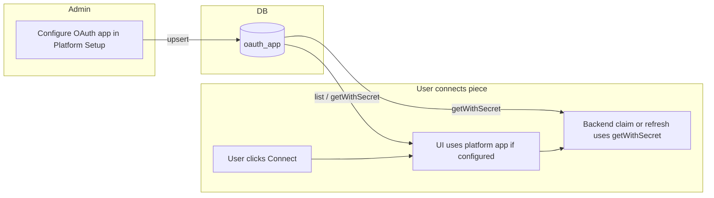

# OAuth App in DB – Purpose and Use Cases

## 1. Purpose of `oauth_app` in the Database

The `**oauth_app**` table stores **per-platform, per-piece OAuth2 client credentials** (client ID and encrypted client secret). It lets a **platform admin** register their own OAuth app for a given piece (e.g. Google Sheets, Slack) instead of using Activepieces’ shared cloud app.

- **Schema** ([oauth-app.entity.ts](packages/server/api/src/app/ee/oauth-apps/oauth-app.entity.ts)): `id`, `pieceName`, `platformId`, `clientId`, `clientSecret` (jsonb, encrypted). Unique on `(platformId, pieceName)`. FK to `platform` with CASCADE delete.
- **Service** ([oauth-app.service.ts](packages/server/api/src/app/ee/oauth-apps/oauth-app.service.ts)): `upsert`, `list`, `getWithSecret`, `delete`. Secrets are encrypted at rest; `clientSecret` is stripped from API responses via `deleteProps`.
- **API**: `POST/GET/DELETE /v1/oauth-apps` – platform-scoped; only platform owners can upsert/delete; members can list their platform’s apps.

---

## 2. Use Cases in the Activepieces Project

### Use case 1: Platform-owned OAuth2 apps (override default/cloud apps)

Admins configure custom OAuth apps in **Platform Admin → Setup → Pieces** so that:

- **Branding**: Their app name appears on the provider’s consent screen instead of “Activepieces”.
- **Limits**: They avoid shared-app rate limits.
- **Compliance**: They use company-owned credentials.

Ref: [docs/admin-guide/guides/manage-oauth2.mdx](docs/admin-guide/guides/manage-oauth2.mdx).

### Use case 2: Claiming connections (authorization code → tokens)

When a user connects an OAuth2 piece and the platform has registered an app for that piece:

- [platform-oauth2-service.ts](packages/server/api/src/app/ee/app-connections/platform-oauth2-service.ts) **claim** loads the app via `oauthAppService.getWithSecret({ platformId, pieceName, clientId })`.
- It uses that app’s `clientId` and decrypted `clientSecret` in `credentialsOauth2Service(log).claim(...)` and returns a connection of type `PLATFORM_OAUTH2`.

### Use case 3: Refreshing tokens

When refreshing an existing `PLATFORM_OAUTH2` connection:

- **refresh** in [platform-oauth2-service.ts](packages/server/api/src/app/ee/app-connections/platform-oauth2-service.ts) again calls `oauthAppService.getWithSecret(...)` and passes the decrypted secret into `credentialsOauth2Service(log).refresh(...)`.

### Use case 4: UI – list, configure, delete platform OAuth apps

- **List**: `GET /v1/oauth-apps` – platform owners/members see which pieces have a platform OAuth app.
- **Configure**: Platform Admin → Setup → Pieces → lock icon → enter Client ID/Secret (`POST /v1/oauth-apps` upsert).
- **Delete**: Platform owners can remove a configured app via `DELETE /v1/oauth-apps/:id`.

The React UI ([oauth-apps-hooks.ts](packages/react-ui/src/features/connections/lib/oauth-apps-hooks.ts)) builds a map of which pieces have a platform OAuth app and uses it when showing connection options.

### Use case 5: Choosing which OAuth app to use when connecting

When adding a connection for an OAuth2 piece, the UI prefers the **platform** app over the **cloud** app:

- [oauth2-utils.ts](packages/react-ui/src/lib/oauth2-utils.ts) `getPredefinedOAuth2App`: if the piece has a platform OAuth app, it is used; otherwise the cloud app is used.

---

## 3. End-to-end flow (summary)

**One-line summary:** `oauth_app` lets a platform register its own OAuth2 client per piece; that app is then used to **claim** and **refresh** user OAuth connections for that piece, with the UI listing and preferring platform apps over the default cloud app.