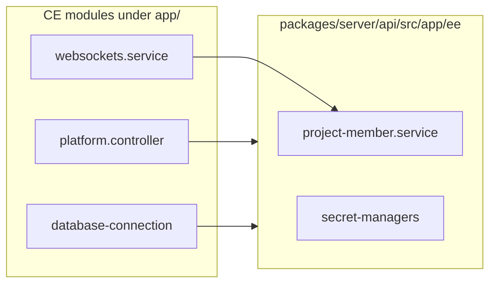

# Plan: Remove EE folders and dependencies (MIT-only fork)

## Goal and non-goals (as requested)

- **Goal**: Run and ship **Community Edition only** (set/assume `AP_EDITION=ce`), with **no commercial EE source code** present (`packages/ee/` and `packages/server/api/src/app/ee/` removed) and CE features working end-to-end.
- **Non-goal**: Preserving EE/Cloud features. After removal, any EE-only routes/UI/features should be removed or replaced with CE-safe behavior.
- **Database stance** (selected): **Leave existing EE tables untouched**; CE should ignore them (no destructive drop migrations).

## License scope — three different “EE” locations

Per [LICENSE](LICENSE), **Commercial License** (`packages/ee/LICENSE`) applies **only** to:

- [`packages/ee/`](packages/ee/)
- [`packages/server/api/src/app/ee/`](packages/server/api/src/app/ee/)

**Separate from those:** [`packages/shared/src/lib/ee/`](packages/shared/src/lib/ee/) is **not** listed in the commercial carve-out, so under the root LICENSE it is **MIT** (same as the rest of `packages/shared`). It only contains shared **types, DTOs, and small helpers** (billing, oauth-apps, scim, etc.) and is re-exported from [`packages/shared/src/index.ts`](packages/shared/src/index.ts).

| Path | License | Role |
|------|---------|------|
| `packages/ee/` | Commercial | Embed SDK, billing UI, auth helpers, etc. |
| `packages/server/api/src/app/ee/` | Commercial | Server Enterprise modules |
| **`packages/shared/src/lib/ee/`** | **MIT** | Shared types used by multiple editions |

### Scope decision (unchanged intent, explicit paths)

| Scope | Deletes commercial source | [`packages/shared/src/lib/ee/`](packages/shared/src/lib/ee/) |
|-------|---------------------------|---------------------------------------------------------------|
| **A – Minimal (recommended first)** | Delete `packages/ee` + `server/.../app/ee`, strip imports / stubs | **Keep** (MIT); optional **rename** later for clarity (not a license requirement) |
| **B – Aggressive** | Same as A | **Rename or split** DTOs into neutral paths (e.g. `lib/platform/...`), update exports + consumers; bump `@activepieces/shared` per [AGENTS.md](AGENTS.md) |

**Recommendation:** achieve **A** first; treat **B** as optional cleanup because the folder name is confusing but not commercial-licensed.

---

## Why this is not “delete two directories”

### 1. Unconditional imports from CE code into `app/ee`

[`packages/server/api/src/app/app.ts`](packages/server/api/src/app/app.ts) imports **all** EE modules at the top level (not only inside `switch (edition)`). Even for `ApEdition.COMMUNITY`, the TypeScript graph still references `./ee/...` unless you remove or isolate those imports.

Roughly **40+** server files under `packages/server/api/src/app` import paths under `../ee/` or `./ee/` (examples: [`core/websockets.service.ts`](packages/server/api/src/app/core/websockets.service.ts), [`platform/platform.controller.ts`](packages/server/api/src/app/platform/platform.controller.ts), [`database/database-connection.ts`](packages/server/api/src/app/database/database-connection.ts), [`mcp/mcp-service.ts`](packages/server/api/src/app/mcp/mcp-service.ts)). Those must be **rewired** (stubs, moved code, or feature removal)—not only deleting folders.

### 2. Workspace and path aliases

- Root [`package.json`](package.json) lists `packages/ee/embed-sdk` as a workspace member.
- [`tsconfig.base.json`](tsconfig.base.json) maps `@activepieces/ee-auth`, `@activepieces/ee/billing/ui`, `@ee/*`, `ee-embed-sdk` → under [`packages/ee/`](packages/ee/).

These must be removed or repointed after code deletion.

### 3. [`packages/shared/src/lib/ee/`](packages/shared/src/lib/ee/) (MIT)

Not a commercial directory. Removing **only** `packages/ee` and `server/app/ee` still leaves imports like `export * from './lib/ee/billing'` in [`packages/shared/src/index.ts`](packages/shared/src/index.ts) valid. **Scope B** is the phase that renames or splits this tree for a cleaner public API and naming.

### 4. Database and migrations

EE features add tables/entities registered via [`database-connection.ts`](packages/server/api/src/app/database/database-connection.ts) / postgres equivalents. Dropping code without a **data migration strategy** leaves orphaned tables or breaks startup if TypeORM still expects entities.

Options: (1) ship migrations that drop EE tables (follow [Database Migrations Playbook](https://www.activepieces.com/docs/handbook/engineering/playbooks/database-migration)); (2) leave tables unused (simpler, messier).

### 5. Front-end, tests, CI

- Grep for `@ee/`, embed-sdk, billing UI, and feature flags that assume EE.
- Remove or gate tests under `packages/server/api/test/integration/ee`, `packages/tests-e2e/scenarios/ee`, etc.
- Update [`scripts/validate-license-compliance.sh`](scripts/validate-license-compliance.sh) and [`.husky/pre-commit`](.husky/pre-commit): commercial EE paths may disappear; [`packages/shared/src/lib/ee/`](packages/shared/src/lib/ee/) was never part of that script’s EE path pattern unless you extend it.
- Docker / deploy docs that reference `AP_EDITION=ee|cloud`.

---

## Phased implementation

### Phase 0 – Inventory (read-only checklist)

- List all `from '.../ee/'` imports in `packages/server`, `packages/web`, `packages/react-ui`, `packages/engine`, `extensions` — **excluding** [`packages/shared/src/lib/ee/`](packages/shared/src/lib/ee/) internal files unless tracing re-exports.
- List Nx/turbo projects that depend on `packages/ee/*`.
- Confirm target edition: **CE-only** (`ApEdition.COMMUNITY` only) and remove `ee`/`cloud` branches from [`packages/shared/src/lib/flag/flag.ts`](packages/shared/src/lib/flag/flag.ts) usages where safe.

### Phase 1 – Stop the bleeding (buildable CE without `app/ee` imports)

- Refactor [`app.ts`](packages/server/api/src/app/app.ts): remove EE imports; keep only `COMMUNITY` registration path (and BMP hooks if you keep them).
- For each CE file that imported `app/ee`, choose one: **move** minimal logic, **stub** no-ops for CE, or **remove** the feature.
- Pay special attention to: database entity registration, websocket auth, MCP RBAC, platform controller, OAuth/connection flows, canary routing.

### Phase 2 – Delete commercial trees

- Delete [`packages/ee/`](packages/ee/) (including [`packages/ee/LICENSE`](packages/ee/LICENSE)).
- Delete [`packages/server/api/src/app/ee/`](packages/server/api/src/app/ee/).
- Update root [`LICENSE`](LICENSE) to remove the EE directory carve-out (lawyer review recommended for redistribution wording).

### Phase 3 – Shared package (scope A vs B)

- **A:** Keep [`packages/shared/src/lib/ee/`](packages/shared/src/lib/ee/) as-is (MIT); rename only if desired later.
- **B:** Move types to neutral paths, update [`packages/shared/src/index.ts`](packages/shared/src/index.ts), bump `@activepieces/shared`.

### Phase 4 – Migrations and data

- **Chosen approach**: **Do not drop tables.** Ensure CE startup and runtime do not reference EE entities/services.\n+- Optional documentation: “legacy EE tables may exist but are unused in CE-only fork.”

### Phase 5 – Tooling and verification

- Remove workspace entries and tsconfig path aliases for deleted packages.
- Run `npm run lint-dev`, server/unit tests, and a CE smoke path.
- Simplify license validation / husky when commercial EE dirs are gone.

---

## Risks and mitigations

| Risk | Mitigation |
|------|------------|
| Hidden runtime dependency on EE service | Grep + integration tests with `AP_EDITION=ce` only |
| Upstream merge pain | Long-lived fork branch; document divergence |
| Legal | Redistribute only after LICENSE text matches shipped tree; not legal advice |

---

## Realistic effort

This is a **multi-week** fork refactor at this repo size, unless you only **run** CE (`AP_EDITION=ce`) and **defer** physical deletion.
