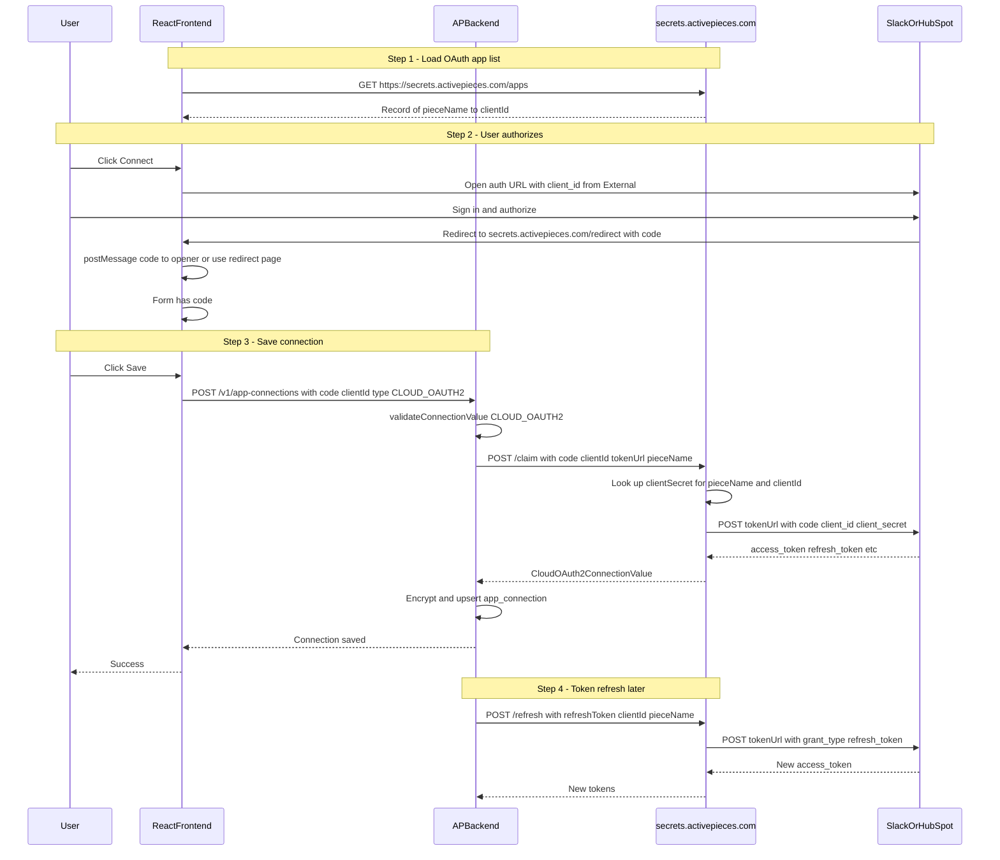
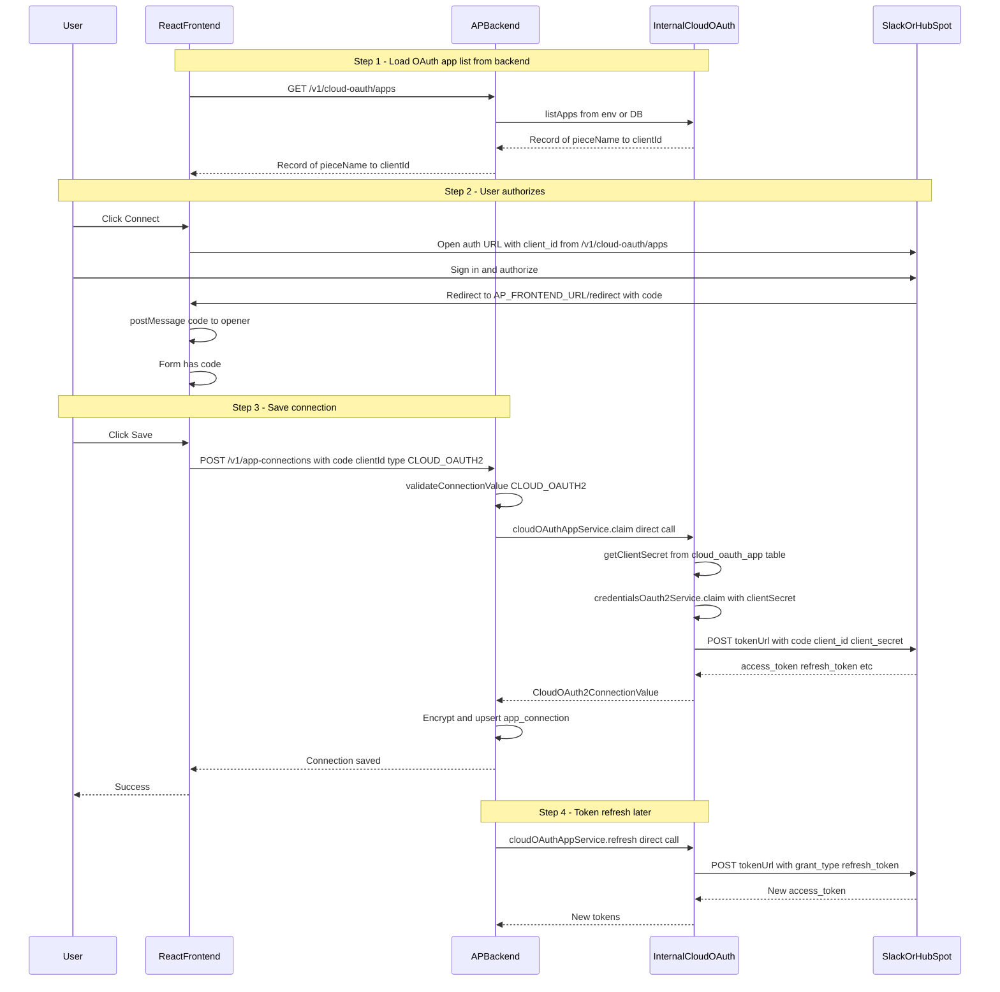

# Implement Cloud OAuth Endpoints Inside Activepieces Backend

## Todo List

- Create `cloud_oauth_app` table migration (postgres + sqlite)
- Create `CloudOAuthAppEntity` in `cloud-oauth/` module
- Register `CloudOAuthAppEntity` in `database-connection.ts`
- Create `cloudOAuthAppService` with listApps, getWithSecret, claim, refresh
- Create `cloudOAuthAppController` with GET /apps, POST /claim, POST /refresh
- Create `cloudOAuthAppModule` and register in app.ts for COMMUNITY
- Update `oauth-apps.ts` to call `/v1/cloud-oauth/apps` in CE
- Update `oauth2-connection-settings.tsx` to use thirdPartyUrl for CLOUD_OAUTH2
- Update `cloud-oauth2-service.ts` to call internal cloudOAuthAppService
- Test: insert cloud OAuth app, connect Slack, verify claim and refresh work

## Goal

Replace external calls to `secrets.activepieces.com` with **internal endpoints** inside the Activepieces backend so that:

- **Frontend** fetches OAuth app list (client IDs) from `/v1/cloud-oauth/apps`
- **Backend** exchanges authorization codes for tokens via `/v1/cloud-oauth/claim`
- **Backend** refreshes tokens via `/v1/cloud-oauth/refresh`
- **Frontend** uses your redirect URL (or internal redirect handler)

This allows you to use your own Slack, HubSpot, etc. OAuth apps with the simplified "Connect only" UI (CLOUD_OAUTH2 type) **without running a separate service**.

## Current Hardcoded URLs

1. **Frontend:** `https://secrets.activepieces.com/apps` - GET list of OAuth apps
2. **Frontend:** `https://secrets.activepieces.com/redirect` - OAuth redirect URL
3. **Backend:** `https://secrets.activepieces.com/claim` - POST exchange code for tokens
4. **Backend:** `https://secrets.activepieces.com/refresh` - POST refresh tokens

## Auth Data Flow Diagrams

### Current flow (using secrets.activepieces.com)




### Required flow (after update - internal backend)




### Summary of changes

- **Load apps:** Current: Frontend → secrets.activepieces.com/apps. After: Frontend → Backend GET /v1/cloud-oauth/apps.
- **Redirect URL:** Current: secrets.activepieces.com/redirect. After: AP_FRONTEND_URL/redirect.
- **Claim:** Current: Backend → HTTP → secrets.activepieces.com/claim → Provider. After: Backend → internal cloudOAuthAppService.claim → Provider.
- **Refresh:** Current: Backend → HTTP → secrets.activepieces.com/refresh → Provider. After: Backend → internal cloudOAuthAppService.refresh → Provider.
- **Secrets:** Current: Stored on secrets.activepieces.com. After: Stored in `cloud_oauth_app` table (CE).

## Best Approach for Community Edition (CE)

To fulfill OAuth requirements in CE **without violating EE policy** (no use of code under `packages/ee` or `packages/server/api/src/app/ee` without a license):

- **Use a new table and new CE-only module.** Do **not** reuse the existing `oauth_app` table or `ee/oauth-apps` module in CE, as those are EE features.
- **New table:** `cloud_oauth_app` — created via a migration in the **core** migration folder (`database/migration/postgres/` and `database/migration/common/` for SQLite). Columns: `id`, `created`, `updated`, `pieceName`, `clientId`, `clientSecret` (jsonb, encrypted). Unique on `pieceName` (one cloud OAuth app per piece in CE).
- **New module:** `packages/server/api/src/app/cloud-oauth/` — entity, service, controller, module live **outside** `ee/`. Use core `encryptUtils` from `app/helper/encryption.ts` for `clientSecret`. No imports from `ee/` or `@activepieces/ee-shared`.
- **Registration:** Register `cloudOAuthAppModule` in [app.ts](packages/server/api/src/app/app.ts) **for `ApEdition.COMMUNITY`** (inside the `case ApEdition.COMMUNITY` block). Optionally register for CLOUD/ENTERPRISE if you want internal cloud there too.

This keeps the feature fully in MIT-licensed core code and ensures all CLOUD_OAUTH2 piece connections (Slack, HubSpot, etc.) work in CE without external services or EE dependencies.

## Implementation Strategy

Instead of calling external `secrets.activepieces.com`, we'll:

1. Create internal backend endpoints `/v1/cloud-oauth/apps`, `/v1/cloud-oauth/claim`, `/v1/cloud-oauth/refresh`
2. **For CE:** Store cloud OAuth app configs in the new `**cloud_oauth_app`** table only (no environment variables required).
3. Update frontend to call `/v1/cloud-oauth/apps` when using internal cloud (e.g. CE or when internal cloud is enabled)
4. Update backend `cloudOAuth2Service` to call internal `cloudOAuthAppService.claim()` / `refresh()` (direct service calls, no HTTP to external URLs)
5. Reuse existing `credentialsOauth2Service` logic for token exchange (it already handles provider token URLs)

## Pre-Implementation Validation

Verified before implementation:

1. `**/redirect` route already exists** — [packages/react-ui/src/app/routes/redirect.tsx](packages/react-ui/src/app/routes/redirect.tsx) handles OAuth callback correctly:
  - Extracts `code` from query params
  - Posts code back to opener window via `postMessage` (lines 65-72)
  - No new route needed; just change CLOUD_OAUTH2 to use `thirdPartyUrl` instead of hardcoded external URL
2. `**cloudAuthEnabled` defaults to `true`** — In [platform.service.ts](packages/server/api/src/app/platform/platform.service.ts) line 73, new platforms are created with `cloudAuthEnabled: true`. So CE platforms will fetch cloud OAuth apps by default; no extra configuration needed.
3. `**thirdPartyUrl` flag** — Resolves to `{AP_FRONTEND_URL}/redirect` via `getThirdPartyRedirectUrl()` in [federated-authn-service.ts](packages/server/api/src/app/ee/authentication/federated-authn/federated-authn-service.ts). This is the URL we'll use for CLOUD_OAUTH2 redirect instead of `secrets.activepieces.com/redirect`.

## Implementation

### Ensuring All Piece Connections Work

- **OAUTH2:** Unchanged; still uses `credentialsOAuth2Service` (user supplies client ID/secret in form).
- **PLATFORM_OAUTH2:** Unchanged; Cloud/EE only, uses `oauth_app` and `platformOAuth2Service`.
- **CLOUD_OAUTH2:** In CE, uses new internal `cloudOAuthAppService` and `cloud_oauth_app` table; no external secrets.activepieces.com; claim and refresh run in-process.

**Verification:** (1) In CE, add a Slack/HubSpot app via DB or env, open connection dialog, choose Connect, complete auth and save — connection works. (2) Token refresh for that connection succeeds. (3) OAUTH2 and PLATFORM_OAUTH2 flows unchanged.

### 1. Storage: Cloud OAuth App Configuration (CE)

**Recommended for CE: New table `cloud_oauth_app`**

- **Schema:** `id` (varchar 21), `created`, `updated`, `pieceName` (varchar), `clientId` (varchar), `clientSecret` (jsonb, encrypted via `encryptUtils`). Unique constraint on `pieceName` so there is one cloud OAuth app per piece per instance.
- **Migrations:** Add `AddCloudOAuthApp` in [packages/server/api/src/app/database/migration/postgres/](packages/server/api/src/app/database/migration/postgres/) and equivalent in [database/migration/common/](packages/server/api/src/app/database/migration/common/) if SQLite is supported. Do **not** place migrations under `ee/`.
- **Entity:** New file `packages/server/api/src/app/cloud-oauth/cloud-oauth-app.entity.ts` (EntitySchema), registered in [database-connection.ts](packages/server/api/src/app/database/database-connection.ts) in the core entities list.

### 2. Backend: Create Cloud OAuth Module

**New File:** `packages/server/api/src/app/cloud-oauth/cloud-oauth-app.module.ts`

- Create Fastify plugin similar to `oauth-app.module.ts`
- Register routes at `/v1/cloud-oauth` prefix
- Implement three endpoints:

**GET `/v1/cloud-oauth/apps`**

- Read cloud OAuth apps from `cloud_oauth_app` table
- Return `Record<string, { clientId: string }>` format (same as external service)
- Include both short name (`"slack"`) and full piece name (`"@activepieces/piece-slack"`)

**POST `/v1/cloud-oauth/claim`**

- Accept same request body as external service: `{ pieceName, code, codeVerifier, authorizationMethod, clientId, tokenUrl, edition }`
- Look up `clientSecret` for the given `pieceName` and `clientId`
- Reuse `credentialsOauth2Service.claim()` logic to exchange code with provider
- Return tokens in `CloudOAuth2ConnectionValue` format

**POST `/v1/cloud-oauth/refresh`**

- Accept same request body: `{ refreshToken, pieceName, clientId, edition, authorizationMethod, tokenUrl }`
- Look up `clientSecret`
- Reuse `credentialsOauth2Service.refresh()` logic
- Return new tokens

**New File:** `packages/server/api/src/app/cloud-oauth/cloud-oauth-app.service.ts`

- **No imports from `ee/` or `@activepieces/ee-shared`** (CE-only module). Use core `encryptUtils` from `app/helper/encryption.ts` for encrypting/decrypting `clientSecret`.
- Service functions to:
  - `listApps()`: Read from `cloud_oauth_app` table, return `Record<string, { clientId: string }>`
  - `getWithSecret(pieceName, clientId)`: Look up row and return decrypted clientSecret for claim/refresh
  - `claim(request)`: Exchange code for tokens (reuse credentialsOAuth2Service logic after resolving clientSecret)
  - `refresh(request)`: Refresh tokens (reuse credentialsOAuth2Service logic)

**New File:** `packages/server/api/src/app/cloud-oauth/cloud-oauth-app.controller.ts`

- Fastify controller with three routes
- Use `securityAccess.publicPlatform()` or `securityAccess.public()` for apps endpoint (no auth needed)
- Use `securityAccess.publicPlatform()` for claim/refresh (needs platform context)

### 3. Register Module in Backend

**File:** [packages/server/api/src/app/app.ts](packages/server/api/src/app/app.ts)

- In the `case ApEdition.COMMUNITY:` block, add: `await app.register(cloudOAuthAppModule)` so that CE has the cloud OAuth API and all CLOUD_OAUTH2 connections work without external services.
- Optionally register for CLOUD/ENTERPRISE as well if you want internal cloud OAuth there too.

### 4. Frontend: Update to Use Internal Endpoint

**File:** [packages/react-ui/src/features/connections/lib/api/oauth-apps.ts](packages/react-ui/src/features/connections/lib/api/oauth-apps.ts)

- When using internal cloud (e.g. edition is CE, or internal cloud is enabled), call `GET /v1/cloud-oauth/apps` instead of `GET https://secrets.activepieces.com/apps`. Use relative URL `'/v1/cloud-oauth/apps'` so the same API base is used.
- Ensure [oauth-apps-hooks.ts](packages/react-ui/src/features/connections/lib/oauth-apps-hooks.ts) builds `piecesOAuth2AppsMap` from `/v1/cloud-oauth/apps` in CE when cloud auth is enabled so that the Connect button and connection dialog show the correct apps and connection types.

**File:** [packages/react-ui/src/app/connections/oauth2-connection-settings.tsx](packages/react-ui/src/app/connections/oauth2-connection-settings.tsx)

- For CLOUD_OAUTH2 redirect URL: Use `thirdPartyUrl` (AP_FRONTEND_URL/redirect) instead of hardcoded `secrets.activepieces.com/redirect`
- Change lines 58-61: remove the special case for CLOUD_OAUTH2; use `thirdPartyUrl` for all OAuth2 types
- The `/redirect` route already exists and handles `postMessage` correctly (see Pre-Implementation Validation above)

### 5. Backend: Update Cloud OAuth Service to Use Internal Endpoints

**File:** [packages/server/api/src/app/app-connection/app-connection-service/oauth2/services/cloud-oauth2-service.ts](packages/server/api/src/app/app-connection/app-connection-service/oauth2/services/cloud-oauth2-service.ts)

- Replace `'https://secrets.activepieces.com/claim'` with internal call to `cloudOAuthAppService.claim()` (direct service call, not HTTP)
- Replace `'https://secrets.activepieces.com/refresh'` with internal call to `cloudOAuthAppService.refresh()`
- Remove `apAxios` calls, use service functions directly

**Alternative:** Keep HTTP calls but use internal URLs:

- Use `http://localhost:3000/v1/cloud-oauth/claim` (or get base URL from system config)
- This keeps the service isolated but adds HTTP overhead

**Recommendation:** Use **direct service calls** (no HTTP) for better performance and simpler error handling.

### 6. Role of `/v1/cloud-oauth/claim` and how code exchange works

**Role:** The claim endpoint exchanges an OAuth **authorization code** (from the provider after user authorizes) for **access_token** and optionally **refresh_token**. It runs server-side because it needs the **client_secret**, which the frontend must not have.

**When it is called:** After the user clicks "Connect" (authorizes at Slack/HubSpot), then clicks "Save" in the dialog. The backend receives the code and calls claim to get tokens to store.

**Step-by-step (how claim exchanges code with Slack):**

1. **Claim receives:** `pieceName`, `code`, `clientId`, `tokenUrl` (e.g. `https://slack.com/api/oauth.v2.access`), `authorizationMethod`, `redirectUrl`, optional `codeVerifier`.
2. **Look up client secret:** From `cloud_oauth_app` table, find the row for `pieceName` + `clientId` and get decrypted `clientSecret`.
3. **Build request to provider:** POST to `tokenUrl` with form-encoded body:
  - `grant_type=authorization_code`
  - `code=<authorization_code>`
  - `client_id=<clientId>`
  - `client_secret=<clientSecret>`
  - `redirect_uri=<redirect_uri>` (must match the redirect used in the auth step)
  - `code_verifier=<pkce>` if PKCE was used
   If `authorizationMethod === "HEADER"`, send `client_id`/`client_secret` as Basic Auth header instead of in body.
4. **Call provider:** HTTP POST to the provider token URL (e.g. Slack: `https://slack.com/api/oauth.v2.access`). Provider validates code, client_id, client_secret, redirect_uri.
5. **Provider response:** e.g. Slack returns `{ access_token, token_type, scope, data: { team, authed_user, ... } }`. Some providers also return `refresh_token`, `expires_in`.
6. **Format and return:** Normalize to `CloudOAuth2ConnectionValue` (access_token, refresh_token, expires_in, token_type, scope, data, claimed_at) and return to caller. Backend then encrypts and stores this in `app_connection`.

**Why claim is needed:** The frontend only has the code and client_id; the client_secret must stay on the server. Claim is the secure server-side step that uses the secret to exchange the code for tokens.

**Reference implementation:** [packages/server/api/src/app/app-connection/app-connection-service/oauth2/services/credentials-oauth2-service.ts](packages/server/api/src/app/app-connection/app-connection-service/oauth2/services/credentials-oauth2-service.ts) already implements this exchange (body building, BODY vs HEADER auth, POST to tokenUrl, response formatting). The internal claim service should reuse it after looking up `clientSecret`.

### 7. API Contract (Internal Endpoints)

Internal endpoints to implement:

#### GET `/v1/cloud-oauth/apps`

**Request:**

- Query param: `edition` (optional, e.g., `"ce"`)

**Response:**

```json
{
  "slack": { "clientId": "YOUR_SLACK_CLIENT_ID" },
  "@activepieces/piece-slack": { "clientId": "YOUR_SLACK_CLIENT_ID" },
  "hubspot": { "clientId": "YOUR_HUBSPOT_CLIENT_ID" },
  "@activepieces/piece-hubspot": { "clientId": "YOUR_HUBSPOT_CLIENT_ID" },
  ...
}
```

**Implementation:**

- Read from `cloud_oauth_app` table; return `Record<string, { clientId: string }>` keyed by pieceName (include both short name and full piece name for each app where applicable)
- Return `{}` if no rows in table

#### POST `/v1/cloud-oauth/claim`

**Request Body:**

```json
{
  "pieceName": "@activepieces/piece-slack",
  "code": "authorization_code_from_provider",
  "codeVerifier": "pkce_code_verifier_or_undefined",
  "authorizationMethod": "BODY" | "HEADER" | undefined,
  "clientId": "YOUR_SLACK_CLIENT_ID",
  "tokenUrl": "https://slack.com/api/oauth.v2.access",
  "edition": "ce"
}
```

**Response:** `CloudOAuth2ConnectionValue` format (same as external service)

**Implementation:**

1. Look up `clientSecret` from `cloud_oauth_app` table for `pieceName` + `clientId`
2. Call `credentialsOAuth2Service.claim()` with `clientId`, `clientSecret`, `code`, `tokenUrl`, etc.
3. Return formatted response

#### POST `/v1/cloud-oauth/refresh`

**Request Body:**

```json
{
  "refreshToken": "existing_refresh_token",
  "pieceName": "@activepieces/piece-slack",
  "clientId": "YOUR_SLACK_CLIENT_ID",
  "edition": "ce",
  "authorizationMethod": "BODY" | "HEADER" | undefined,
  "tokenUrl": "https://slack.com/api/oauth.v2.access"
}
```

**Response:** Same as `/claim`

**Implementation:**

1. Look up `clientSecret` from `cloud_oauth_app` table
2. Call `credentialsOauth2Service.refresh()` with `refreshToken`, `clientId`, `clientSecret`, `tokenUrl`
3. Return formatted response

### 8. Security Considerations

- **Store client secrets securely** - Use encrypted database storage (`cloud_oauth_app.clientSecret` via `encryptUtils`)
- **Validate `pieceName` and `clientId`** - Ensure they match configured apps before looking up secrets
- **Error handling** - Return appropriate HTTP status codes (400 for invalid requests, 500 for server errors)
- **Rate limiting** - Consider adding rate limits to prevent abuse (Fastify has rate limit plugins)
- **HTTPS only** - Ensure your Activepieces backend uses HTTPS in production

### 9. Testing

1. **Insert a cloud OAuth app** into `cloud_oauth_app` (e.g. via SQL or a seed script) for a piece such as `@activepieces/piece-slack` with `clientId` and encrypted `clientSecret`.
2. **Test apps endpoint:**
  - Start backend
  - Call `GET http://localhost:3000/v1/cloud-oauth/apps`
  - Verify it returns your Slack client ID
3. **Test claim flow:**
  - Open "Connect to Slack" dialog in frontend
  - Verify frontend calls `/v1/cloud-oauth/apps` (check network tab)
  - Click "Connect" → authorize at Slack
  - Click "Save" → verify backend calls internal `cloudOAuthAppService.claim()`
  - Check logs show claim success
4. **Test refresh:**
  - Use existing CLOUD_OAUTH2 connection
  - Trigger token refresh (when token expires or manually)
  - Verify backend calls internal `cloudOAuthAppService.refresh()`

## Result

After implementation the goal is fulfilled and all piece connections work:

- **No external service needed in CE** — Everything runs inside Activepieces backend; no calls to secrets.activepieces.com.
- **CLOUD_OAUTH2** — Frontend calls `/v1/cloud-oauth/apps`; backend uses internal `cloudOAuthAppService.claim()` / `refresh()` with `cloud_oauth_app` table. Slack, HubSpot, etc. use the simplified "Connect only" UI without issues.
- **OAUTH2 and PLATFORM_OAUTH2** — Unchanged; existing flows continue to work.
- **EE policy** — CE uses only the new `cloud-oauth` module and `cloud_oauth_app` table (no EE code).
- Client secrets stored securely in `cloud_oauth_app` table (encrypted via `encryptUtils`). No environment variables required.

## Migration Path

1. **Phase 1:** Implement internal endpoints, keep external URLs as fallback
2. **Phase 2:** Update frontend/backend to prefer internal endpoints
3. **Phase 3:** Remove external URL fallback (optional)

## Optional Enhancements

- **Admin UI:** Add platform admin UI to manage cloud OAuth apps (CRUD for `cloud_oauth_app` rows)
- **Per-platform config:** Support different cloud OAuth apps per platform (multi-tenant)
- **Health check:** Add `/v1/cloud-oauth/health` endpoint
- **Metrics:** Add logging/metrics for claim/refresh success rates

