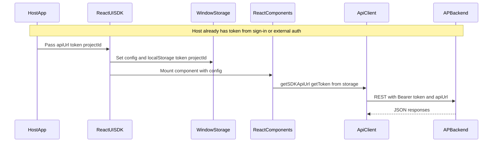
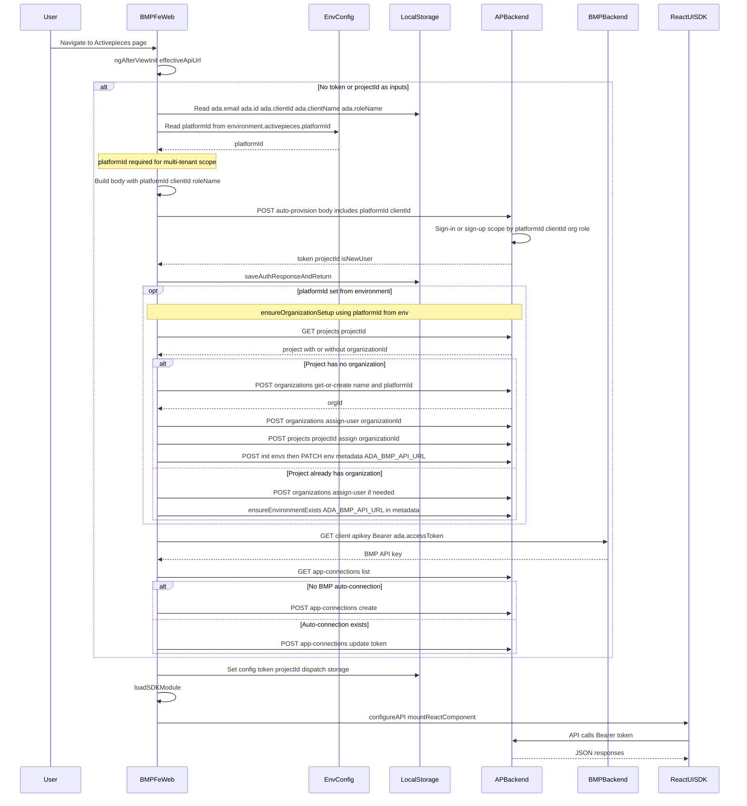

# SDK Auth Data Flow Diagrams

## Goal

Add a new section to [docs/project/BMP_MULTIPLE_USER_HANDLING_WITH_ROLES.md](docs/project/BMP_MULTIPLE_USER_HANDLING_WITH_ROLES.md) containing two **Mermaid sequence diagrams** (Auth Data Flow):

1. **Original SDK authentication flow** – host supplies token/config; SDK sets `__AP_SDK_CONFIG__` and storage; React UI uses them for API calls (SDK does not perform login).
2. **bmp-fe-web authentication flow** – based on [bmp-fe-web/src/app/pages/activepieces/page/activepieces.component.ts](/Users/rajarammohanty/Documents/ADA/bmp-fe-web/src/app/pages/activepieces/page/activepieces.component.ts): `ngAfterViewInit` → `exchangeToken` (localStorage ada.*, POST auto-provision) → `ensureOrganizationSetup` (if platformId) → `ensureBmpConnection` (GET /client/apikey, POST app-connections) → set config → load SDK → mount component.

Reference: existing doc (same file), react-ui-sdk config/storage usage, and the bmp-fe-web component code above.

---

## Key Code References

- **SDK config and token consumption**
  - [packages/react-ui-sdk/src/providers/sdk-providers.tsx](packages/react-ui-sdk/src/providers/sdk-providers.tsx): Sets `window.__AP_SDK_CONFIG__` and `localStorage` token/projectId from `config` (lines 114–137).
  - [packages/react-ui-sdk/src/angular/react-ui-wrapper.component.ts](packages/react-ui-sdk/src/angular/react-ui-wrapper.component.ts): Host passes `apiUrl`, `token`, `projectId`; component sets `__AP_SDK_CONFIG__` and storage (lines 61–82).
  - [packages/react-ui/src/lib/api.ts](packages/react-ui/src/lib/api.ts): `getSDKApiUrl()` reads `window.__AP_SDK_CONFIG__.apiUrl`; token is read via `authenticationSession.getToken()` which uses [packages/react-ui/src/lib/authentication-session.ts](packages/react-ui/src/lib/authentication-session.ts) and [packages/react-ui/src/lib/ap-browser-storage.ts](packages/react-ui/src/lib/ap-browser-storage.ts) (default: localStorage).
- **Original standalone auth (for contrast)**
  - Full UI: user hits sign-in/sign-up pages → `authenticationApi.signIn` / `signUp` → POST `/v1/authentication/sign-in` or sign-up → backend returns token → `authenticationSession.saveResponse()` stores in ApStorage (localStorage). No SDK; `api.ts` uses `window.location.origin` when `__AP_SDK_CONFIG__` is absent.
- **How platformId from environment is set up (bmp-fe-web)**
  - `platformId` comes from the Angular environment config (typically `environment.activepieces.platformId` in `environments/environment.ts` or environment-specific variants). It is a tenant (platform) identifier used by Activepieces backend for multi-tenant scoping.
  - When present, bmp-fe-web includes it in the `/auto-provision` request body (SDK mode) and then uses it to run `ensureOrganizationSetup(..., platformId)` which creates/assigns org and sets environment metadata (e.g. `ADA_BMP_API_URL`).
  - **When platformId is set, the flow is:**
    - **Before auto-provision:** bmp-fe-web reads `platformId` from `environment.activepieces?.platformId` and includes it (with `clientId`, `clientName`, `roleName`) in the POST body to `/auto-provision`. The backend uses it to scope the user and project to that tenant.
    - **After auth (token/projectId received):** bmp-fe-web calls `ensureOrganizationSetup(apiBaseUrl, token, projectId, platformId)` which:
      - GET project, check for `organizationId`
      - If missing: POST `organizations/get-or-create` with `name` and `platformId`
      - POST `organizations/assign-user`
      - Assign project to org
      - Initialize org environments and set environment metadata (`ADA_BMP_API_URL`) from `environment.api`
- **Role of platformId**
  - **Activepieces (backend) – required for multi-tenant:** On the Activepieces side, **platformId is required to handle multi-tenancy**. Each **platform** is a **tenant**; user, project, and organization are scoped by `platformId`. The backend resolves `platformId` as: (1) `request.body.platformId` (SDK mode), or (2) `platformUtils.getPlatformIdForRequest(request)` (from request principal, or hostname/custom domain, or in Community Edition the oldest platform). If **platformId cannot be determined**, the API returns validation error: *"Platform ID could not be determined. Please provide platformId parameter or ensure the request is made to a valid platform."* For **SDK/embedded** use (e.g. one host like bmp-fe-web serving multiple tenants), the request usually has no tenant context from URL/principal, so **the client must send `platformId**` in the request body so Activepieces knows which tenant (platform) to use. See [authentication.controller.ts](packages/server/api/src/app/authentication/authentication.controller.ts) (lines 384–398, 414–422) and [platform.utils.ts](packages/server/api/src/app/platform/platform.utils.ts) (`getPlatformIdForRequest`).
  - **When `platformId` is provided to `/auto-provision` (SDK mode):** `clientId` is required; user and org are scoped to that platform (tenant). Same `clientId` + same `platformId` → same organization. `platformId` should be the platform of an OWNER (tenant owner).
  - **bmp-fe-web:** `platformId` comes from **environment** (`environment.activepieces?.platformId`). If set: (1) sent in auto-provision so Activepieces can scope the user to that tenant; (2) after auth, **ensureOrganizationSetup** is called with this `platformId`. If not set, auto-provision may still run only when the request context (e.g. hostname) resolves a platform; in typical SDK embedding, **platformId must be set** for correct multi-tenant behavior.
- **Importance of platformId for the SDK config**
  - The **SDK config** (what the host passes to the SDK) is `apiUrl`, `token`, and `projectId` (optional `flowId`). The SDK does **not** receive `platformId` as a config field; it only uses apiUrl, token, and projectId for API calls.
  - **platformId is required on the Activepieces side for multi-tenant handling** (see above). The backend needs platformId to know which tenant (platform) to use; without it, the request can fail or resolve to the wrong tenant. So the **correct platformId in the host environment** (e.g. bmp-fe-web’s `environment.activepieces.platformId`) is what ensures (1) the backend can process the request for the right tenant, and (2) the token and projectId returned and later passed into the SDK are for the **right tenant**. If the host uses the wrong or no platformId, the SDK would get token/projectId for the wrong tenant (or auth would fail), and the embedded UI would show wrong data or fail. When documenting the auth flow, state that **platformId is required on the Activepieces side for multi-tenant handling** and must be set correctly in the host so that the resulting SDK config (token, projectId) is valid for the intended platform.
- **BMP auto-provision and connection**
  - Backend: [packages/server/api/src/app/authentication/authentication.controller.ts](packages/server/api/src/app/authentication/authentication.controller.ts) – POST `/auto-provision` (lines 339–652): sign-in first, else sign-up; clientId/org handling; returns `{ token, projectId, ... }`.
  - **bmp-fe-web** ([activepieces.component.ts](file:///Users/rajarammohanty/Documents/ADA/bmp-fe-web/src/app/pages/activepieces/page/activepieces.component.ts)): `exchangeToken()` reads `ada.email`, `ada.id` (used as password), `ada.clientId`, `ada.clientName`, `ada.roleName` (sent as `bmp-` + adaRoleName); **platformId from environment**; POST to auto-provision; `saveAuthResponseAndReturn` → localStorage token/projectId. If **platformId** set → `ensureOrganizationSetup(effectiveApiUrl, token, projectId, platformId)`. Then `ensureBmpConnection()`: `getBmpApiKey()` via GET to BMP `AccountApiKeyServicePathConst` with `ada.accessToken`; GET app-connections list; update or create via POST app-connections. Finally set `__AP_SDK_CONFIG__`, load SDK script, `configureAPI`, `mountReactComponent`.

---

## Diagram 1: Original SDK Authentication Flow (Sequence Diagram)

**Concept:** The SDK does not perform login. The host application obtains a token (e.g. its own login or standard Activepieces sign-in) and passes `apiUrl`, `token`, `projectId` into the SDK; the SDK only stores and uses them for API calls.




**Narrative to include in doc:** Host obtains token (e.g. standard sign-in/sign-up or its own auth). Host passes `apiUrl`, `token`, `projectId` to the SDK via Angular inputs or `SDKProviders` config. SDK writes these to `window.__AP_SDK_CONFIG__` and to localStorage. React UI (and `api.ts`) read config and token from storage for all API requests; the SDK never calls sign-in or sign-up itself. (When the host uses platform-scoped auth such as auto-provision, the **correct platformId** in the host environment is what ensures the token and projectId passed to the SDK are for the right tenant; see “Importance of platformId for the SDK config” below.)

---

## Diagram 2: bmp-fe-web Authentication Flow (Sequence Diagram)

**Concept:** bmp-fe-web (ActivepiecesComponent) runs in `ngAfterViewInit`: if token/projectId are not provided as inputs, it calls `exchangeToken` (localStorage ada.* and **platformId from environment**; POST auto-provision with platformId + clientId for SDK/tenant scope), then **ensureOrganizationSetup** only when **platformId** is set (org + env with ADA_BMP_API_URL), then `ensureBmpConnection` (BMP API key + app-connections), sets config, loads SDK script, and mounts the React component. **platformId** identifies the tenant and gates SDK-mode auto-provision and org setup. Sequence matches [activepieces.component.ts](/Users/rajarammohanty/Documents/ADA/bmp-fe-web/src/app/pages/activepieces/page/activepieces.component.ts).




**Narrative to include in doc:** **platformId is required on the Activepieces side for multi-tenant handling:** each platform is a tenant; the backend needs platformId to determine which tenant to use and will return a validation error if it cannot be determined. bmp-fe-web reads `ada.email`, `ada.id` (used as password), `ada.clientId`, `ada.clientName`, and `ada.roleName` from localStorage, and **platformId** from **environment** (`environment.activepieces.platformId`). It POSTs to `/v1/authentication/auto-provision` with platformId and clientId so the backend scopes the user to that tenant (same platformId + same clientId → same organization). Backend signs in or signs up, applies clientId/organization and role, returns token and projectId. Frontend stores them. **If platformId is set**, it runs `ensureOrganizationSetup` (org + env with ADA_BMP_API_URL) using that platformId; then `ensureBmpConnection` (GET BMP API key from BMP backend, then create/update BMP app-connection via Activepieces API). Finally it sets `__AP_SDK_CONFIG__`, loads the SDK script, calls `configureAPI` and `mountReactComponent`. From then on, SDK behavior matches the original SDK flow.

---

## Where to Add in the Doc

- Add a new section **"Data Flow: SDK Authentication"** (or similar) after the **Table of Contents** and before **Same ClientId Organization Sharing** (or after **BMP Frontend Integration** so it ties BMP and SDK together).
- Recommendation: place it after **BMP Frontend Integration** (around line 197) so that readers see the BMP JS example first, then the two diagrams that clarify original vs bmp-fe-web auth flows. Alternatively, place after **Table of Contents** (around line 21) as a high-level "Data Flow" section.
- Content to add:
  - Short intro: SDK does not authenticate users itself; the host supplies token and config. Two flows: original (generic host) and bmp-fe-web (see `bmp-fe-web/src/app/pages/activepieces/page/activepieces.component.ts`).
  - **Role of platformId:** In bmp-fe-web, `platformId` comes from environment; it scopes auto-provision to a tenant (with clientId), and when set it triggers `ensureOrganizationSetup`. In the doc, add one sentence or bullet so readers see why platformId matters.
  - **Importance of platformId for the SDK config:** The SDK config only has apiUrl, token, projectId (no platformId). In the doc add: (1) **platformId is required on the Activepieces side for multi-tenant handling**—each platform is a tenant; the backend needs platformId to scope the request and to create/return the correct token and projectId. (2) The host must set the correct platformId (e.g. in environment) when calling auto-provision so the resulting SDK config is for the intended tenant; wrong or missing platformId yields wrong or failed SDK auth.
  - **Diagram 1** – Original SDK auth (sequence diagram) + short caption.
  - **Diagram 2** – bmp-fe-web auth (sequence diagram) + short caption; reference the component path and mention platformId in caption or narrative.
  - Optional: after SDK receives config in bmp-fe-web, behavior matches original SDK flow.

---

## File to Modify

- [docs/project/BMP_MULTIPLE_USER_HANDLING_WITH_ROLES.md](docs/project/BMP_MULTIPLE_USER_HANDLING_WITH_ROLES.md) only.

---
<!--
## Mermaid Compliance (per user instructions)

- No spaces in node IDs (use camelCase/PascalCase).
- Edge labels with parentheses quoted: `|"label (detail)"|`.
- Node labels with special characters in double quotes: `["Label (detail)"]`.
- No reserved keywords as node IDs (`end`, `subgraph`, `graph`).
- No explicit colors or `click` usage.

All diagrams above follow these rules.

---
- ...
-->

## Summary

- **Section title:** "Auth Data Flow Diagrams" or "SDK Authentication Data Flows"
- **Location:** After "BMP Frontend Integration" (or after TOC) in [BMP_MULTIPLE_USER_HANDLING_WITH_ROLES.md](docs/project/BMP_MULTIPLE_USER_HANDLING_WITH_ROLES.md)
- **Diagram 1:** Sequence diagram – Original SDK: Host passes config → SDK sets **AP_SDK_CONFIG**/storage → React UI / api.ts use token for Backend calls
- **Diagram 2:** Sequence diagram – bmp-fe-web: ngAfterViewInit → exchangeToken (localStorage ada.*, **platformId from environment**, POST auto-provision) → ensureOrganizationSetup **when platformId set** → ensureBmpConnection → set config → load SDK → mount; then same as original. **platformId** = tenant scope and gates org setup.
- **platformId and SDK config:** SDK config has no platformId field. **platformId is required on the Activepieces side for multi-tenant handling** (backend needs it to scope the tenant); the host must provide it (e.g. in environment) so the token and projectId passed to the SDK are for the correct tenant.
- **bmp-fe-web code ref:** `bmp-fe-web/src/app/pages/activepieces/page/activepieces.component.ts`
- **Lint:** Mermaid blocks fenced with ```mermaid; sequenceDiagram syntax (participant, Note, alt/opt).

No code or backend changes; documentation only.