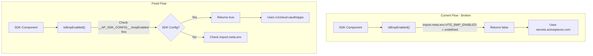

# SDK Cloud OAuth Internal Endpoints - BMP Extension Fix

## Problem

The SDK is using `secrets.activepieces.com` for OAuth instead of your local BMP Cloud OAuth endpoints (`/v1/cloud-oauth/apps`). This happens because:

1. `isBmpEnabled()` in [packages/web/src/app/routes/bmp-routes.ts](packages/web/src/app/routes/bmp-routes.ts) checks `import.meta.env.VITE_BMP_ENABLED`
2. The SDK uses webpack (not Vite), which replaces `import.meta.env` with `{ MODE: 'development' }` - missing `VITE_BMP_ENABLED`
3. Therefore `isBmpEnabled()` returns `false`, causing OAuth to fallback to `secrets.activepieces.com`

## Solution

Make BMP detection work in the SDK by:

1. Adding `VITE_BMP_ENABLED` to webpack's DefinePlugin
2. OR creating an SDK-specific BMP override that can be set at runtime via SDK config

### Recommended Approach: Runtime SDK Config Override

Since the SDK is embedded in third-party apps, using a runtime config is more flexible than build-time variables. The SDK host should be able to enable BMP mode via the SDK config.

## Architecture




## Implementation Tasks

### 1. Update SDK Types to Include BMP Config

Add `bmpEnabled` option to `ReactUISDKConfig` in [packages/extensions/react-ui-sdk/src/types/index.ts](packages/extensions/react-ui-sdk/src/types/index.ts):

```typescript
export interface ReactUISDKConfig {
  apiUrl: string;
  token: string;
  projectId?: string;
  flowId?: string;
  bmpEnabled?: boolean;  // Enable BMP Cloud OAuth endpoints
}
```

### 2. Update SDK Providers to Store BMP Config

In [packages/extensions/react-ui-sdk/src/providers/sdk-providers.tsx](packages/extensions/react-ui-sdk/src/providers/sdk-providers.tsx), add `bmpEnabled` to the `__AP_SDK_CONFIG__` window object:

```typescript
(window as any).__AP_SDK_CONFIG__ = {
  apiUrl: config.apiUrl,
  token: config.token,
  projectId: config.projectId,
  bmpEnabled: config.bmpEnabled ?? false,  // Add this
};
```

### 3. Update isBmpEnabled() to Check SDK Config First

In [packages/web/src/app/routes/bmp-routes.ts](packages/web/src/app/routes/bmp-routes.ts), modify `isBmpEnabled()` to check SDK config:

```typescript
export const isBmpEnabled = (): boolean => {
  // SDK mode: check runtime config first
  if (typeof window !== 'undefined') {
    const sdkConfig = (window as any).__AP_SDK_CONFIG__;
    if (sdkConfig?.bmpEnabled !== undefined) {
      return sdkConfig.bmpEnabled === true;
    }
  }
  // Standard web app: check Vite env
  return import.meta.env.VITE_BMP_ENABLED === 'true';
};
```

### 4. Update Angular Test App to Pass bmpEnabled

In your Angular test app component, add `bmpEnabled: true` to the SDK config:

```typescript
// In activepieces.component.ts or wherever SDK is initialized
{
  apiUrl: 'http://localhost:3000',
  token: '...',
  projectId: '...',
  bmpEnabled: true,  // Enable BMP Cloud OAuth
}
```

### 5. Rebuild SDK

After changes:

```bash
npx nx run react-ui-sdk:bundle
```

## Files to Modify


| File                                                                                                                                 | Change                                           |
| ------------------------------------------------------------------------------------------------------------------------------------ | ------------------------------------------------ |
| [packages/extensions/react-ui-sdk/src/types/index.ts](packages/extensions/react-ui-sdk/src/types/index.ts)                           | Add `bmpEnabled?: boolean` to `ReactUISDKConfig` |
| [packages/extensions/react-ui-sdk/src/providers/sdk-providers.tsx](packages/extensions/react-ui-sdk/src/providers/sdk-providers.tsx) | Store `bmpEnabled` in `__AP_SDK_CONFIG__`        |
| [packages/web/src/app/routes/bmp-routes.ts](packages/web/src/app/routes/bmp-routes.ts)                                               | Check `__AP_SDK_CONFIG__.bmpEnabled` first       |
| Angular test app config                                                                                                              | Add `bmpEnabled: true`                           |


## Testing

1. Build SDK: `npx nx run react-ui-sdk:bundle`
2. Start backend with BMP enabled: `AP_BMP_ENABLED=true`
3. Start Angular test app with `bmpEnabled: true` in SDK config
4. Open DevTools Network tab
5. Create a connection - OAuth apps should be fetched from `/v1/cloud-oauth/apps` not `secrets.activepieces.com`
6. Console should show `[AP OAuth] Cloud apps: GET /v1/cloud-oauth/apps` instead of `secrets.activepieces.com`

