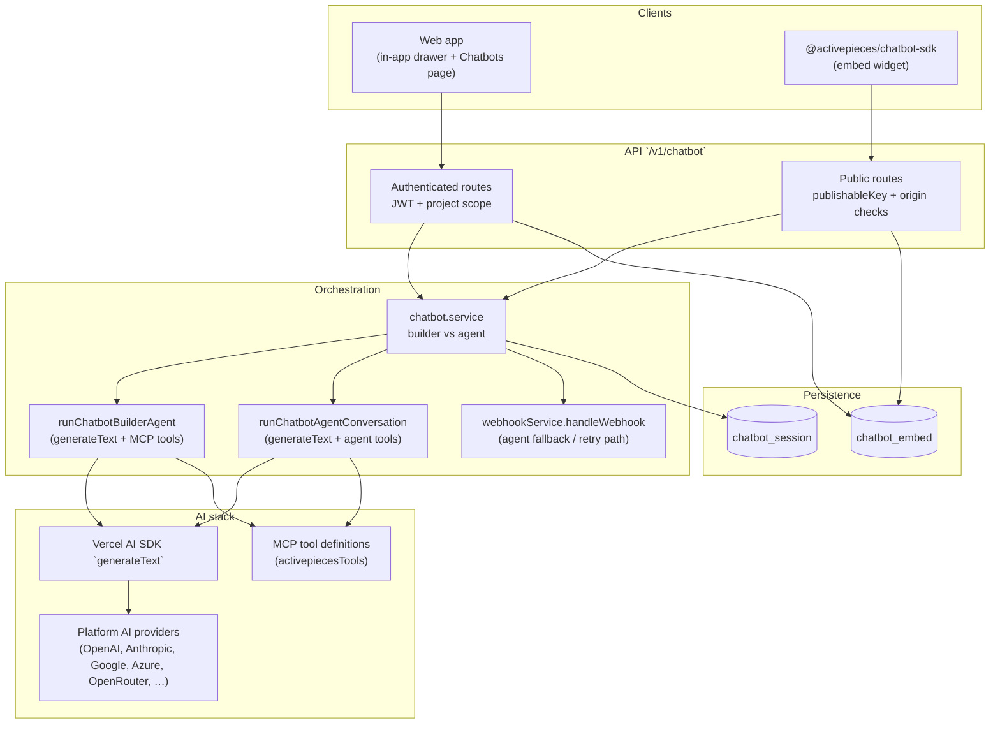

# Project chatbot — architecture, LLM usage, and user guide

This document describes the **in-project chatbot** in Activepieces: how it is built, how large language models (LLMs) participate, and how operators and end users work with it.

---

## 1. Overview

The chatbot helps users work with automations in two **modes**:

| Mode | Purpose |
|------|---------|
| **Builder** | Natural-language assistance to **design, validate, test, and (with consent) publish** flows using the same MCP-style tools as the project MCP server. |
| **Agent** | Conversational assistant to **discover flows**, collect real user-supplied data, and **invoke Catch Webhook** flows with a JSON body—without inventing placeholder data. |

The feature spans:

- **Server API** (`packages/server/api/src/app/chatbot/`) — sessions, messages, embed security, rate limits, orchestration.
- **Web UI** — project **Chatbots** settings (embed key, domains, modes) and the **in-app drawer** chatbot on project pages.
- **Optional embed** — `@activepieces/chatbot-sdk` widget for host applications that call the **public** chatbot HTTP API.

**Prerequisite:** For full LLM-powered behavior, the **platform** must have at least one configured **AI provider** with a valid API key (see [How the LLM is used](#4-how-the-llm-is-used)). Without it, Builder mode returns a clear “unavailable” message; Agent mode can still fall back to a **simple webhook POST** when a flow is selected (see below).

---

## 2. System architecture

### 2.1 High-level diagram

### 2.2 Main building blocks

| Layer | Responsibility |
|-------|----------------|
| **HTTP module** (`chatbot.module.ts`) | Registers routes under `/v1/chatbot`: authenticated message/session/embed CRUD, and public message/session for embeds. |
| **Session service** (`chatbot-session.service.ts`) | Creates or loads sessions **per project + mode**, appends turns, stores `messages` JSON and optional `flowId`. |
| **Embed service** (`chatbot-embed.service.ts`) | Per-project embed settings: enabled flag, **publishable key**, **allowed domains**, Builder/Agent toggles; validates public requests. |
| **Rate limiter** (`chatbot-public-message-rate-limiter.ts`) | Protects public endpoints from abuse. |
| **Chatbot service** (`chatbot.service.ts`) | Switches on `mode`: `builder` → builder agent; `agent` → agent conversation or fallbacks. |

### 2.3 Data model (conceptual)

- **`chatbot_session`** — one row per chat session: `projectId`, `mode` (`builder` \| `agent`), optional `flowId`, `messages` (array of turns with roles and timestamps), optional expiry.
- **`chatbot_embed`** — one row per project: embed on/off, **publishable key**, **allowedDomains** (for browser Origin validation), `builderEnabled`, `agentEnabled`.

### 2.4 API surface (summary)

| Method | Path | Auth | Role |
|--------|------|------|------|
| POST | `/v1/chatbot/message` | User + project | Send a message (signed-in product UI). |
| GET | `/v1/chatbot/session` | User + project | Load session history. |
| GET/POST | `/v1/chatbot/embed` | User + project | Read/update embed settings; rotate key. |
| POST | `/v1/chatbot/public/message` | Public + key + origin | Embed/widget traffic. |
| GET | `/v1/chatbot/public/session` | Public + key + origin | Load history for embed sessions. |

Public routes require a valid **`publishableKey`**, embed **enabled**, mode allowed (**builder** / **agent**), and an **Origin** (or referer) that matches **allowed domains** configured for the project.

---

## 3. User manual

### 3.1 For platform / project operators

1. **Configure an AI provider (recommended)**  
   In platform settings, add at least one AI provider with a valid API key. The chatbot resolves a **default chat model** per provider (see [Model resolution](#41-model-resolution-and-providers)).

2. **Open Project → Chatbots**  
   - Enable the embed if third-party sites or the SDK will call the API.  
   - Set **allowed domains** (origins) that may use the public key—this is a security control for browser-based embeds.  
   - Toggle **Builder** and **Agent** depending on what you want to expose.  
   - Copy the **publishable key** and snippet for `@activepieces/chatbot-sdk` if you embed the widget.

3. **Permissions**  
   Authenticated routes require appropriate **project** permissions (e.g. flow read/write as defined on each route). Public routes do not use the end-user’s login; they use the **project owner** resolved for the embed key to execute server-side actions—so embed access must be restricted by domain and key rotation.

### 3.2 For signed-in users (web app)

- Open the **chatbot drawer** from the project shell (floating action or entry point provided by the UI).  
- Use the **mode** control to switch between **Builder** and **Agent**. Sessions are **separate per mode** (distinct session ids and history).  
- **Builder:** describe the automation you want; the assistant uses tools to list pieces, build/update flows, validate, test, and—only after explicit user confirmation—lock and publish.  
- **Agent:** describe outcomes (e.g. “create a lead”); the assistant helps pick a flow, gathers **real** field values from you, then triggers **Catch Webhook** flows with a JSON body. It will not invent demo emails or names.  
- Short phrases like “try again” / “same data” can **reuse the last JSON object** from the thread to re-invoke the webhook without sending everything through the LLM again (fast path in `chatbot.service.ts`).

### 3.3 For embedded apps (`@activepieces/chatbot-sdk`)

- Host pages must use HTTPS in production and be listed in **allowed domains** if Origin checks apply.  
- Pass **`apiUrl`**, **`projectId`**, **`publishableKey`**, and initial **`mode`** as shown on the Chatbots settings page.  
- The SDK talks to **`/v1/chatbot/public/message`** and **`/v1/chatbot/public/session`**; ensure CORS and network paths allow the browser to reach the Activepieces API.

---

## 4. How the LLM is used

The server uses the **Vercel AI SDK** (`generateText` from the `ai` package) with **tool calling**. The same **platform-level** AI configuration is shared with the builder path: `resolveChatbotBuilderLanguageModel` in `chatbot-builder-agent.ts` picks the first **usable** provider from a fixed priority list and builds a `LanguageModel` instance (OpenAI, Anthropic, Google, Azure, OpenRouter, etc.).

### 4.1 Model resolution and providers

- Providers are loaded from the **`ai_provider`** table for the **platform** (`platformId` from the project).  
- Priority order: **OpenAI → Anthropic → Google → Azure → OpenRouter → Activepieces (OpenRouter)** — first row with a **non-empty API key** and successful config wins.  
- Default model ids are defined in code (e.g. OpenAI `gpt-4o-mini`, Anthropic Haiku, Google `gemini-2.0-flash`, etc.—see `DEFAULT_CHAT_MODEL_IDS` in `chatbot-builder-agent.ts`).

If **no** model resolves:

- **Builder:** `runChatbotBuilderAgent` returns **skipped**; the user sees a message that the builder assistant is unavailable until an AI provider is configured (no draft flow is created for vague input).  
- **Agent:** `runChatbotAgentConversation` returns **skipped**; behavior then depends on whether a **flow id** is available (see fallbacks below).

### 4.2 Builder mode (`runChatbotBuilderAgent`)

- **Input:** User message + **prior messages** in the session + optional **session flow id**.  
- **System prompt:** Instructs the model to act as an **Activepieces flow builder**, use **MCP-aligned tools** (list pieces, get props, build/update flow, validate, test, get run, lock/publish), avoid inventing piece names, prefer tight `ap_list_pieces` queries, map Catch Webhook body fields correctly, and ask for a **concrete goal** before creating a new flow when none is tied to the session.  
- **Tools:** A **subset** of MCP tools (`CHATBOT_BUILDER_TOOL_TITLE_SET`)—e.g. `ap_build_flow`, `ap_validate_flow`, `ap_test_flow`, `ap_update_step`, `ap_lock_and_publish`, etc.—wrapped with **permission checks**.  
- **Generation:** `generateText` with `stopWhen: stepCountIs(CHATBOT_BUILDER_MAX_STEPS)` (32), low temperature (0.2), capped output tokens.  
- **Output:** Assistant reply text; **flow id** may be extracted from tool results (e.g. after `ap_build_flow`). Session row is updated with the new messages and flow id.

### 4.3 Agent mode (`runChatbotAgentConversation`)

- **Input:** User message, history, optional **preferred flow id** from the UI.  
- **System prompt:** Instructs the model to **list/inspect flows**, never invent business data, collect real values conversationally, and call **`trigger_flow_webhook`** only with user-provided JSON bodies for **Catch Webhook** flows—plus guidance on retries and HTTP errors.  
- **Tools:**  
  - **Narrow MCP set** for discovery/structure: e.g. `ap_list_flows`, `ap_flow_structure`, `ap_get_piece_props`, `ap_list_pieces`.  
  - **Custom tool** `trigger_flow_webhook` — runs `executeCatchWebhookInvocation`, which validates the flow, ensures **Catch Webhook** trigger, checks **enabled** status, and calls **`webhookService.handleWebhook`** with the JSON body.  
- **Generation:** `generateText` with `CHATBOT_AGENT_MAX_STEPS` (14) and `CHATBOT_AGENT_MAX_OUTPUT_TOKENS` (1200).  
- **Output:** Natural-language reply; flow id may be inferred from tool output.

### 4.4 When the LLM is *not* used (Agent fallbacks)

1. **Retry fast path** — If the user message matches short “retry / same data” intent and the thread contains a parseable JSON object, the server may **invoke the Catch Webhook directly** without calling `generateText`.  
2. **No LLM + flow id present** — If agent conversation is skipped but **`effectiveFlowId`** is set, the server **POSTs the user message** to the flow webhook via `webhookService.handleWebhook` (simple pass-through of `message` and `metadata`).  
3. **No LLM + no flow** — User receives guidance to configure an AI provider or supply a flow id for basic webhook testing.

---

## 5. Security and operational notes

- **Embed key** is a secret for **public** endpoints—rotate it if leaked (`/v1/chatbot/embed/rotate-key`).  
- **Allowed domains** limit which browser origins can use the public API with that key.  
- **Rate limiting** applies to public message/session traffic.  
- **Agent mode** prompts forbid fabricated PII; operators should still treat LLM outputs as untrusted and rely on **tool-level** permission checks and **flow design** for real guarantees.

---

## 6. Code map (for developers)

| Area | Location |
|------|----------|
| Routes | `packages/server/api/src/app/chatbot/chatbot.module.ts` |
| Message handling | `packages/server/api/src/app/chatbot/chatbot.service.ts` |
| Builder LLM + tools | `packages/server/api/src/app/chatbot/chatbot-builder-agent.ts` |
| Agent LLM + webhook tool | `packages/server/api/src/app/chatbot/chatbot-agent-conversation.ts` |
| Sessions | `packages/server/api/src/app/chatbot/chatbot-session.service.ts`, `chatbot-session.entity.ts` |
| Embed | `packages/server/api/src/app/chatbot/chatbot-embed.service.ts`, `chatbot-embed.entity.ts` |
| Embed widget package | `packages/extensions/chatbot-sdk/` |
| Web Chatbots page | `packages/web/src/app/routes/chatbots/index.tsx` |
| In-app drawer | `packages/web/src/features/chatbots/components/in-app-chatbot.tsx` |

---

*This document reflects the implementation in the repository at the time of writing; behavior may evolve with releases.*
