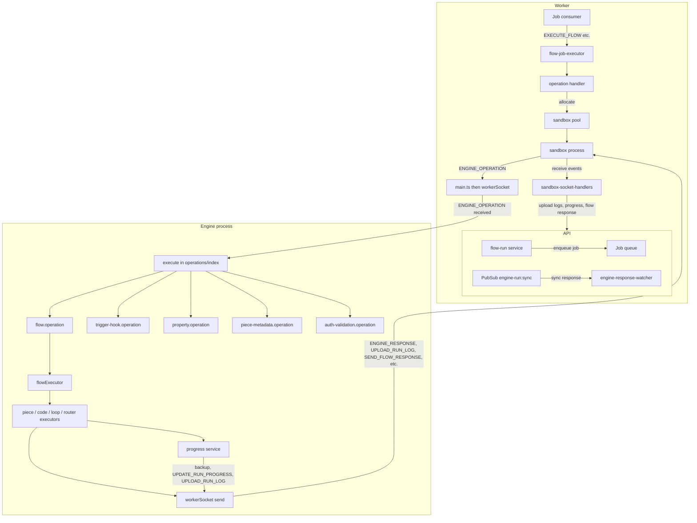

The Engine file contains the following types of operations:

- **Extract Piece Metadata**: Extracts metadata when installing new pieces.
- **Execute Step**: Executes a single test step.
- **Execute Flow**: Executes a flow.
- **Execute Property**: Executes dynamic dropdowns or dynamic properties.
- **Execute Trigger Hook**: Executes actions such as OnEnable, OnDisable, or extracting payloads.
- **Execute Auth Validation**: Validates the authentication of the connection.

The engine takes the flow JSON with an engine token scoped to this project and implements the API provided for the piece framework, such as:
- Storage Service: A simple key/value persistent store for the piece framework.
- File Service: A helper to store files either locally or in a database, such as for testing steps.
- Fetch Metadata: Retrieves metadata of the current running project.

## Data flow

The diagram below shows how execution reaches the Engine and how the Engine communicates back. The API and Worker run in your deployment; the Engine runs inside a **sandbox process** started by the Worker and talks to it over Socket.IO.

**Flow in words:**

1. **Who invokes the Engine:** The API (e.g. flow-run service) enqueues a job (e.g. `EXECUTE_FLOW`) to the job queue. The Worker’s job consumer picks it up, the flow-job-executor prepares the operation, and the operation handler allocates a sandbox from the pool and sends the operation into the sandbox process. The sandbox runs the Engine; the Engine’s `workerSocket` receives an `ENGINE_OPERATION` event and calls `execute(operationType, operation)`.

2. **Engine process:** `main.ts` initializes `workerSocket` and `progressService`. When an `ENGINE_OPERATION` arrives, `execute()` in `operations/index.ts` routes by `EngineOperationType` to one of the five operations: flow, trigger-hook, property, piece-metadata, or auth-validation.

3. **Flow execution path:** For `EXECUTE_FLOW`, `flowOperation.execute()` builds execution state (BEGIN or RESUME), then `flowExecutor.executeFromTrigger()` or `execute()` runs the trigger and steps. Each step is handled by the appropriate executor (piece, code, loop, or router). The progress service backs up execution state and sends updates; the Engine sends `ENGINE_RESPONSE`, `UPLOAD_RUN_LOG`, `SEND_FLOW_RESPONSE`, and similar events back over the socket.

4. **Worker side:** The sandbox process receives those socket events and delegates to sandbox-socket-handlers, which upload run logs, emit run/step progress (e.g. via app socket), publish flow responses to PubSub, and push run metadata to the runs queue. For synchronous flow runs (e.g. webhook response), the API’s engine-response-watcher subscribes to `engine-run:sync:{serverId}` and resolves the waiting request when the response is published.