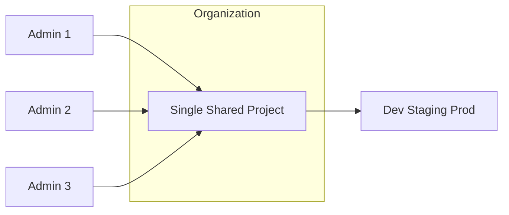
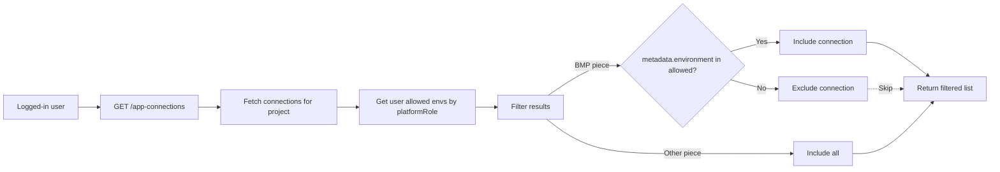
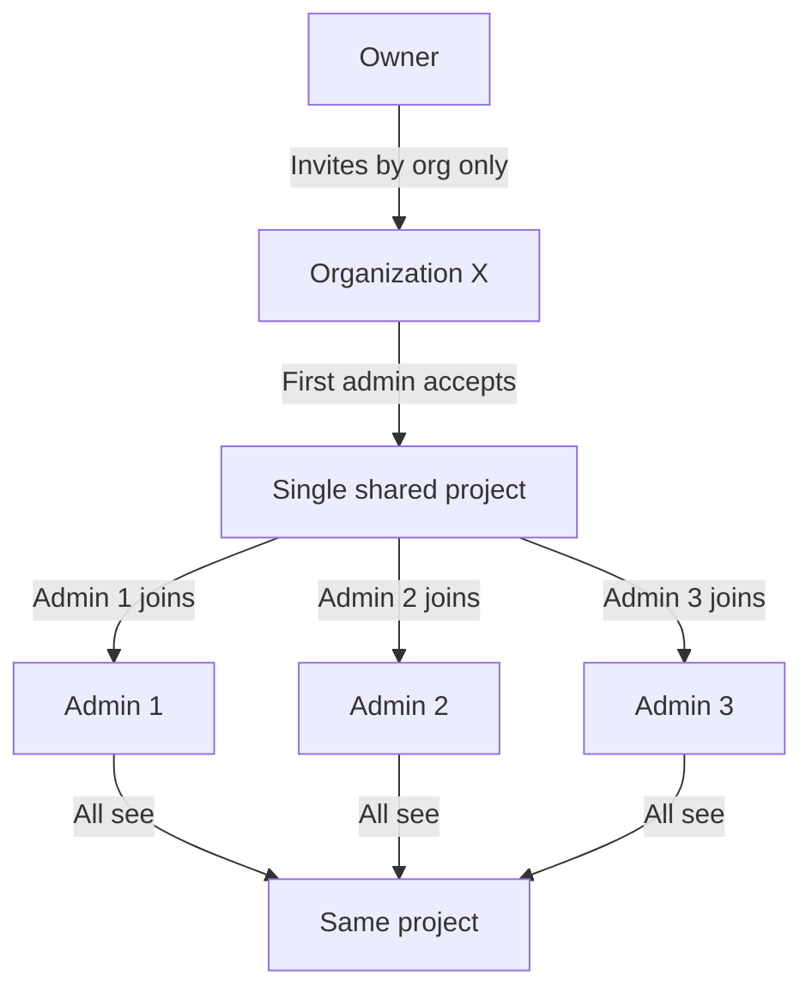
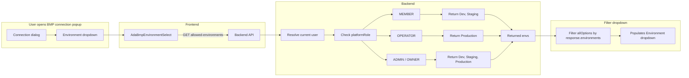
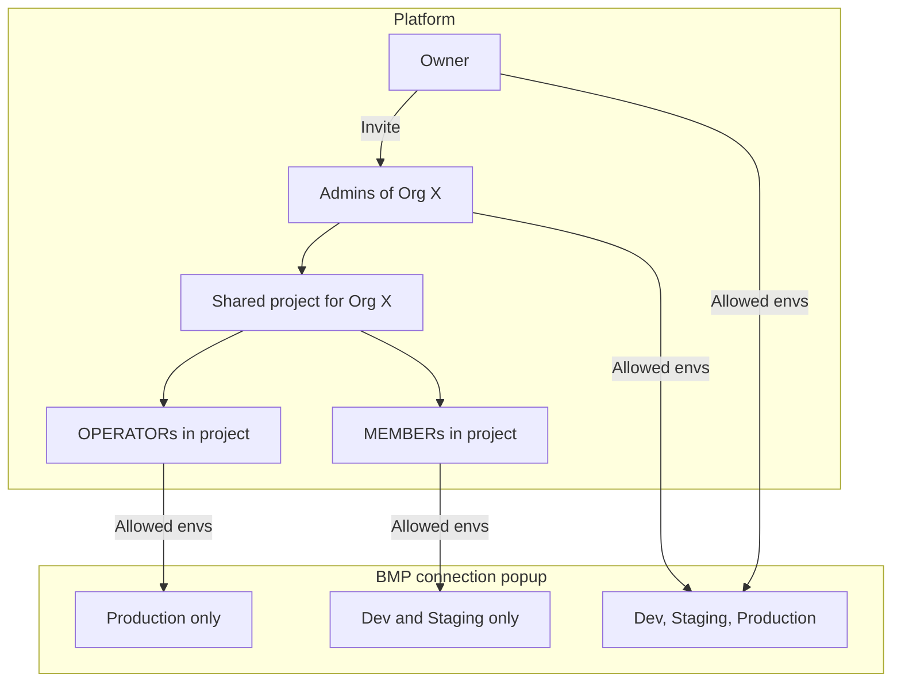

# Admin Invite and Environment Mapping — Updated Plan (New Requirement)

## New Requirement Summary

1. **Admin (Sub-owner) mapped to all environments by default** — Same Admin is mapped for Dev, Staging, and Production for the same organization (no longer one Admin per environment).
2. **Owner can invite multiple Admins for the same organization** — Same org can have multiple Admins with the same details; no "one Admin per (org, env)" slot restriction.
3. **Single project per organization** — Do not create a new project per Admin; one shared project per organization visible to all Admins of that organization.

---

## To-do list

- [ ] Add `organization.projectId`; create DB migration for organization table
- [ ] Update user-invitation.module.ts — remove env requirement, admin slot check for ADMIN invites
- [ ] Update user-invitation.service.ts — shared project logic, no projectMemberService for Admin
- [ ] Extend `applyProjectsAccessFilters` in project-service.ts for organizationId
- [ ] Update checkAdminAvailability, listByOrganization, upsert in organization-environment.service
- [ ] Hide environment selector in invite-user-dialog.tsx for ADMIN invite
- [ ] Use org shared project for OPERATOR/MEMBER invites; replace projectMemberService with visibility
- [ ] Update allowed-environments endpoint — derive from platform role (MEMBER/OPERATOR/ADMIN)
- [ ] Store metadata.creatorPlatformRole and metadata.environment in app-connection upsert
- [ ] Filter connections list by allowed envs and creator role in app-connection controller
- [ ] Store metadata.creatorPlatformRole when creating flow in flow.controller
- [ ] Filter flows list by creator role in flow.controller or flow.service
- [ ] Define BMP piece name constant for connection filtering

---

## Current vs New Model

| Aspect            | Current                                                               | New                                                                     |
| ----------------- | --------------------------------------------------------------------- | ----------------------------------------------------------------------- |
| Admin–Environment | One Admin per (org, env) slot (Dev / Staging / Prod each separate)    | One Admin mapped to all envs (Dev, Staging, Prod) for same org          |
| Admins per org    | One Admin per env → max 3 Admins per org (one per env)                | Multiple Admins per org allowed                                         |
| Project per Admin | Each Admin gets a personal project on accept (e.g. "ABC Dev Project") | Single shared project per org; all org Admins see the same project      |
| Invite flow       | Owner picks org + one environment; slot must be free                  | Owner picks org only (no env slot); can invite many Admins for same org |

---

## High-Level Design

- **Organization**: has one `projectId` (shared project). Created when the first Admin is provisioned for that org (or on first org creation, depending on product choice).
- **Admins**: linked to org via `user.organizationId`. All Admins of the org are given access to the org's single project (e.g. as project members or via org-level access).
- **Environments**: Dev, Staging, Prod are metadata/default for the org (Admin is "mapped" to all by default). No per-env "slot" or per-env project.

---

## Implementation Areas

### 1. Data model

**Organization**

- Add (or reuse) a field for the org's shared project, e.g. `organization.projectId` (nullable until first Admin is provisioned).
- Alternatively keep a single "default" row in `organization_environment` per (org, env) with the same `projectId` for all three envs and allow multiple Admins via a separate relation (see below).

**Organization–Environment**

- Current: `(organizationId, environment)` unique, one `adminUserId`, one `projectId` per row.
- Options:
  - **A** — One shared project per org: store `projectId` on `organization`; use `organization_environment` only for env metadata (same `projectId` for Dev/Staging/Prod) and allow multiple admins via a join table (e.g. `organization_admin`: organizationId, userId).
  - **B** — Keep one row per (org, env) but all three rows point to the same `projectId`; add `organization_admin` (orgId, userId) for "who is Admin for this org"; stop using `adminUserId` on `organization_environment` as the single owner (or deprecate it).
- Recommendation: **One shared project per org**; **organization_admin** (or equivalent) for "Admins of this org"; **organization_environment** can point to the same `projectId` for all three envs and optionally track metadata only.

**User**

- Keep `user.organizationId` to denote "this user is an Admin for this org" (or use a dedicated org–admin table).

**Project**

- Keep `project.organizationId`. The org's shared project has `organizationId` set; no need for `ownerId` to represent "the" Admin (or use a designated owner for legacy reasons).

### 2. Invitation flow (backend)

**Invite creation** ([user-invitation.module.ts](packages/server/api/src/app/user-invitations/user-invitation.module.ts))

- For OWNER inviting ADMIN: require only **organization (name/id)**; **do not** require environment.
- Remove "admin slot" check for (org, env) — multiple Admins per org allowed.
- Request body: keep `organizationName` (or `organizationId`); make `environment` optional or remove it for ADMIN invites.
- Store on invitation: `organizationId` only (no `environment` for ADMIN).

**Invitation acceptance / provisioning** ([user-invitation.service.ts](packages/server/api/src/app/user-invitations/user-invitation.service.ts))

- For ADMIN with organization:
  - Resolve org; set `user.platformRole`, `user.organizationId`.
  - **If org has no project yet**: create one shared project for the org (e.g. "{OrgName} Project"), set `organization.projectId` and `project.organizationId`, `project.ownerId` = first Admin.
  - **If org already has a project**: do **not** create a new project.
  - **Do NOT use projectMemberService** — access is via project visibility filter (`applyProjectsAccessFilters` with `organizationId`), per EE policy (no project members).
  - Optionally create/update `organization_environment` rows for Dev/Staging/Prod all pointing to the same `projectId` and same org (no single `adminUserId` ownership), or add the user to an `organization_admin` table.
- Remove: "create personal project per Admin" and "upsert organization_environment with this adminUserId and this projectId". Remove any `projectMemberService.upsert()` for Admin provisioning.

### 3. Organization–environment service

- **checkAdminAvailability**: remove or repurpose — no longer "one slot per (org, env)". If kept for backward compatibility, always return "available" for ADMIN invite flow.
- **listByOrganization**: can return one shared project and "all envs" for that project; or three rows (Dev/Staging/Prod) with same `projectId` and no single `adminUserId` (or list of admin IDs from org-admin table).
- **upsert**: when creating/updating org–env rows for "default mapping for all envs", set same `projectId` for all three envs; do not overwrite with a single `adminUserId` per row if multiple Admins are allowed.

### 4. Frontend (invite dialog)

- [invite-user-dialog.tsx](packages/react-ui/src/features/members/component/invite-user/invite-user-dialog.tsx):
  - For OWNER inviting ADMIN: show **Organization** only; **hide Environment** selector (or show as read-only "All (Dev, Staging, Prod)").
  - Remove environment validation and "taken slot" logic for ADMIN.
  - Remove or simplify `adminAvailability` and `orgEnvironments` usage for ADMIN path.
- Form schema: `environment` optional for platform ADMIN invites; API accepts invite without environment.

### 5. Project visibility for Admins

- When resolving "current project" or project list for an Admin:
  - Use `user.organizationId` to load the org's shared project (`organization.projectId` or project where `project.organizationId = user.organizationId`).
  - Ensure all Admins of the same org get the same project in their list and as default when they belong to that org.
- Existing logic that uses "admin's personal project" (e.g. OPERATOR/MEMBER invite) should use the **org's shared project** when the inviter is an Admin of an org.

### 6. OPERATOR/MEMBER invites by Admin

- Today: ADMIN invites OPERATOR/MEMBER and stores their **personal** project ID.
- New: For an Admin belonging to an org, use the **org's shared project** (not a per-Admin project) when inviting OPERATOR/MEMBER so they join the same project as all other org members.

### 7. BMP connection popup — platform-role based allowed environments

When creating a BMP piece connection, the environment dropdown is filtered by **platform role** so that:

- **MEMBER** → can use **Dev** and **Staging** only (no Production).
- **OPERATOR** → can use **Production** only.
- **ADMIN / OWNER** → can use **Dev, Staging, Production** (all).

**Where it is implemented**

- **UI**: The BMP environment dropdown is rendered by [AdaBmpEnvironmentSelect](packages/react-ui/src/app/connections/ada-bmp-environment-select.tsx), which is used in [properties-utils.tsx](packages/react-ui/src/app/builder/piece-properties/properties-utils.tsx) when `propertyName === 'environment'` and `inputName` includes `props.environment`.
- **Backend**: [GET /v1/organizations/current-user/allowed-environments](packages/server/api/src/app/organization/organization.controller.ts) currently returns environments based on "user is admin of this org-env"; it does **not** yet apply platform-role rules.

**Required change**

- In the **allowed-environments** endpoint: after resolving the current user, derive allowed environments from **platform role**:
  - `PlatformRole.MEMBER` → `['Dev', 'Staging']`
  - `PlatformRole.OPERATOR` → `['Production']`
  - `PlatformRole.ADMIN` or `PlatformRole.OWNER` → `['Dev', 'Staging', 'Production']`
- No frontend change needed: [AdaBmpEnvironmentSelect](packages/react-ui/src/app/connections/ada-bmp-environment-select.tsx) already filters the dropdown using the API response; once the backend returns role-based lists, the BMP connection popup will show the correct options.

### 8. Connections list — filter by allowed environments

The connections list should show only connections that the logged-in user is allowed to use, based on their **allowed environments** (Dev, Staging, Production per platform role).

**Requirement**

- **MEMBER** → only connections that use Dev or Staging env config.
- **OPERATOR** → only connections that use Production env config.
- **ADMIN / OWNER** → all connections.

**Where it is implemented**

- **UI**: [AppConnectionsPage](packages/react-ui/src/app/routes/connections/index.tsx) fetches connections via `appConnectionsQueries.useAppConnections` (projectId, pieceName, status, etc.).
- **API**: [GET /v1/app-connections](packages/server/api/src/app/app-connection/app-connection.controller.ts) returns connections for the project; `value` is redacted (`removeSensitiveData`), so `value.props.environment` is not available in the list response.

**Challenge**

- The connection's environment (Dev/Staging/Production) is stored in `value.props.environment` for BMP piece connections.
- The list API does not return `value`; it's stripped for security.
- We cannot filter by environment on the frontend without that data.

**Solution**

1. **Persist environment in metadata**
  When creating/updating a BMP piece connection, store the selected environment in `metadata.environment` (e.g. `metadata: { environment: 'Dev' }`). This is done in the upsert path when the piece is BMP and the value includes `props.environment`.
2. **Filter in the list API**
  In the app-connection list handler:
  - Get the current user's allowed environments (via platform role: MEMBER → Dev/Staging, OPERATOR → Production, ADMIN/OWNER → all).
  - After fetching connections for the project, filter results:
    - For BMP piece connections (`pieceName` matches BMP piece): only include if `metadata.environment` is in the user's allowed environments.
    - For non-BMP pieces: include all (no environment filter).
  - Connections without `metadata.environment` (legacy or non-BMP): include all for backward compatibility, or treat as "all envs" if desired.
3. **Connection select dropdown**
  The connection dropdown used when building flows ([connection-select.tsx](packages/react-ui/src/app/builder/step-settings/piece-settings/connection-select.tsx)) also uses `useAppConnections`. Once the list API filters by allowed envs, the dropdown will automatically show only allowed connections.

**Data flow**

### 9. Connections list — filter by creator platform role (all pieces)

Connections created by Member or Operator should only be visible to users with the same or higher role. Admin sees all.

**Visibility matrix (connections):**

| Connection created by | Visible to MEMBER | Visible to OPERATOR | Visible to ADMIN |
| --------------------- | ----------------- | ------------------- | ---------------- |
| **Member**            | Yes               | No                  | Yes              |
| **Operator**          | No                | Yes                 | Yes              |
| **Admin**             | Yes               | Yes                 | Yes              |

**Implementation**

- Store `metadata.creatorPlatformRole` (e.g. `'MEMBER'`, `'OPERATOR'`, `'ADMIN'`) when creating any connection (all pieces, not just BMP), using the creator's platform role at creation time.
- In the app-connection list API, filter results by the current user's platform role:
  - **ADMIN** → return all connections.
  - **MEMBER** → return connections where `metadata.creatorPlatformRole` is `'MEMBER'` or `'ADMIN'` (or missing for backward compatibility).
  - **OPERATOR** → return connections where `metadata.creatorPlatformRole` is `'OPERATOR'` or `'ADMIN'` (or missing for backward compatibility).
- Apply this filter in addition to the BMP environment filter (section 8); both filters apply to BMP connections.

### 10. Flows list — filter by creator platform role

Flows created by Member, Operator, or Admin should be visible according to the following matrix. Admin sees all flows.

**Visibility matrix (flows):**

| Flow created by | Visible to MEMBER | Visible to OPERATOR | Visible to ADMIN |
| --------------- | ----------------- | ------------------- | ---------------- |
| **Member**      | Yes               | Yes                 | Yes              |
| **Operator**    | No                | Yes                 | Yes              |
| **Admin**       | Yes               | Yes                 | Yes              |

**Summary in words**

- **Member-created flows** → visible to MEMBER, OPERATOR, ADMIN (everyone).
- **Operator-created flows** → visible to OPERATOR and ADMIN only (not MEMBER).
- **Admin-created flows** → visible to everyone.

**Implementation**

- Store `metadata.creatorPlatformRole` when creating a flow, using the creator's platform role at creation time.
- In the flow list API ([flow.service.ts](packages/server/api/src/app/flows/flow/flow.service.ts) `list`), filter results by the current user's platform role:
  - **ADMIN** → return all flows.
  - **OPERATOR** → return all flows.
  - **MEMBER** → return flows where `metadata.creatorPlatformRole` is `'MEMBER'` or `'ADMIN'` (exclude Operator-created flows).
- For flows without `metadata.creatorPlatformRole` (legacy): treat as visible to everyone for backward compatibility.

---

## Data flow diagrams

### A. Admin invite and shared project flow

**In words:** Owner invites admins by organization only. The first admin who accepts creates the org's single shared project. Every later admin joins that same project — no new project per admin.

```mermaid
flowchart LR
    subgraph Step1 [Step 1: Owner invites]
        Owner[Owner]
        Owner -->|Picks organization only| Invite[Create invitation]
        Invite -->|No env slot check| Ready[Invitation ready]
    end
    
    subgraph Step2 [Step 2: First admin accepts]
        Admin1[Admin 1]
        Ready --> Admin1
        Admin1 -->|Org has no project yet| Create[Create shared project]
        Create -->|Link project to org| Link[Org.projectId set]
        Link -->|Add Admin 1| Member1[Admin 1 in project]
    end
    
    subgraph Step3 [Step 3: More admins accept]
        Admin2[Admin 2]
        Admin3[Admin 3]
        Member1 --> Admin2
        Admin2 -->|Org already has project| Join[Join same project]
        Join --> Member2[Admin 2 in project]
        Member2 --> Admin3
        Admin3 -->|Join same project| Member3[Admin 3 in project]
    end
    
    subgraph Result [Result]
        Member1 --> SameProject[One shared project]
        Member2 --> SameProject
        Member3 --> SameProject
        SameProject -->|Visible to| AllAdmins[All admins of that org]
    end
```

**Simplified view (who sees what):**

### B. BMP connection popup — allowed environments by role

### C. End-to-end: Organization, project, and BMP env access

---

## Challenges and EE dependency analysis

### No EE folder changes required

All planned changes can be made in **core** (non-EE) modules. No new EE modules need to be added, and no EE files need to be modified.

| Module to change                 | Location                | EE imports today                                                           | Plan impact                                                              |
| -------------------------------- | ----------------------- | -------------------------------------------------------------------------- | ------------------------------------------------------------------------ |
| **user-invitation.module.ts**    | `app/user-invitations/` | Yes (ee-authorization, rbac-middleware, projectRoleService)                | Use existing EE imports; change ADMIN invite logic only                  |
| **user-invitation.service.ts**   | `app/user-invitations/` | Yes (domainHelper, emailService, projectMemberService, projectRoleService) | Use existing EE imports; change provisioning logic                       |
| **organization.controller.ts**   | `app/organization/`     | **No EE imports**                                                          | Add platform-role logic for allowed-environments                         |
| **app-connection.controller.ts** | `app/app-connection/`   | `@activepieces/ee-shared` (ApplicationEventName)                           | Add filtering; use `userService` (core) for platformRole                 |
| **app-connection-service.ts**    | `app/app-connection/`   | Yes (projectMemberService)                                                 | Add `metadata.creatorPlatformRole` and `metadata.environment` in upsert  |
| **flow.controller.ts**           | `app/flows/flow/`       | Yes (assertUserHasPermissionToFlow, platformPlanService, gitRepoService)   | Add filtering after list(); add `metadata.creatorPlatformRole` on create |
| **flow.service.ts**              | `app/flows/flow/`       | **No EE imports**                                                          | Add optional filter param or keep filtering in controller                |
| **invite-user-dialog.tsx**       | `packages/react-ui/`    | No EE imports                                                              | Hide env selector for ADMIN invite                                       |

### Potential challenges

1. **Edition (COMMUNITY vs ENTERPRISE/CLOUD)**
  This plan is **EE policy compliant**: it does **not** use `projectMemberService` or project members. Project access uses visibility filter (`applyProjectsAccessFilters` with `organizationId`), which works in all editions. Compatible with **COMMUNITY**, **ENTERPRISE**, and **CLOUD**.
2. **BMP piece identification**
  Connection filtering uses `pieceName` to detect BMP piece connections. The plan assumes a known BMP piece name (e.g. config or constant). Define the BMP piece name in one place (e.g. env or config) and reuse it for both environment and creator-role filtering.
3. **Organization projectId migration**
  Adding `organization.projectId` requires a DB migration. Add a new migration under `packages/server/api/src/app/database/migration/postgres/` (and sqlite if used). Organization and organization_environment are core tables, not EE, so migrations stay in core.
4. **Pagination and filtering**
  Flow and connection list filtering is done after fetching. If results are paginated, filtering after fetch can reduce page size (e.g. 10 requested, 3 pass filter). Options: (a) filter in controller after fetch, or (b) move filtering into the service/query so it happens in the DB. Option (a) is simpler but may affect pagination; option (b) is better for large lists.
5. **Existing flows/connections without creatorPlatformRole**
  Legacy flows and connections have no `metadata.creatorPlatformRole`. Treat as visible to everyone (or to ADMIN only, per product choice) for backward compatibility.

### EE services used (no new EE dependencies)

Existing EE imports used by this plan (EE policy compliant):

- `projectRoleService` — used for PROJECT invitations only (unchanged)
- `platformMustBeOwnedByCurrentUser`, `projectMustBeTeamType`, etc. — used for invitation/auth (unchanged)
- `ApplicationEventName` — used for connection events (unchanged)

**EE policy note:** `projectMemberService` is **not** used for Admin/Operator/Member provisioning. Project access is controlled via project visibility filter (`applyProjectsAccessFilters` with `organizationId`), not project members, per MULTI_TENANT_EE_COMPLIANCE.

---

## EE policy compliance

Per [MULTI_TENANT_EE_COMPLIANCE.md](docs/project/MULTI_TENANT_EE_COMPLIANCE.md) and [EE.md](technical-docs/EE.md), the plan must comply with:

### EE restrictions (do not use)

| Feature             | EE status | Plan compliance                            |
| ------------------- | --------- | ------------------------------------------ |
| **TEAM projects**   | EE-only   | Do NOT use; use PERSONAL only              |
| **Project members** | EE-only   | Do NOT use; use project visibility instead |
| **Project roles**   | EE-only   | Do NOT use; use platform roles only        |

### EE-compliant approach for shared project and access

1. **Do NOT use `projectMemberService`**
  Do not add Admins/Operators/Members to projects via `project_member`. Use project visibility filters instead.
2. **Extend project visibility filter**
  In [project-service.ts](packages/server/api/src/app/project/project-service.ts), extend `applyProjectsAccessFilters` to include:
  - Projects where `project.organizationId = user.organizationId` — all users in the same org see the org's shared project.
  - No `project_member` involvement; visibility is based on `organizationId`.
3. **Shared project as PERSONAL**
  The org's shared project remains `ProjectType.PERSONAL` with `ownerId` set to the first Admin. Visibility is granted via `organizationId` and the extended visibility filter, not via project members.
4. **Provisioning without project members**
  On invitation acceptance:
  - Set `user.organizationId`.
  - Create shared project if needed; set `project.organizationId`, `project.ownerId` (first Admin).
  - Do **not** call `projectMemberService.upsert()`.
  - Access is controlled by `applyProjectsAccessFilters` (users with same `organizationId` see the project).
5. **Platform roles only**
  All role logic uses `user.platformRole` (OWNER, ADMIN, OPERATOR, MEMBER) — available in all editions. Do not rely on `projectRolesEnabled` or project roles.
6. **PERSONAL projects only**
  All projects used in this flow are `ProjectType.PERSONAL`. Do not introduce TEAM projects.

### Compliance checklist

| Requirement                | Status                          |
| -------------------------- | ------------------------------- |
| Use PERSONAL projects only | Yes                             |
| No project members         | Yes (visibility filter instead) |
| No project roles           | Yes (platform roles only)       |
| Platform roles             | Yes (all editions)              |
| No new EE modules          | Yes                             |
| No EE file changes         | Yes                             |

### Changes required for EE compliance

- **user-invitation.service.ts**
  Remove or avoid calls to `projectMemberService.upsert()` for Admin/Operator/Member provisioning. Rely on `organizationId` and project visibility instead.
- **project-service.ts**
  Extend `applyProjectsAccessFilters` to include `project.organizationId = user.organizationId` when `user.organizationId` is set, so org members see the org's shared project without using `project_member`.
- **All provisioning flows**
  Do not add users to `project_member`; set `user.organizationId` and rely on visibility filter for access. This applies to ADMIN and to OPERATOR/MEMBER when invited to org's shared project. (The current OPERATOR/MEMBER flow uses `projectMemberService` — replace with visibility-based access for EE compliance.)
- **OPERATOR/MEMBER invitations**
  Do not call `projectMemberService.upsert()` or `projectRoleService` for PLATFORM invitations to org's shared project. Set `user.organizationId`; project visibility filter (`project.organizationId = user.organizationId`) controls access. Note: Per-project permissions (Operator vs Viewer) would need an alternative if project roles are not used; platform role (OPERATOR vs MEMBER) can drive read/write behavior where needed.

---

## Migration / Backward compatibility

- **Existing data**: Orgs that already have one Admin per (org, env) and separate projects need a migration path:
  - Either migrate to "one shared project per org" (e.g. pick one existing project as the org project, add other Admins as members, deprecate duplicate projects), or
  - Support both models temporarily (e.g. if `organization.projectId` is set, use shared project; else fall back to existing per-Admin project).
- **DB migrations**: Add `organization.projectId` if chosen; add `organization_admin` if used; adjust unique constraints on `organization_environment` if moving to multiple Admins per (org, env).

---

## Summary of changes

| Area                     | Change                                                                                                                                                                                                                                                                                                                                                                                               |
| ------------------------ | ---------------------------------------------------------------------------------------------------------------------------------------------------------------------------------------------------------------------------------------------------------------------------------------------------------------------------------------------------------------------------------------------------- |
| **Data model**           | One shared project per org; allow multiple Admins per org (e.g. org.projectId + organization_admin or user.organizationId).                                                                                                                                                                                                                                                                          |
| **Invite (backend)**     | ADMIN invite: organization only, no environment; no slot check; multiple Admins per org allowed.                                                                                                                                                                                                                                                                                                   |
| **Provisioning**         | First Admin for org creates shared project; subsequent Admins only join that project; no new project per Admin.                                                                                                                                                                                                                                                                                      |
| **Org–env**              | Default "all envs" for org; same projectId for Dev/Staging/Prod; no single adminUserId slot.                                                                                                                                                                                                                                                                                                         |
| **Frontend**             | Hide environment selector for ADMIN invite; remove slot/availability logic for ADMIN.                                                                                                                                                                                                                                                                                                                  |
| **Project visibility**   | All Admins of same org see the same (org) project.                                                                                                                                                                                                                                                                                                                                                   |
| **OPERATOR/MEMBER**      | Invite into org's shared project when inviter is org Admin.                                                                                                                                                                                                                                                                                                                                          |
| **BMP connection popup**  | Allowed environments by platform role: MEMBER → Dev/Staging; OPERATOR → Production; ADMIN/OWNER → all. Backend `allowed-environments` endpoint returns role-based list.                                                                                                                                                                                                                                 |
| **Connections list**     | Filter by allowed envs: store `metadata.environment` for BMP connections on upsert; list API filters by user's allowed envs (MEMBER → Dev/Staging only, OPERATOR → Prod only, ADMIN/OWNER → all). Non-BMP pieces shown without filter. Filter by creator role: store `metadata.creatorPlatformRole`; MEMBER sees Member+Admin connections; OPERATOR sees Operator+Admin connections; ADMIN sees all. |
| **Flows list**           | Filter by creator role: store `metadata.creatorPlatformRole`; MEMBER sees Member+Admin flows (not Operator-created); OPERATOR sees all; ADMIN sees all. See visibility matrix in section 10.                                                                                                                                                                                                         |

---

## Implementation to-do list

Use this list to track implementation progress. Items are grouped by phase and ordered by dependency.

### Phase 1: Data model and project visibility

- **1.1** Add `projectId` column to `organization` table — create migration in `packages/server/api/src/app/database/migration/postgres/` (and sqlite if used)
- **1.2** Update organization entity and service to support `organization.projectId`
- **1.3** Extend `applyProjectsAccessFilters` in [project-service.ts](packages/server/api/src/app/project/project-service.ts) to include `project.organizationId = user.organizationId` when `user.organizationId` is set
- **1.4** Ensure `project` entity has `organizationId` (already exists) and `projectService` uses it in visibility logic

### Phase 2: Invitation flow (backend)

- **2.1** In [user-invitation.module.ts](packages/server/api/src/app/user-invitations/user-invitation.module.ts): for OWNER inviting ADMIN, require only `organizationName`; make `environment` optional; remove admin slot check
- **2.2** In [user-invitation.module.ts](packages/server/api/src/app/user-invitations/user-invitation.module.ts): remove `checkAdminAvailability` call for ADMIN invites; allow multiple Admins per org
- **2.3** In [user-invitation.service.ts](packages/server/api/src/app/user-invitations/user-invitation.service.ts): for ADMIN with organization — if org has no project, create shared project and set `organization.projectId`; if org has project, do not create new project; set `user.organizationId`; do NOT call `projectMemberService.upsert()`
- **2.4** In [user-invitation.service.ts](packages/server/api/src/app/user-invitations/user-invitation.service.ts): for OPERATOR/MEMBER — use org's shared project (from invitation.organizationId); set `user.organizationId`; do NOT call `projectMemberService.upsert()` (EE compliance)
- **2.5** In [user-invitation.module.ts](packages/server/api/src/app/user-invitations/user-invitation.module.ts): when ADMIN invites OPERATOR/MEMBER, resolve org's shared project and store its ID in invitation instead of admin's personal project
- **2.6** Update organization-environment service: `checkAdminAvailability` — return "available" for ADMIN invite flow (or remove usage); update `upsert`/`listByOrganization` for new model if needed

### Phase 3: Invitation flow (frontend)

- **3.1** In [invite-user-dialog.tsx](packages/react-ui/src/features/members/component/invite-user/invite-user-dialog.tsx): hide Environment selector when OWNER invites ADMIN; show Organization only
- **3.2** Remove environment validation and "taken slot" logic for ADMIN path
- **3.3** Remove or simplify `adminAvailability` and `orgEnvironments` usage for ADMIN invite path
- **3.4** Update form schema: make `environment` optional for platform ADMIN invites

### Phase 4: BMP allowed environments

- **4.1** In [organization.controller.ts](packages/server/api/src/app/organization/organization.controller.ts) `GET /current-user/allowed-environments`: derive allowed environments from `currentUser.platformRole` — MEMBER → Dev/Staging; OPERATOR → Production; ADMIN/OWNER → all
- **4.2** Define BMP piece name constant (e.g. in shared or config) for use in connection filtering

### Phase 5: Connections list filtering

- **5.1** In [app-connection-service.ts](packages/server/api/src/app/app-connection/app-connection-service/app-connection-service.ts) `upsert`: store `metadata.creatorPlatformRole` (creator's platform role at creation time) for all pieces
- **5.2** In [app-connection-service.ts](packages/server/api/src/app/app-connection/app-connection-service/app-connection-service.ts) `upsert`: when piece is BMP and value has `props.environment`, store `metadata.environment`
- **5.3** In [app-connection.controller.ts](packages/server/api/src/app/app-connection/app-connection.controller.ts) `GET /`: after fetching connections, filter by creator role and by allowed environments (for BMP pieces)
- **5.4** Ensure app-connection controller has access to current user and userService for platform role

### Phase 6: Flows list filtering

- **6.1** In [flow.controller.ts](packages/server/api/src/app/flows/flow/flow.controller.ts) `POST /` (create flow): add `metadata.creatorPlatformRole` from current user's platform role to flow metadata
- **6.2** In [flow.controller.ts](packages/server/api/src/app/flows/flow/flow.controller.ts) `GET /` (list flows): filter results by creator role — ADMIN and OPERATOR see all; MEMBER sees Member+Admin flows only
- **6.3** Ensure flow list receives current user context from request.principal for filtering

### Phase 7: Project visibility and current project

- **7.1** When resolving "current project" for Admin: use `user.organizationId` to load org's shared project (`organization.projectId` or project where `project.organizationId = user.organizationId`)
- **7.2** Ensure project list for Admin includes org's shared project via extended visibility filter
- **7.3** Verify OPERATOR/MEMBER see org's shared project after accepting invitation (via visibility filter)

### Phase 8: Testing and backward compatibility

- **8.1** Add or update tests for invitation flow (OWNER invites ADMIN, multiple Admins per org)
- **8.2** Add or update tests for allowed-environments endpoint (platform role based)
- **8.3** Add or update tests for connections list filtering (creator role, BMP environment)
- **8.4** Add or update tests for flows list filtering (creator role)
- **8.5** Verify backward compatibility: existing flows/connections without `metadata.creatorPlatformRole` visible to all; existing orgs handled (migration or fallback)

---

## Use case scenarios for validation

Use these scenarios to validate the implementation after completion. Run both positive (expected success) and negative (expected failure/block) cases.

### 1. Admin invite and shared project

**Positive scenarios**

| ID   | Scenario                                  | Steps                                                                                      | Expected result                                                                                  |
| ---- | ----------------------------------------- | ------------------------------------------------------------------------------------------ | ------------------------------------------------------------------------------------------------ |
| P1.1 | Owner invites first Admin for Org X       | Owner selects platform invite, role ADMIN, organization "X", no environment selector shown | Invitation created with organizationId only; no environment required                             |
| P1.2 | First Admin accepts invitation            | Admin A accepts invite for Org X                                                           | Shared project created for Org X; Admin A gets organizationId; Admin A sees the shared project   |
| P1.3 | Owner invites second Admin for same Org X | Owner invites Admin B for Org X (same org as Admin A)                                      | Invitation created; no "slot taken" error                                                        |
| P1.4 | Second Admin accepts invitation            | Admin B accepts invite for Org X                                                           | No new project created; Admin B gets organizationId; Admin B sees same shared project as Admin A |
| P1.5 | Multiple Admins, same project             | Admin A and Admin B both log in                                                            | Both see the same shared project for Org X in project list                                       |
| P1.6 | Environment selector hidden for ADMIN     | Owner opens invite dialog, selects role ADMIN                                              | Environment dropdown/radio is not shown; only Organization field shown                           |

**Negative scenarios**

| ID   | Scenario                                  | Steps                                                | Expected result                                                                   |
| ---- | ----------------------------------------- | ---------------------------------------------------- | --------------------------------------------------------------------------------- |
| N1.1 | Missing organization for ADMIN invite     | Owner submits ADMIN invite without organization name | Validation error: "Organization name required"                                    |
| N1.2 | OPERATOR cannot invite ADMIN              | User with role OPERATOR tries to invite ADMIN        | Invitation not allowed or authorization error                                     |
| N1.3 | MEMBER cannot invite ADMIN                | User with role MEMBER tries to invite ADMIN          | Invitation not allowed or authorization error                                     |
| N1.4 | Admin from Org A cannot see Org B project | Admin A (Org X) and Admin B (Org Y) exist            | Admin A does not see Org Y's shared project; Admin B does not see Org X's project |

### 2. BMP connection popup — allowed environments

**Positive scenarios**

| ID   | Scenario                            | Steps                                                  | Expected result                                                 |
| ---- | ----------------------------------- | ------------------------------------------------------ | --------------------------------------------------------------- |
| P2.1 | MEMBER opens BMP connection popup   | User with platformRole MEMBER creates BMP connection   | Environment dropdown shows only Dev and Staging (no Production) |
| P2.2 | OPERATOR opens BMP connection popup | User with platformRole OPERATOR creates BMP connection | Environment dropdown shows only Production                      |
| P2.3 | ADMIN opens BMP connection popup    | User with platformRole ADMIN creates BMP connection    | Environment dropdown shows Dev, Staging, Production             |
| P2.4 | OWNER opens BMP connection popup    | User with platformRole OWNER creates BMP connection    | Environment dropdown shows Dev, Staging, Production             |

**Negative scenarios**

| ID   | Scenario                              | Steps                               | Expected result                                           |
| ---- | ------------------------------------- | ----------------------------------- | --------------------------------------------------------- |
| N2.1 | MEMBER cannot select Production       | MEMBER opens BMP connection popup   | Production option is not available or is disabled         |
| N2.2 | OPERATOR cannot select Dev or Staging | OPERATOR opens BMP connection popup | Dev and Staging options are not available or are disabled |

### 3. Connections list — filtering by creator role and allowed envs

**Positive scenarios**

| ID   | Scenario                                              | Steps                                                                          | Expected result                                                                      |
| ---- | ----------------------------------------------------- | ------------------------------------------------------------------------------ | ------------------------------------------------------------------------------------ |
| P3.1 | MEMBER sees Member- and Admin-created connections     | MEMBER views connections list                                                  | Sees connections created by MEMBER and ADMIN; does not see Operator-created          |
| P3.2 | OPERATOR sees Operator- and Admin-created connections | OPERATOR views connections list                                                | Sees connections created by OPERATOR and ADMIN; does not see Member-created          |
| P3.3 | ADMIN sees all connections                            | ADMIN views connections list                                                   | Sees all connections (Member-, Operator-, Admin-created)                             |
| P3.4 | MEMBER sees only Dev/Staging BMP connections          | MEMBER views connections; BMP connections exist for Dev, Staging, Production | Sees only BMP connections with Dev or Staging; Production BMP connections are hidden |
| P3.5 | OPERATOR sees only Production BMP connections         | OPERATOR views connections; BMP connections exist for Dev, Staging, Production | Sees only BMP connections with Production; Dev/Staging BMP connections are hidden   |
| P3.6 | Non-BMP connections visible by creator role           | MEMBER/OPERATOR views connections; non-BMP piece connections exist             | Non-BMP connections visible based on creator-role filter only (no env filter)        |

**Negative scenarios**

| ID   | Scenario                                          | Steps                                                              | Expected result                                  |
| ---- | ------------------------------------------------- | ------------------------------------------------------------------ | ------------------------------------------------ |
| N3.1 | MEMBER does not see Operator-created connections  | MEMBER views connections list                                      | Operator-created connections are not in the list |
| N3.2 | OPERATOR does not see Member-created connections  | OPERATOR views connections list                                    | Member-created connections are not in the list   |
| N3.3 | MEMBER does not see Production BMP connections    | MEMBER views connections; BMP connection with Production exists    | Production BMP connection is not in the list     |
| N3.4 | OPERATOR does not see Dev/Staging BMP connections | OPERATOR views connections; BMP connections with Dev/Staging exist | Dev/Staging BMP connections are not in the list  |

### 4. Flows list — filtering by creator role

**Positive scenarios**

| ID   | Scenario                                         | Steps                                                                             | Expected result                                        |
| ---- | ------------------------------------------------ | --------------------------------------------------------------------------------- | ------------------------------------------------------ |
| P4.1 | MEMBER sees Member- and Admin-created flows      | MEMBER views flows list                                                           | Sees flows created by MEMBER and ADMIN                  |
| P4.2 | MEMBER does not see Operator-created flows       | MEMBER views flows list                                                           | Operator-created flows are not in the list             |
| P4.3 | OPERATOR sees all flows                          | OPERATOR views flows list                                                          | Sees Member-, Operator-, and Admin-created flows        |
| P4.4 | ADMIN sees all flows                             | ADMIN views flows list                                                             | Sees all flows                                         |
| P4.5 | Legacy flows without creatorPlatformRole visible | MEMBER/OPERATOR views flows; legacy flow exists (no metadata.creatorPlatformRole) | Legacy flow is visible to all (backward compatibility) |

**Negative scenarios**

| ID   | Scenario                                   | Steps                   | Expected result                            |
| ---- | ------------------------------------------ | ----------------------- | ------------------------------------------ |
| N4.1 | MEMBER does not see Operator-created flows | MEMBER views flows list | Operator-created flows are not in the list |

### 5. Project visibility — shared project per org

**Positive scenarios**

| ID   | Scenario                                         | Steps                                                         | Expected result                                                   |
| ---- | ------------------------------------------------ | ------------------------------------------------------------- | ----------------------------------------------------------------- |
| P5.1 | Admin A and Admin B see same project             | Admin A and Admin B both belong to Org X                      | Both see the same shared project for Org X                        |
| P5.2 | OPERATOR sees org project after accepting invite | Admin invites Operator to Org X; Operator accepts             | Operator sees Org X's shared project (via visibility filter)      |
| P5.3 | MEMBER sees org project after accepting invite   | Admin invites Member to Org X; Member accepts                 | Member sees Org X's shared project (via visibility filter)       |
| P5.4 | No duplicate projects for same org               | Owner invites Admin A, Admin B, Admin C for Org X; all accept | Only one shared project exists for Org X; all three Admins see it |

**Negative scenarios**

| ID   | Scenario                                    | Steps                            | Expected result                                                            |
| ---- | ------------------------------------------- | -------------------------------- | -------------------------------------------------------------------------- |
| N5.1 | Admin from Org A does not see Org B project | Admin A (Org X), Admin B (Org Y) | Admin A does not see Org Y's project; Admin B does not see Org X's project |

### 6. OPERATOR/MEMBER invitations by Admin

**Positive scenarios**

| ID   | Scenario                                         | Steps                                                   | Expected result                                                                                  |
| ---- | ------------------------------------------------ | ------------------------------------------------------- | ------------------------------------------------------------------------------------------------ |
| P6.1 | Admin invites Operator to org's shared project   | Admin (Org X) invites Operator; Operator accepts       | Operator gets organizationId; Operator sees Org X's shared project; no projectMemberService used |
| P6.2 | Admin invites Member to org's shared project     | Admin (Org X) invites Member; Member accepts            | Member gets organizationId; Member sees Org X's shared project; no projectMemberService used     |
| P6.3 | Operator and Member in same org see same project  | Admin invites Operator and Member to Org X; both accept | Both see the same shared project for Org X                                                       |

**Negative scenarios**

| ID   | Scenario                     | Steps                          | Expected result                               |
| ---- | ---------------------------- | ------------------------------ | --------------------------------------------- |
| N6.1 | OPERATOR cannot invite ADMIN | OPERATOR tries to invite ADMIN | Invitation not allowed or authorization error |
| N6.2 | MEMBER cannot invite ADMIN   | MEMBER tries to invite ADMIN   | Invitation not allowed or authorization error |

### 7. EE policy compliance

**Positive scenarios**

| ID   | Scenario                                                 | Steps                                             | Expected result                                                             |
| ---- | -------------------------------------------------------- | ------------------------------------------------- | --------------------------------------------------------------------------- |
| P7.1 | No project_member records for Admin provisioning         | Admin accepts invite; check project_member table | No row added to project_member for the Admin                                |
| P7.2 | No project_member records for OPERATOR/MEMBER (org flow) | Admin invites Operator/Member to org; they accept | No row added to project_member; access via visibility filter                 |
| P7.3 | Only PERSONAL projects used                              | Check all projects created for orgs               | All are ProjectType.PERSONAL                                                |
| P7.4 | Works in COMMUNITY edition                               | Run with AP_EDITION=COMMUNITY                     | Invitation acceptance and project visibility work (no project members used) |

**Negative scenarios**

| ID   | Scenario                           | Steps                                | Expected result                                                                     |
| ---- | ---------------------------------- | ------------------------------------ | ----------------------------------------------------------------------------------- |
| N7.1 | No TEAM projects created           | Verify project types                 | No ProjectType.TEAM used in org flow                                                |
| N7.2 | No project roles used for org flow | Admin invites Operator/Member to org | projectRoleService and projectMemberService not called for PLATFORM org invitations |

### 8. Backward compatibility

**Positive scenarios**

| ID   | Scenario                                            | Steps                                                  | Expected result                                  |
| ---- | --------------------------------------------------- | ------------------------------------------------------ | ------------------------------------------------ |
| P8.1 | Legacy connections without creatorPlatformRole      | Connection exists with no metadata.creatorPlatformRole | Visible to all roles (MEMBER, OPERATOR, ADMIN)  |
| P8.2 | Legacy flows without creatorPlatformRole            | Flow exists with no metadata.creatorPlatformRole       | Visible to all roles                            |
| P8.3 | Legacy BMP connections without metadata.environment | BMP connection exists with no metadata.environment    | Treated as visible to all (or document behavior) |

---

This plan replaces the previous "one Admin per (org, env) slot" and "one project per Admin" behavior with the new requirement: **one shared project per organization, multiple Admins per org, Admin default-mapped to all environments**; **BMP connection popup environment options filtered by platform role (MEMBER: Dev/Staging; OPERATOR: Prod only)**; **connections list filtered by allowed envs and by creator role**; and **flows list filtered by creator role** (see visibility matrices in sections 9 and 10).
