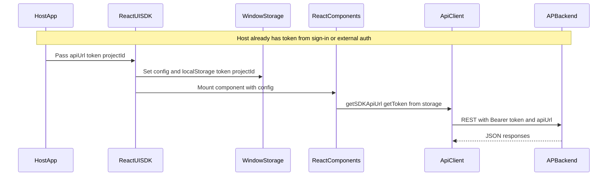
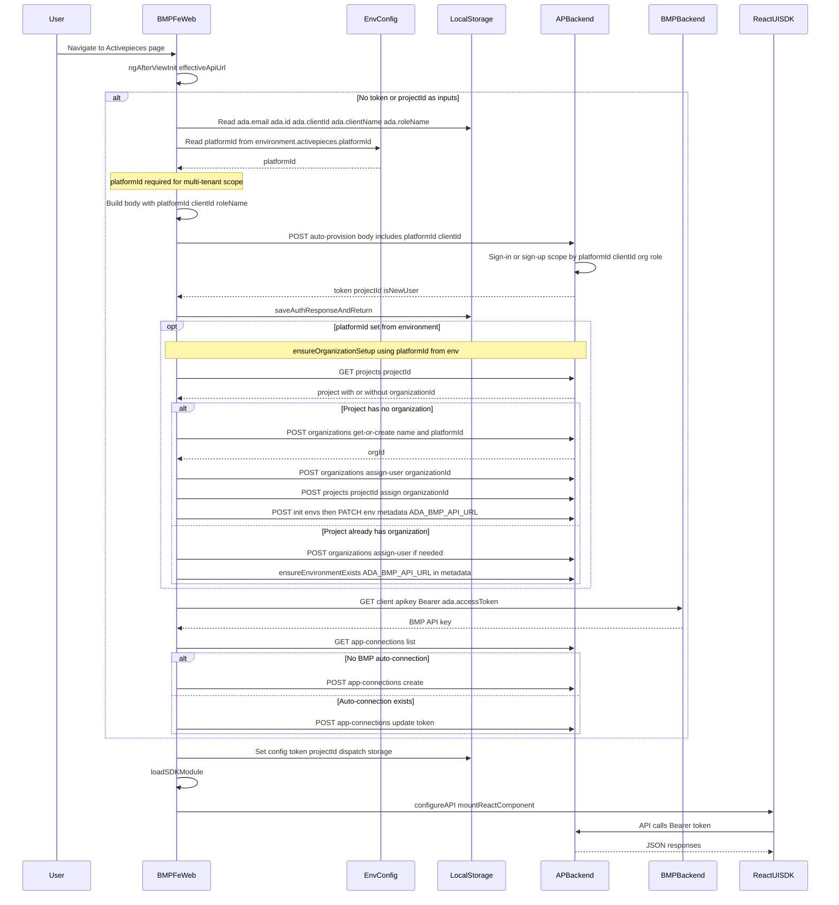

# BMP Multiple User Handling with Role Types

## Overview

This document explains how multiple users from the same BMP client are handled in Activepieces, including:
- **Shared Organizations**: Users with the same `clientId` automatically share organizations
- **Custom Platform Roles**: Users can be assigned different platform roles (ADMIN, MEMBER, OPERATOR, etc.)
- **SDK Authentication**: Using the `/auto-provision` endpoint for seamless user management

---

## Table of Contents

1. [Same ClientId Organization Sharing](#same-clientid-organization-sharing)
2. [Platform Roles](#platform-roles)
3. [Custom Role Assignment](#custom-role-assignment)
4. [BMP Frontend Integration](#bmp-frontend-integration)
5. [Auth Data Flow Diagrams](#auth-data-flow-diagrams)
6. [API Examples](#api-examples)
7. [Use Cases](#use-cases)

---

## Same ClientId Organization Sharing

### How It Works

When multiple users sign up or sign in with the **same `clientId` but different email addresses**, they will **automatically share the same organization**.

### Flow Example

**First User (User A):**
1. Provides `clientId: "client-123"` and `clientName: "MyCompany"`
2. System stores `clientId` in User A's record
3. System creates organization "MYCOMPANY"
4. User A is assigned to this organization

**Second User (User B):**
1. Provides `clientId: "client-123"` (same as User A)
2. System stores `clientId` in User B's record
3. System checks: "Do any other users with `clientId: "client-123"` already have an organization?"
4. **YES** - User A already has organization "MYCOMPANY"
5. System assigns User B to the **same organization**
6. User B joins "MYCOMPANY" with User A

### Implementation Details

```typescript
// After storing clientId
const usersWithSameClientId = await userService.getByClientIdAndPlatform({
    clientId: params.clientId,
    platformId: params.platformId,
})

// Find existing organization from another user with same clientId
const existingOrgUser = usersWithSameClientId.find(
    u => u.id !== user.id && u.organizationId
)

if (existingOrgUser && existingOrgUser.organizationId) {
    // Assign new user to existing organization
    await userService.update({
        id: user.id,
        platformId: params.platformId,
        organizationId: existingOrgUser.organizationId,
    })
}
```

### Important Notes

1. **Organization Name:** The organization name is determined by the **first user** who provides `clientName`. Subsequent users join that organization regardless of their `clientName` value.

2. **No `clientName` Provided:** If a user signs in without `clientName` but another user with the same `clientId` already has an organization, the user will be assigned to that existing organization.

3. **Platform Isolation:** Users with the same `clientId` only share organizations within the same `platformId`. Different platforms have separate organizations.

---

## Platform Roles

### Available Roles

| Role | Description | Permissions |
|------|-------------|-------------|
| **SUPER_ADMIN** | System-wide administrator | Full system access |
| **OWNER** | Platform/tenant owner | Full platform access |
| **ADMIN** | Platform administrator | Can create projects, manage users |
| **MEMBER** | Regular platform member | Limited permissions, needs invites |
| **OPERATOR** | Platform operator | Automatic project access (except private) |

### Role Assignment Logic

#### Standard Signup (`/sign-up`)
- **With invitation**: Uses role from invitation (or defaults to MEMBER)
- **No invitation**: Defaults to **MEMBER**

#### Standard Login (`/sign-in`)
- **No role change** - User keeps existing platform role

#### SDK Authentication (`/auto-provision`)
- **Signup**: Assigns **ADMIN** role (or custom role via `roleName`)
- **Login**: User keeps existing role

---

## Custom Role Assignment

### The `roleName` Parameter

The `/auto-provision` endpoint supports custom platform roles via the **`roleName`** parameter.

**Parameter Details:**
- **Source**: `localStorage.getItem('ada.roleName')` from BMP frontend
- **Type**: String (case-insensitive)
- **Valid Values**: `SUPER_ADMIN`, `OWNER`, `ADMIN`, `MEMBER`, `OPERATOR`
- **Default**: `ADMIN` (if not provided or invalid)

### Role Mapping Function

```typescript
function mapRoleNameToPlatformRole(roleName?: string): PlatformRole {
    if (!roleName) {
        return PlatformRole.ADMIN // Default role
    }
    
    const normalizedRoleName = roleName.toUpperCase().trim()
    
    switch (normalizedRoleName) {
        case 'SUPER_ADMIN': return PlatformRole.SUPER_ADMIN
        case 'OWNER': return PlatformRole.OWNER
        case 'ADMIN': return PlatformRole.ADMIN
        case 'MEMBER': return PlatformRole.MEMBER
        case 'OPERATOR': return PlatformRole.OPERATOR
        default: return PlatformRole.ADMIN // Invalid role, default to ADMIN
    }
}
```

### When Role is Applied

**Signup Flow:**
1. Creating auto-invitation → Uses `platformRole` from `roleName`
2. Creating user directly → Assigns `platformRole` from `roleName`
3. Defaults to ADMIN if `roleName` not provided

**Login Flow:**
- Role is **NOT changed** during login
- User keeps their existing role from signup

### Important Notes

1. **Case Insensitive**: `"admin"`, `"ADMIN"`, `"Admin"` all map to `PlatformRole.ADMIN`

2. **Default Behavior**: Invalid or missing `roleName` defaults to `ADMIN` for backward compatibility

3. **Role Persistence**: Role is set during signup only; login does NOT change the user's role

4. **Security**: Role assignment happens server-side (client cannot bypass validation)

---

## BMP Frontend Integration

### JavaScript Example

```javascript
// Get role and client info from localStorage
const roleName = localStorage.getItem('ada.roleName')      // e.g., "ADMIN", "MEMBER"
const clientName = localStorage.getItem('ada.clientName')  // e.g., "MyCompany"

// Prepare auto-provision request
const requestBody = {
  email: userEmail,
  password: userPassword,
  firstName: userFirstName,
  lastName: userLastName,
  platformId: '2Y6xAoWbvjiBgdRsBDcbP',  // Your platform ID
  clientId: 'client-123',                // Unique client identifier
  clientName: clientName,                // Organization name (optional)
  roleName: roleName                     // Custom role (optional)
}

// Call auto-provision endpoint
const response = await fetch('http://localhost:3000/api/v1/authentication/auto-provision', {
  method: 'POST',
  headers: { 'Content-Type': 'application/json' },
  body: JSON.stringify(requestBody)
})

const data = await response.json()
// Store token and user info
localStorage.setItem('token', data.token)
```

### Setting Role in BMP Frontend

```javascript
// Set role before signup/login
localStorage.setItem('ada.roleName', 'MEMBER')    // For regular users
localStorage.setItem('ada.roleName', 'ADMIN')     // For administrators
localStorage.setItem('ada.roleName', 'OPERATOR')  // For operators
```

---

## Auth Data Flow Diagrams

The React UI SDK does **not** authenticate users itself; the host application supplies the token and config (`apiUrl`, `token`, `projectId`). Two flows are described below: the **original SDK flow** (generic host passing config to the SDK) and the **bmp-fe-web flow** (host uses `/auto-provision` and then passes config to the SDK). Implementation reference: `bmp-fe-web/src/app/pages/activepieces/page/activepieces.component.ts`.

### Role of platformId

- **bmp-fe-web:** `platformId` comes from the host **environment** (e.g. `environment.activepieces?.platformId`). It scopes auto-provision to a tenant (together with `clientId`), and when set it triggers `ensureOrganizationSetup` after auth.
- **Activepieces (backend):** **platformId is required on the Activepieces side for multi-tenant handling.** Each platform is a tenant; user, project, and organization are scoped by `platformId`. For SDK/embedded use (e.g. one host like bmp-fe-web serving multiple tenants), the client must send `platformId` in the request body so Activepieces knows which tenant to use; otherwise the API may return a validation error or resolve to the wrong tenant.

### How platformId from environment is set up

When **platformId** is set in the host (e.g. bmp-fe-web), it comes from the **build-time / runtime environment config** — typically `environment.activepieces.platformId` in the Angular app (e.g. in `environments/environment.ts` or environment-specific files). That value is the Activepieces platform (tenant) ID, usually the platform of the tenant owner.

**When platformId is set, the flow is:**

1. **Before auto-provision:** bmp-fe-web reads `platformId` from `environment.activepieces?.platformId` and includes it (with `clientId`, `clientName`, `roleName`) in the POST body to `/auto-provision`. The backend uses it to scope the user and project to that tenant.
2. **After auth (token/projectId received):** If `platformId` is set, bmp-fe-web calls **ensureOrganizationSetup(apiBaseUrl, token, projectId, platformId)**. That does:
   - **Step 1:** GET project — check if the project already has an organization.
   - **Step 2:** If no org: POST **organizations/get-or-create** with `name` and **platformId** (so the org is created under the correct tenant).
   - **Step 3:** POST **organizations/assign-user** — assign the current user to that organization.
   - **Step 4:** PATCH/POST project — assign the project to that organization.
   - **Step 5:** **ensureEnvironmentExists** — initialize org environments (Dev/Staging/Prod) if needed, then set environment metadata **ADA_BMP_API_URL** (and optionally ADA_BMP_TIMEOUT, ADA_BMP_DEBUG) from `environment.api` so the BMP piece can call the correct BMP API.

If `platformId` is not set, `ensureOrganizationSetup` is skipped (no org/env setup). For SDK embedding with multiple tenants, **platformId must be set** in the environment so the correct tenant and org/env are used.

### Importance of platformId for the SDK config

The **SDK config** (what the host passes to the SDK) is `apiUrl`, `token`, and `projectId` (optional `flowId`). The SDK does **not** receive `platformId` as a config field; it only uses `apiUrl`, `token`, and `projectId` for API calls.

1. **platformId is required on the Activepieces side for multi-tenant handling** — each platform is a tenant; the backend needs `platformId` to scope the request and to create/return the correct token and projectId.
2. The host must set the correct `platformId` (e.g. in environment) when calling auto-provision so the resulting SDK config is for the intended tenant; wrong or missing `platformId` yields wrong or failed SDK auth.

### Diagram 1: Original SDK Authentication Flow

The SDK does not perform login. The host application obtains a token (e.g. its own login or standard Activepieces sign-in) and passes `apiUrl`, `token`, and `projectId` into the SDK; the SDK only stores and uses them for API calls.



**Caption:** Host obtains token (e.g. standard sign-in/sign-up or its own auth). Host passes `apiUrl`, `token`, `projectId` to the SDK via Angular inputs or `SDKProviders` config. SDK writes these to `window.__AP_SDK_CONFIG__` and to localStorage. React UI (and `api.ts`) read config and token from storage for all API requests; the SDK never calls sign-in or sign-up itself. When the host uses platform-scoped auth such as auto-provision, the correct `platformId` in the host environment is what ensures the token and projectId passed to the SDK are for the right tenant (see "Importance of platformId for the SDK config" above).

### Diagram 2: bmp-fe-web Authentication Flow

**platformId is required on the Activepieces side for multi-tenant handling:** each platform is a tenant; the backend needs `platformId` to determine which tenant to use and will return a validation error if it cannot be determined. The sequence below matches `bmp-fe-web` (ActivepiecesComponent): `ngAfterViewInit` → read **platformId from environment** (see [How platformId from environment is set up](#how-platformid-from-environment-is-set-up)) → `exchangeToken` (POST auto-provision with platformId + clientId) → **ensureOrganizationSetup** when platformId is set (GET project → get-or-create org with platformId → assign-user → assign project → env metadata ADA_BMP_API_URL) → `ensureBmpConnection` → set config → load SDK → mount component.



**Caption:** bmp-fe-web reads `ada.email`, `ada.id` (used as password), `ada.clientId`, `ada.clientName`, and `ada.roleName` from localStorage, and **platformId** from **environment** (`environment.activepieces.platformId`). It POSTs to `/v1/authentication/auto-provision` with platformId and clientId so the backend scopes the user to that tenant (same platformId + same clientId → same organization). Backend signs in or signs up, applies clientId/organization and role, returns token and projectId. Frontend stores them. If platformId is set, it runs `ensureOrganizationSetup` (org + env with ADA_BMP_API_URL) using that platformId; then `ensureBmpConnection` (GET BMP API key from BMP backend, then create/update BMP app-connection via Activepieces API). Finally it sets `__AP_SDK_CONFIG__`, loads the SDK script, calls `configureAPI` and `mountReactComponent`. From then on, SDK behavior matches the original SDK flow (Diagram 1).

---

## API Examples

### Example 1: Team Admin with Custom Organization

```javascript
POST /api/v1/authentication/auto-provision
{
  "email": "admin@company.com",
  "password": "secure123",
  "firstName": "Admin",
  "lastName": "User",
  "platformId": "2Y6xAoWbvjiBgdRsBDcbP",
  "clientId": "company-abc-123",
  "clientName": "MyCompany",
  "roleName": "ADMIN"
}

// Result: User created with ADMIN role in "MYCOMPANY" organization
```

### Example 2: Team Member Joining Existing Organization

```javascript
POST /api/v1/authentication/auto-provision
{
  "email": "member@company.com",
  "password": "secure456",
  "firstName": "Team",
  "lastName": "Member",
  "platformId": "2Y6xAoWbvjiBgdRsBDcbP",
  "clientId": "company-abc-123",      // Same clientId as admin
  "clientName": "MyCompany",
  "roleName": "MEMBER"
}

// Result: User created with MEMBER role, automatically joins "MYCOMPANY" organization
```

### Example 3: Without Custom Role (Default ADMIN)

```javascript
POST /api/v1/authentication/auto-provision
{
  "email": "user@example.com",
  "password": "password123",
  "firstName": "John",
  "lastName": "Doe",
  "platformId": "2Y6xAoWbvjiBgdRsBDcbP",
  "clientId": "client-789",
  "clientName": "JohnOrg"
  // roleName not provided → defaults to ADMIN
}

// Result: User created with ADMIN role in "JOHNORG" organization
```

### Example 4: Operator Role

```javascript
POST /api/v1/authentication/auto-provision
{
  "email": "operator@company.com",
  "password": "secure789",
  "firstName": "Operator",
  "lastName": "User",
  "platformId": "2Y6xAoWbvjiBgdRsBDcbP",
  "clientId": "company-abc-123",      // Same clientId as others
  "clientName": "MyCompany",
  "roleName": "OPERATOR"
}

// Result: User created with OPERATOR role, joins "MYCOMPANY" organization
//         Has automatic access to non-private projects
```

---

## Use Cases

### Use Case 1: Company with Multiple Team Members

**Scenario:** A company has an admin, several members, and operators.

**Setup:**
```javascript
// 1. Admin signs up first
{
  email: "admin@company.com",
  clientId: "company-123",
  clientName: "CompanyName",
  roleName: "ADMIN"
}

// 2. Team members join
{
  email: "member1@company.com",
  clientId: "company-123",  // Same clientId
  roleName: "MEMBER"
}

{
  email: "member2@company.com",
  clientId: "company-123",  // Same clientId
  roleName: "MEMBER"
}

// 3. Operator joins
{
  email: "ops@company.com",
  clientId: "company-123",  // Same clientId
  roleName: "OPERATOR"
}
```

**Result:**
- ✅ All users share the "COMPANYNAME" organization
- ✅ Admin can create and manage projects
- ✅ Members need project invites
- ✅ Operator has automatic access to projects

### Use Case 2: Multi-Client SaaS Platform

**Scenario:** BMP frontend serves multiple client companies.

**Client A:**
```javascript
{
  email: "user1@clienta.com",
  clientId: "client-a",
  clientName: "Client A Corp",
  roleName: "ADMIN"
}
```

**Client B:**
```javascript
{
  email: "user1@clientb.com",
  clientId: "client-b",      // Different clientId
  clientName: "Client B Inc",
  roleName: "ADMIN"
}
```

**Result:**
- ✅ Client A users share one organization
- ✅ Client B users share a separate organization
- ✅ Complete isolation between clients
- ✅ Each can have their own role structure

### Use Case 3: Gradual Team Growth

**Scenario:** Company starts with one user, adds more over time.

**Timeline:**
1. **Week 1**: First user signs up
   - Creates organization "MYCOMPANY"
   - Gets ADMIN role

2. **Week 2**: Second user joins
   - Same `clientId`
   - Automatically joins "MYCOMPANY"
   - Gets MEMBER role

3. **Week 3**: Third user joins
   - Same `clientId`
   - Automatically joins "MYCOMPANY"
   - Gets OPERATOR role

**Result:**
- ✅ Seamless team growth
- ✅ No manual organization assignment needed
- ✅ Each user has appropriate role
- ✅ All share same resources

---

## Summary Table

| Feature | Description |
|---------|-------------|
| **Endpoint** | `/api/v1/authentication/auto-provision` |
| **Organization Sharing** | Same `clientId` → Same organization |
| **Default Role** | `ADMIN` (if `roleName` not provided) |
| **Custom Roles** | Via `roleName` parameter from localStorage |
| **Role Options** | SUPER_ADMIN, OWNER, ADMIN, MEMBER, OPERATOR |
| **Platform Isolation** | Different `platformId` → Separate organizations |
| **Backward Compatible** | ✅ Yes - defaults to ADMIN |

---

## Database Schema

```sql
-- User table
user {
    id: string
    email: string (via identity)
    clientId: string (nullable)
    organizationId: string (nullable)
    platformId: string
    platformRole: enum (SUPER_ADMIN, OWNER, ADMIN, MEMBER, OPERATOR)
}

-- Organization table
organization {
    id: string
    name: string (e.g., "MYCOMPANY")
    platformId: string
}
```

---

## Testing Checklist

- ✅ Same `clientId` with different emails → Users share organization
- ✅ Different `clientId` → Separate organizations
- ✅ `roleName: "ADMIN"` → User gets ADMIN role
- ✅ `roleName: "MEMBER"` → User gets MEMBER role
- ✅ `roleName: "OPERATOR"` → User gets OPERATOR role
- ✅ `roleName` not provided → Defaults to ADMIN
- ✅ Invalid `roleName` → Defaults to ADMIN
- ✅ Case-insensitive role names work correctly
- ✅ Login preserves existing role (no change)
- ✅ Platform isolation works (different platformId)
- ✅ New user's project inherits user's `organizationId` automatically
- ✅ Existing identity with new platform user → Project gets correct `organizationId`

---

## Auto-Create Default BMP Connection (Frontend)

The default BMP connection is created by the **BMP frontend** (`bmp-fe-web`) using the `ensureBmpConnection` function in `activepieces.component.ts`.

### How It Works

1. After successful authentication, the frontend calls `ensureBmpConnection`
2. It fetches the real BMP API key from `GET /client/apikey`
3. Checks if a BMP connection already exists for the project
4. If an auto-connection exists, **updates the token** to keep it in sync
5. If no connection exists, **creates a new one** with the real API key

### Benefits of Frontend Approach

- Uses the **real BMP API key** (not a placeholder)
- **Updates tokens** on each visit to keep them in sync
- Runs in the **user's session context** where BMP credentials are available

### Related Files

- Frontend: `bmp-fe-web/src/app/pages/activepieces/page/activepieces.component.ts`
  - `ensureBmpConnection()` - Main function
  - `getBmpApiKey()` - Fetches API key from BMP backend
  - `createBmpConnection()` - Creates new connection
  - `updateBmpConnectionToken()` - Updates existing connection token

### Required request body for POST /v1/app-connections (BMP / Custom Auth)

The API expects a **body** that matches the **Custom Auth** schema. A **400 Bad Request** usually means a required field is missing or the shape is wrong.

- **Required body fields** (all must be present):
  - `projectId` (string) – **Must be in the body**; used for authorization. Use the current project ID (e.g. from `/auto-provision` or project context).
  - `type`: `"CUSTOM_AUTH"`
  - `externalId` (string) – e.g. a stable id for the BMP connection
  - `displayName` (string)
  - `pieceName`: `"@activepieces/piece-ada-bmp"`
  - `value`: `{ type: "CUSTOM_AUTH", props: { apiToken: "<BMP API key>", environment: "Dev" | "Staging" | "Production" } }`
- **Optional**: `metadata`, `pieceVersion`

Example (create/upsert BMP connection):

```json
{
  "projectId": "<current-project-id>",
  "type": "CUSTOM_AUTH",
  "externalId": "bmp-auto-connection",
  "displayName": "ADA BMP",
  "pieceName": "@activepieces/piece-ada-bmp",
  "value": {
    "type": "CUSTOM_AUTH",
    "props": {
      "apiToken": "<BMP API key>",
      "environment": "Staging"
    }
  }
}
```

Ensure the request also sends the project scope (e.g. `projectId` query param or header if your proxy/API expects it) so the backend can authorize the request.

---

## Benefits

1. **Automatic Team Management** - No manual organization assignment needed
2. **Flexible Role Structure** - Support for various permission levels
3. **Seamless Onboarding** - New users automatically join correct organization
4. **Client Isolation** - Different clients remain completely separate
5. **Backward Compatible** - Existing integrations continue to work
6. **Secure** - Server-side role validation and assignment
7. **Auto BMP Connection** - Default connection created by frontend with real API key

---

## Date Created
February 16, 2026

## Related Files
- Backend Implementation: `/packages/server/api/src/app/authentication/authentication.controller.ts`
- User Service: `/packages/server/api/src/app/user/user-service.ts`
- User Entity: `/packages/server/api/src/app/user/user-entity.ts`
- Frontend BMP Connection: `bmp-fe-web/src/app/pages/activepieces/page/activepieces.component.ts`
